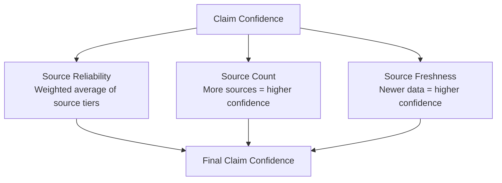

# Confidence Scoring

> Every claim, pillar, and total score carries a confidence sub-score (0–100) that represents how reliable the system considers that output. Confidence propagates upward from individual sources to the final Move Probability Score.

## Per-Claim Confidence

Each claim in `evidence_claims` has a `confidence_score` column (0–100). This score is computed from three factors:



### Formula

```
claim_confidence = min(100, round(
    (source_reliability_score × 0.5) +
    (source_count_score × 0.3) +
    (freshness_score × 0.2)
))
```

Where:

**Source Reliability Score** (0–100):
```
source_reliability_score = average of (tier_to_score(s.reliability_tier) for each source)
tier_to_score(1) = 100, tier_to_score(2) = 85, tier_to_score(3) = 70,
tier_to_score(4) = 40, tier_to_score(5) = 10
```

**Source Count Score** (0–100):
```
source_count_score = min(100, source_count × 25)
-- 1 source = 25, 2 sources = 50, 3 sources = 75, 4+ sources = 100
```

**Freshness Score** (0–100):
```
freshness_score = max(0, 100 - (days_since_capture × decay_rate))
decay_rate = varies by data type (see sources.md)
```

### Example Calculation

Claim: "TechNova hired 200 employees in Q2 2026"

| Source | Tier | Tier Score | Captured | Days Old | Freshness |
|--------|------|------------|----------|----------|-----------|
| LinkedIn company page | 2 | 85 | 2026-07-01 | 10 | 97 |
| Economic Times article | 3 | 70 | 2026-06-28 | 13 | 96 |
| Company blog post | 1 | 100 | 2026-07-05 | 6 | 98 |

```
source_reliability = (85 + 70 + 100) / 3 = 85.0
source_count_score = min(100, 3 × 25) = 75
freshness_score = (97 + 96 + 98) / 3 = 97.0

claim_confidence = (85.0 × 0.5) + (75 × 0.3) + (97.0 × 0.2) = 42.5 + 22.5 + 19.4 = 84.4
```

Result: `claim_confidence = 84`

## Aggregation to Pillar Confidence

Each scoring pillar (Growth, Space Need, etc.) contains multiple claims. Pillar confidence is the weighted average of its claims' confidences:

```sql
SELECT
    claim_category,
    COUNT(*) AS claim_count,
    ROUND(AVG(confidence_score)) AS avg_confidence,
    ROUND(
        SUM(confidence_score * weight) / SUM(weight)
    ) AS weighted_confidence
FROM (
    SELECT
        ec.claim_category,
        ec.confidence_score,
        CASE ec.claim_category
            WHEN 'growth' THEN 1.0
            WHEN 'space_need' THEN 1.0
            WHEN 'financial' THEN 0.8
            WHEN 'industry_trend' THEN 0.8
            WHEN 'decision_maker_access' THEN 1.0
            WHEN 'digital_footprint' THEN 0.6
            WHEN 'funding_activity' THEN 1.0
            WHEN 'regulatory_exposure' THEN 0.6
        END AS weight
    FROM evidence_claims ec
    WHERE ec.company_id = 'a1b2c3d4-...'
) sub
GROUP BY claim_category;
```

Claims within a pillar are weighted equally by default. If a claim has very low confidence (< 30), it is excluded from pillar aggregation entirely — the system prefers fewer, high-confidence claims over many weak ones.

## Aggregation to Total Confidence

The total confidence score stored in `companies_scores.confidence_score` is the weighted average of all pillar confidences, using the same weights as the scoring system:

```
total_confidence = Σ(pillar_confidence × pillar_weight) / Σ(pillar_weights)
```

```sql
-- Total confidence for a scoring cycle
SELECT
    cs.id,
    cs.total_score,
    ROUND((
        COALESCE(cs.growth_score, 0) * 1.0 +
        COALESCE(cs.space_need_score, 0) * 1.0 +
        COALESCE(cs.financial_health_score, 0) * 0.8 +
        COALESCE(cs.industry_trend_score, 0) * 0.8 +
        COALESCE(cs.decision_maker_access_score, 0) * 1.0 +
        COALESCE(cs.digital_footprint_score, 0) * 0.6 +
        COALESCE(cs.funding_activity_score, 0) * 1.0 +
        COALESCE(cs.regulatory_exposure_score, 0) * 0.6
    ) / (1.0 + 1.0 + 0.8 + 0.8 + 1.0 + 0.6 + 1.0 + 0.6)) AS weighted_total_score,
    ROUND((
        COALESCE(ec.growth_conf, 0) * 1.0 +
        COALESCE(ec.space_conf, 0) * 1.0 +
        COALESCE(ec.financial_conf, 0) * 0.8 +
        COALESCE(ec.industry_conf, 0) * 0.8 +
        COALESCE(ec.dm_access_conf, 0) * 1.0 +
        COALESCE(ec.digital_conf, 0) * 0.6 +
        COALESCE(ec.funding_conf, 0) * 1.0 +
        COALESCE(ec.regulatory_conf, 0) * 0.6
    ) / (1.0 + 1.0 + 0.8 + 0.8 + 1.0 + 0.6 + 1.0 + 0.6)) AS total_confidence
FROM companies_scores cs
LEFT JOIN (
    SELECT company_id,
        AVG(confidence_score) FILTER (WHERE claim_category = 'growth') AS growth_conf,
        AVG(confidence_score) FILTER (WHERE claim_category = 'space_need') AS space_conf,
        AVG(confidence_score) FILTER (WHERE claim_category = 'financial') AS financial_conf,
        AVG(confidence_score) FILTER (WHERE claim_category = 'industry_trend') AS industry_conf,
        AVG(confidence_score) FILTER (WHERE claim_category = 'decision_maker_access') AS dm_access_conf,
        AVG(confidence_score) FILTER (WHERE claim_category = 'digital_footprint') AS digital_conf,
        AVG(confidence_score) FILTER (WHERE claim_category = 'funding_activity') AS funding_conf,
        AVG(confidence_score) FILTER (WHERE claim_category = 'regulatory_exposure') AS regulatory_conf
    FROM evidence_claims
    WHERE confidence_score >= 30
    GROUP BY company_id
) ec ON ec.company_id = cs.company_id
WHERE cs.company_id = 'a1b2c3d4-...'
ORDER BY cs.scored_at DESC
LIMIT 1;
```

## Confidence Thresholds

| Confidence Range | Label | Meaning |
|-----------------|-------|---------|
| 80–100 | High | Well-corroborated by multiple reliable sources |
| 60–79 | Medium | Supported by 1–2 sources, reasonable confidence |
| 40–59 | Low | Supported by weak sources or single source |
| 20–39 | Very Low | Limited evidence, high uncertainty |
| 0–19 | Speculative | Essentially unsupported, treated as noise |

Claims with confidence < 30 are excluded from pillar scoring. Leads whose total confidence is < 40 are flagged for the broker as "low confidence — verify before acting." The Judge layer can downgrade a lead's priority if total confidence is below 50, regardless of the raw score.
