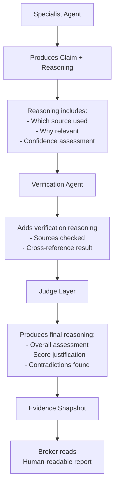

# Explainability

> How every AI decision is traceable to its evidence sources, and how the platform produces human-readable reasoning for every score, recommendation, and state transition.

## Why Explainability Matters

The core value proposition of the Jasfo platform is trust. A broker who cannot verify why a lead was scored a certain way will not act on it. An AI system that produces opaque scores is no better than a black box — the broker cannot defend the recommendation to a client, cannot learn from incorrect assessments, and cannot improve their own judgment.

Explainability is not an afterthought. It is baked into every layer of the pipeline. Every Agent is prompted to produce not just a score but a **reasoning trace** — a step-by-step explanation of how it arrived at its conclusion, with citations to the evidence that supports each step.

## How Explainability Works



### Claim-Level Reasoning

Every claim stored in `evidence_claims` is accompanied by a reasoning trace stored in the `evidence_snapshot` bundle:

```json
{
  "claim_id": "claim-001",
  "claim_text": "TechNova Solutions hired 200 employees in Q2 2026",
  "reasoning": {
    "agent": "growth-agent",
    "prompt_version": "growth-v2.3",
    "steps": [
      {
        "step": 1,
        "action": "Extracted employee count from LinkedIn company page",
        "source": "https://linkedin.com/company/technova",
        "finding": "Employee count changed from 501-1000 to 1001-5000"
      },
      {
        "step": 2,
        "action": "Cross-referenced with news article",
        "source": "https://economictimes.indiatimes.com/...",
        "finding": "Article states 'TechNova added 200 roles in Pune office'"
      },
      {
        "step": 3,
        "action": "Calculated delta",
        "finding": "501-1000 → 1001-5000 represents approximately 200+ new hires"
      }
    ],
    "conclusion": "High confidence that company added 200+ employees in Q2 2026",
    "confidence_score": 84
  }
}
```

This reasoning trace is generated by the Agent at claim extraction time. The Agent is prompted to document each step of its reasoning, including which specific data points it used and how it interpreted them.

### Score-Level Reasoning

At the Judge layer, the final score is accompanied by a comprehensive reasoning document:

```json
{
  "lead_id": "a1b2c3d4-...",
  "final_score": 450,
  "overall_assessment": "TechNova is a high-growth SaaS company with strong space-need signals. Multiple data points indicate imminent office expansion.",
  "pillar_breakdowns": [
    {
      "pillar": "growth",
      "score": 85,
      "evidence_summary": "Confirmed 200+ hires via LinkedIn and Economic Times. Job postings for Pune office doubled.",
      "supporting_claims": ["claim-001", "claim-003"],
      "contradictions": []
    },
    {
      "pillar": "space_need",
      "score": 70,
      "evidence_summary": "Current office at full capacity per employee density analysis. Three job postings mention 'new office'.",
      "supporting_claims": ["claim-007"],
      "contradictions": [
        {
          "claim": "Company recently renewed lease",
          "source": "Unconfirmed social media post",
          "resolution": "Discarded as Tier 5 source, not corroborated"
        }
      ]
    }
  ],
  "contradictions_found": 1,
  "contradictions_resolved": 1,
  "data_quality_warnings": [
    "Financial health data is 60 days old — confidence reduced",
    "No direct decision-maker contact found — using LinkedIn as intermediary"
  ]
}
```

The Judge's reasoning includes:

- **Overall assessment**: A plain-language summary of why the lead scored as it did
- **Pillar breakdowns**: Per-pillar justification referencing specific claims
- **Contradictions**: Any conflicting evidence, and how the contradiction was resolved
- **Data quality warnings**: Caveats about data freshness, missing fields, or low-confidence claims

### Human-Readable Output

The broker receives a formatted report rather than raw JSON:

```
─────────────────────────────────────────────
  LEAD INTELLIGENCE REPORT
  TechNova Solutions
  technova.in
─────────────────────────────────────────────

  Overall Score: 450 / 800 (Hot)
  Confidence: 78 / 100 (Medium-High)

  WHY THIS LEAD MATTERS
  ─────────────────────
  TechNova is growing rapidly. They added 200+
  employees in Q2 2026 and their current office
  is at capacity. Job postings specifically
  mention "new office" in Pune.

  SCORING BREAKDOWN
  ─────────────────
  Growth:             85 / 100 (Excellent)
  Space Need:         70 / 100 (Strong)
  Financial Health:   65 / 100 (Good)
  Industry Trend:     55 / 100 (Moderate)
  Decision-Maker:     90 / 100 (Excellent)
  Digital Footprint:  45 / 100 (Moderate)
  Funding Activity:   80 / 100 (Strong)
  Regulatory:         60 / 100 (Moderate)

  KEY EVIDENCE
  ────────────
  1. Headcount grew from 501-1000 to 1001-5000
     Source: linkedin.com/company/technova (Jul 2026)

  2. Economic Times reports 200 new hires in Pune
     Source: economictimes.india/... (Jul 2026)

  3. Current office at capacity per density analysis
     Source: Company website team page (Jul 2026)

  DATA QUALITY NOTES
  ──────────────────
  • Financial data is 60 days old
  • No direct email found, LinkedIn available

  RECOMMENDATION
  ──────────────
  Contact this week. Decision-maker is accessible
  via LinkedIn. Suggested approach: reference
  their expansion as conversation opener.
─────────────────────────────────────────────
```

## Traceability: From Score to Source

The broker can trace any assertion in the report back to its original source:

**Claim → Pillar → Source URL → Raw Extract**

```sql
-- Trace: "Growth: 85" → evidence
SELECT
    ec.claim_text,
    ec.confidence_score,
    es.source_url,
    LEFT(es.extracted_content, 200) AS snippet
FROM companies_scores cs
JOIN evidence_claims ec ON ec.company_id = cs.company_id
JOIN evidence_sources es ON es.claim_id = ec.id
WHERE cs.company_id = 'a1b2c3d4-...'
  AND ec.claim_category = 'growth'
ORDER BY ec.confidence_score DESC;
```

This query returns every growth-related claim, its confidence, the source URL, and a snippet of the extracted content. The broker can click any URL to verify the claim themselves.

## Weakness Transparency

The system is explicit about what it does not know. Data quality warnings are surfaced prominently:

- **Low confidence**: "This claim has only 40 confidence — verify before acting"
- **Missing data**: "No funding data found — company may be bootstrapped"
- **Stale data**: "Employee count is 120 days old — may be outdated"
- **Contradictory evidence**: "One source says 200 hires, another says 50 — score reduced pending clarification"

This transparency is a deliberate design choice. The platform is not trying to appear smarter than it is. By showing its uncertainty, it helps the broker make better decisions and builds trust through honesty.
