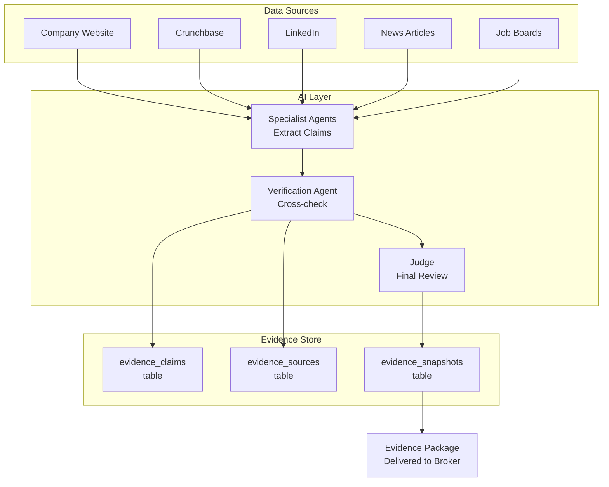
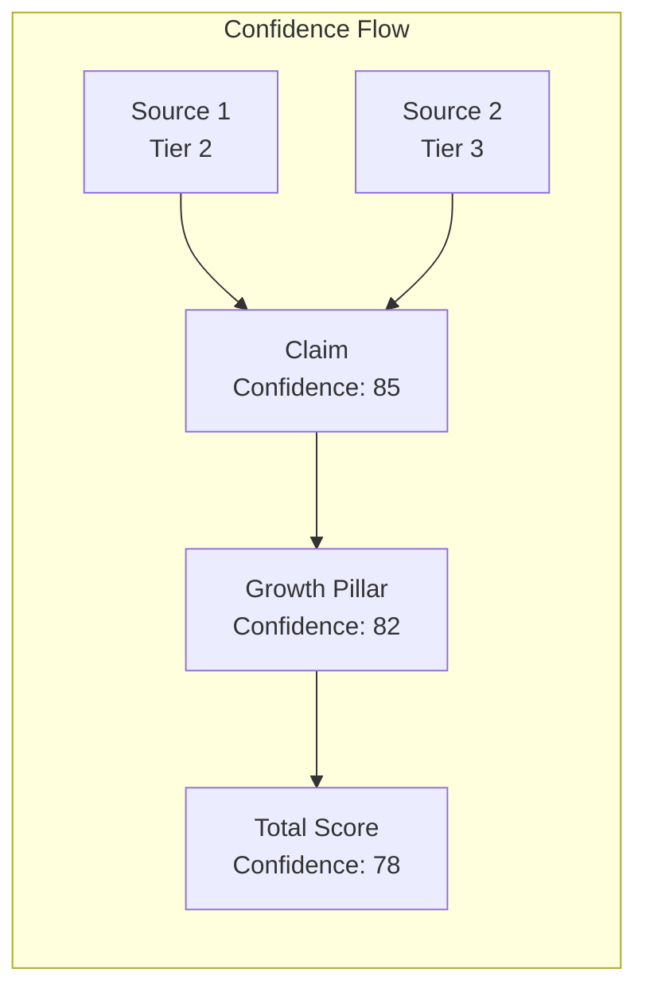

# Evidence Engine Overview

> The Evidence Engine is the foundation of the Jasfo platform's **Evidence First** principle. Every AI-generated conclusion must cite verifiable sources. Claims without sources are discarded.

## Why Evidence Matters

In commercial real estate, a broker's reputation depends on accuracy. A wrong lead wastes the broker's time. A wrong claim about a company's growth or financial health damages the broker's credibility with landlords and clients. The Evidence Engine exists to guarantee that every number, signal, and recommendation in the Lead Intelligence Report is traceable to a source the broker can independently verify.

The Evidence Engine enforces a strict policy: **no unsupported claim reaches the broker**. Every statement in the report — "Company X hired 200 people" or "Company Y's lease expires in Q3" — must be backed by a source URL with extracted full-text content. If a Specialist Agent produces a claim without a source, the Verification layer rejects it. If the Judge cannot find a source for a claim during final review, it downgrades the lead's confidence score.

## Architecture

### Data Flow

1. **Ingestion**: Firecrawl and Apify scrape web sources. Raw HTML/text is stored temporarily in the scraping cache.
2. **Claim Extraction**: Specialist Agents (Growth Agent, Financial Agent, etc.) analyze the scraped content and extract factual claims. Each claim includes: the claim text, the source URL, the relevant excerpt, and a confidence score.
3. **Verification**: The Verification Agent checks each claim against at least two independent sources. Claims meeting the 2-source threshold are marked `is_verified = true`.
4. **Storage**: Verified and unverified claims are stored in `evidence_claims` with their sources in `evidence_sources`. The linkage between a claim and its sources is preserved forever.
5. **Snapshot**: At pipeline completion, an immutable evidence snapshot is created in `evidence_snapshots`. This bundle is the definitive record of what was known about a company at that point in time.
6. **Delivery**: The evidence package is included in the weekly CSV/PDF export. Every score and recommendation in the report links back to its supporting claims.

## Design Principles

**1. Traceability**. Every claim has a `claim_id`. Every score derived from that claim references the `claim_id`. The broker can start from any number in the report and trace it back to the original source URL.

**2. Immutability**. Evidence snapshots are never modified after creation. If new evidence emerges, a new snapshot is created. The old snapshot remains as an audit record. This ensures the broker can always see exactly what evidence supported a decision at the time it was made.

**3. Confidence Propagation**. Evidence confidence flows upward from source → claim → pillar → total score. A claim's confidence is the weighted average of its source confidences. A pillar's confidence is the weighted average of its claims' confidences. The total confidence is the weighted average of all pillar confidences. This means the broker can see not just the score but how confident the system is in that score.

**4. Cost-Aware Verification**. Not every claim needs 2-source verification. Tier 1 sources (official company filings, regulatory documents) are accepted as single-source verification. Claims based on Tier 4–5 sources (anonymous blogs, unverified social media) require 3+ sources. This balances verification rigor against pipeline cost.

## Evidence Package

The final deliverable for each qualified lead contains:

- **Claim list**: All verified claims with source URLs
- **Source archive**: Full-text extraction for each source (if available)
- **Confidence summary**: Per-pillar and total confidence scores
- **Change history**: If the company was previously scored, a diff showing what changed
- **Verification status**: Which claims met the 2-source rule and which were accepted with single-source (Tier 1)

The evidence package is the single source of truth the broker uses to evaluate lead quality and decide whether to invest time in outreach.
