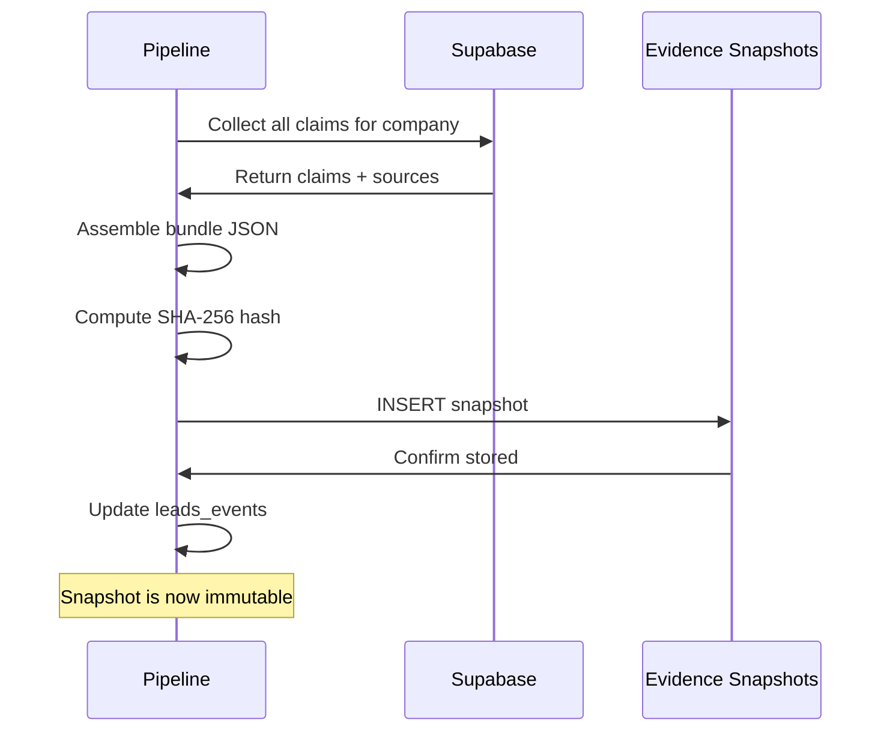
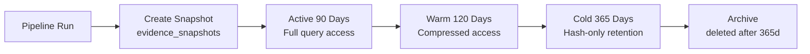

# Evidence Snapshots

> Immutable, timestamped bundles of all evidence for a company at pipeline completion time. Snapshots are the definitive record of what the platform knew and when.

## Purpose

An evidence snapshot is a point-in-time capture of every claim, source, and score for a company. It serves three critical functions:

1. **Audit trail**: At any point in the future, the broker can see exactly what evidence supported a lead's score on the day it was delivered.
2. **Regulatory compliance**: If a client or landlord questions a recommendation, the snapshot provides the evidentiary basis for the claim.
3. **Model improvement**: The snapshot data is used to train and evaluate AI agent performance — if an agent produced a hallucinated claim, the snapshot captures it for root cause analysis.

## Snapshot Schema

Each snapshot is stored in `evidence_snapshots`:

```sql
CREATE TABLE evidence_snapshots (
    id          uuid PRIMARY KEY DEFAULT gen_random_uuid(),
    company_id  uuid NOT NULL REFERENCES companies(id),
    bundle      jsonb NOT NULL,
    sha256_hash text NOT NULL,
    captured_at timestamptz NOT NULL DEFAULT now()
);
```

The `bundle` column contains a complete JSON document:

```json
{
  "snapshot_version": "1.0",
  "pipeline_run_id": "run-2026-W28",
  "company": {
    "id": "a1b2c3d4-...",
    "name": "TechNova Solutions",
    "domain": "technova.in"
  },
  "scores": {
    "total_score": 450,
    "confidence_score": 78,
    "pillars": {
      "growth": { "score": 85, "confidence": 82 },
      "space_need": { "score": 70, "confidence": 75 },
      "financial_health": { "score": 65, "confidence": 80 },
      "industry_trend": { "score": 55, "confidence": 70 },
      "decision_maker_access": { "score": 90, "confidence": 85 },
      "digital_footprint": { "score": 45, "confidence": 60 },
      "funding_activity": { "score": 80, "confidence": 90 },
      "regulatory_exposure": { "score": 60, "confidence": 65 }
    }
  },
  "claims": [
    {
      "id": "claim-001",
      "text": "TechNova hired 200 employees in Q2 2026",
      "category": "growth",
      "confidence": 84,
      "is_verified": true,
      "sources": [
        {
          "url": "https://linkedin.com/company/technova",
          "tier": 2,
          "extracted_snippet": "TechNova Solutions: 501-1000 employees",
          "captured_at": "2026-07-10T14:30:00Z"
        }
      ]
    }
  ],
  "metadata": {
    "total_claims": 12,
    "verified_claims": 10,
    "unverified_claims": 2,
    "total_sources": 28,
    "avg_source_tier": 2.4,
    "pipeline_duration_seconds": 145
  }
}
```

## Snapshot Creation

Snapshots are created by the Judge layer at the end of the pipeline, just before the evidence package is assembled:



The creation function:

```sql
CREATE OR REPLACE FUNCTION create_evidence_snapshot(p_company_id uuid)
RETURNS uuid AS $$
DECLARE
    v_snapshot_id uuid;
    v_bundle jsonb;
    v_hash text;
BEGIN
    -- Assemble the bundle
    SELECT jsonb_build_object(
        'snapshot_version', '1.0',
        'captured_at', now(),
        'company', jsonb_build_object(
            'id', c.id,
            'name', c.company_name,
            'domain', c.domain
        ),
        'scores', row_to_json(cs.*)::jsonb,
        'claims', COALESCE(
            (SELECT jsonb_agg(
                jsonb_build_object(
                    'id', ec.id,
                    'text', ec.claim_text,
                    'category', ec.claim_category,
                    'confidence', ec.confidence_score,
                    'is_verified', ec.is_verified,
                    'sources', (
                        SELECT jsonb_agg(jsonb_build_object(
                            'url', es.source_url,
                            'tier', es.reliability_tier,
                            'captured_at', es.captured_at
                        ))
                        FROM evidence_sources es
                        WHERE es.claim_id = ec.id
                    )
                )
            )
            FROM evidence_claims ec
            WHERE ec.company_id = p_company_id
            ), '[]'::jsonb
        )
    ) INTO v_bundle
    FROM companies c
    LEFT JOIN companies_scores cs ON cs.company_id = c.id
    WHERE c.id = p_company_id
    ORDER BY cs.scored_at DESC
    LIMIT 1;

    -- Compute integrity hash
    v_hash := ENCODE(HMAC(v_bundle::text, 'integrity-key', 'SHA256'), 'hex');

    -- Insert snapshot
    INSERT INTO evidence_snapshots (company_id, bundle, sha256_hash)
    VALUES (p_company_id, v_bundle, v_hash)
    RETURNING id INTO v_snapshot_id;

    RETURN v_snapshot_id;
END;
$$ LANGUAGE plpgsql;
```

## Immutability Enforcement

Snapshots are immutable by design. The database enforces this:

```sql
-- Allow INSERT only; block UPDATE and DELETE
CREATE OR REPLACE FUNCTION prevent_snapshot_modification()
RETURNS trigger AS $$
BEGIN
    RAISE EXCEPTION 'Evidence snapshots are immutable. Cannot modify or delete.';
END;
$$ LANGUAGE plpgsql;

CREATE TRIGGER trg_evidence_snapshots_no_update
    BEFORE UPDATE ON evidence_snapshots
    FOR EACH ROW EXECUTE FUNCTION prevent_snapshot_modification();

CREATE TRIGGER trg_evidence_snapshots_no_delete
    BEFORE DELETE ON evidence_snapshots
    FOR EACH ROW EXECUTE FUNCTION prevent_snapshot_modification();
```

If a snapshot needs to be corrected (e.g., a bug was found in the scoring algorithm), a new snapshot is created alongside the old one. The old snapshot is never removed.

## Snapshot Lifecycle



1. **Active (0–90 days)**: Full bundle accessible. Used for weekly reporting and broker queries.
2. **Warm (90–210 days)**: Bundle is compressed (only claims + scores, not full extracted content). Used for quarterly reviews.
3. **Cold (210–365 days)**: Only the SHA-256 hash is retained for integrity verification. The full bundle can be reconstructed from the `evidence_claims` and `evidence_sources` tables if needed.
4. **Archive (>365 days)**: Snapshot record is deleted. The hash is preserved indefinitely in a separate archive table (`evidence_snapshot_hashes`).

```sql
-- Archive old snapshots (monthly cron job)
CREATE OR REPLACE FUNCTION archive_evidence_snapshots()
RETURNS integer AS $$
DECLARE
    v_archived integer;
BEGIN
    -- Preserve only hashes for snapshots > 365 days old
    INSERT INTO evidence_snapshot_hashes (snapshot_id, sha256_hash, original_captured_at, company_id)
    SELECT id, sha256_hash, captured_at, company_id
    FROM evidence_snapshots
    WHERE captured_at < now() - interval '365 days';

    DELETE FROM evidence_snapshots
    WHERE captured_at < now() - interval '365 days';
    GET DIAGNOSTICS v_archived = ROW_COUNT;

    RETURN v_archived;
END;
$$ LANGUAGE plpgsql;
```
