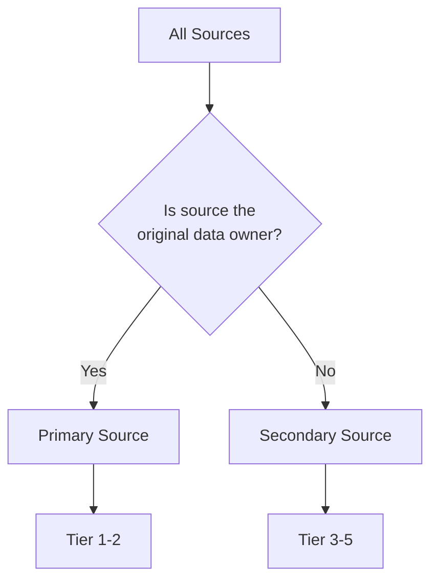

# Source Types and Reliability

> The Evidence Engine classifies every source URL by type and reliability tier. These classifications determine how much weight a source carries in confidence scoring and whether a single source is sufficient for verification.

## Primary vs. Secondary Sources



### Primary Sources (Tier 1–2)

Primary sources are the original publisher of the information. They require no intermediary interpretation.

| Source | Tier | Examples | Single-Source Accepted? |
|--------|------|----------|-------------------------|
| Official company website | 1 | `technova.in/about` | Yes (for basic facts) |
| Regulatory filings | 1 | MCA filings, SEBI disclosures, ROC documents | Yes |
| Official company blog | 1 | `blog.technova.in` | Yes (for announcements) |
| Press release on company site | 1 | `technova.in/press/expansion` | Yes |
| LinkedIn company page | 2 | `linkedin.com/company/technova` | No |
| Crunchbase profile | 2 | `crunchbase.com/organization/technova` | No |
| Government databases | 1 | India Company Register | Yes |

### Secondary Sources (Tier 3–5)

Secondary sources report on or summarize information originally published elsewhere.

| Source | Tier | Examples | Single-Source Accepted? |
|--------|------|----------|-------------------------|
| Business news (major) | 3 | Economic Times, Business Standard, MoneyControl | No |
| Business news (minor) | 4 | Regional business journals | No |
| Industry reports | 3 | Gartner, NASSCOM, KPMG | No |
| Job boards | 3 | Naukri.com, LinkedIn Jobs, Indeed | No |
| Glassdoor / AmbitionBox | 4 | Company reviews, salary data | No |
| Social media (non-official) | 5 | Twitter posts, Reddit discussions | No |
| Anonymous / unverifiable | 5 | Unattributed blog posts, rumors | No |

## Reliability Tiers in Detail

### Tier 1 — Official Primary Source

The highest reliability. Information published directly by the company or a government body.

**Characteristics**: `.gov.in`, `.ac.in` domains; company-owned domains; signed filings with the Registrar of Companies. No editorial process between the fact and publication.

**Weight in confidence scoring**: 1.0 (full weight). A Tier 1 source alone may be sufficient for verification for basic factual claims (company name, founded year, registered address).

### Tier 2 — Verified Aggregator

Curated data from primary sources. The aggregator adds structure but does not change the underlying facts.

**Characteristics**: LinkedIn profiles (verified companies), Crunchbase (funding data from press releases), Registrar of Companies portals. The source may lag the primary source by days or weeks but is generally accurate.

**Weight**: 0.85. Requires at least one supporting source for verification unless the claim is a simple factual assertion.

### Tier 3 — Professional Secondary

Established media or research organizations with editorial standards.

**Characteristics**: Known business publications, industry analyst reports, major news outlets. Editorial process introduces potential bias but factual claims are generally researched.

**Weight**: 0.7. Always requires a second source for verification.

### Tier 4 — Unverified Secondary

Platforms where user-generated content may not be fact-checked.

**Characteristics**: Glassdoor reviews, AmbitionBox, Reddit discussions, unknown blogs. Information may be accurate but is not verified by any editorial process.

**Weight**: 0.4. Requires at least two additional sources for verification.

### Tier 5 — Unreliable

Sources with no accountability or known history of inaccuracy.

**Characteristics**: Anonymous posts, unverified social media, content scrapers. Should be treated as rumor unless corroborated by multiple Tier 1–2 sources.

**Weight**: 0.1. Requires three or more corroborating sources. Claims supported only by Tier 5 sources are typically discarded.

## Source Freshness Requirements

Sources have a freshness window. Data older than the window is considered stale and loses confidence weight:

| Data Type | Freshness Window | Decay After |
|-----------|-----------------|-------------|
| Employee count | 90 days | 0.1x per month |
| Funding round | 365 days | 0.2x per quarter |
| Lease / office info | 180 days | 0.15x per month |
| Management team | 365 days | 0.1x per quarter |
| Company description | 365 days | 0.1x per half-year |
| Industry classification | 730 days | No decay |

```sql
-- Adjust confidence based on source freshness
SELECT
    s.source_url,
    s.reliability_tier,
    s.captured_at,
    CASE
        WHEN s.source_type IN ('employee_count', 'headcount')
            AND s.captured_at < now() - interval '90 days'
        THEN s.reliability_tier * 0.5 -- half confidence for stale data
        ELSE s.reliability_tier
    END AS adjusted_tier
FROM evidence_sources s;
```

## Source Deduplication

The same source URL may be captured by multiple pipeline runs. The Evidence Engine deduplicates by `source_url`:

```sql
-- Keep only the most recent capture of each URL
SELECT DISTINCT ON (s.source_url)
    s.id, s.source_url, s.extracted_content, s.captured_at
FROM evidence_sources s
ORDER BY s.source_url, s.captured_at DESC;
```

This prevents the same article from being counted as multiple sources for verification purposes.
