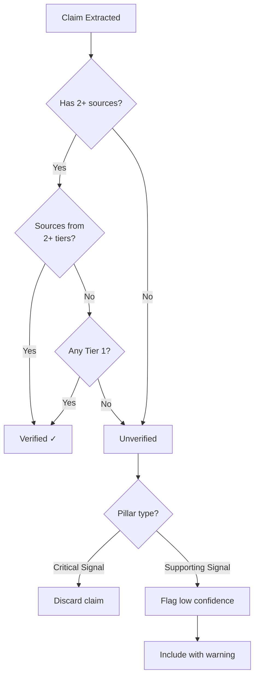

# 2-Source Verification Rule

> The core verification policy: every claim reaching the broker must be supported by at least two independent sources. This rule is the primary defense against AI hallucination and single-source errors.

## The Rule

**A claim is considered `verified` when it is supported by at least two sources from at least two different reliability tiers, OR one source from Tier 1.**

```sql
-- Verification check logic
CREATE OR REPLACE FUNCTION is_claim_verified(p_claim_id uuid)
RETURNS boolean AS $$
DECLARE
    v_tier1_count integer;
    v_total_count integer;
    v_distinct_tiers integer;
BEGIN
    -- Count Tier 1 sources
    SELECT COUNT(*) INTO v_tier1_count
    FROM evidence_sources
    WHERE claim_id = p_claim_id AND reliability_tier = 1;

    -- If any Tier 1 source exists, claim is verified
    IF v_tier1_count > 0 THEN
        RETURN true;
    END IF;

    -- Otherwise, need 2+ sources from 2+ different tiers
    SELECT COUNT(DISTINCT reliability_tier) INTO v_distinct_tiers
    FROM evidence_sources
    WHERE claim_id = p_claim_id;

    SELECT COUNT(*) INTO v_total_count
    FROM evidence_sources
    WHERE claim_id = p_claim_id;

    RETURN v_total_count >= 2 AND v_distinct_tiers >= 2;
END;
$$ LANGUAGE plpgsql;
```

### Why 2 Sources?

A single source can be wrong. The company's website may be outdated. A news article may misstate facts. LinkedIn profiles can be inflated. Requiring a second source from a different tier dramatically reduces the probability of error:

- **Two Tier 3 sources**: Low probability that two independent news outlets would publish the same wrong fact
- **One Tier 1 + one Tier 3**: The official source plus media corroboration
- **Two Tier 2 sources**: LinkedIn + Crunchbase agreeing on the same employee count

The 2-source rule is not absolute — there are exceptions (see below) — but it is the default and the standard against which the Verification Agent judges all claims.

## Verification Process



### Step 1: Source Collection

The Specialist Agents attempt to collect multiple sources for every claim they extract. The Growth Agent, for example, looks for hiring data on LinkedIn, the company's careers page, and news articles — all pointing to the same headcount number.

### Step 2: Verification Check

The Verification Agent runs `is_claim_verified()` for each claim. Verified claims proceed to scoring. Unverified claims are routed based on their importance:

### Step 3: Routing Unverified Claims

| Claim Type | Example | Action |
|------------|---------|--------|
| Pillar-critical signal | "200 new hires in Q2" | Discarded if unverifiable |
| Supporting signal | "Company has modern React-based tech stack" | Flagged as low confidence, included with warning |
| Basic fact | "Founded in 2015" | May be accepted from single source if Tier 1 |
| Speculative | "May be planning expansion" | Discarded unless strong evidence |

### Step 4: Confidence Adjustment

For claims that pass verification but with weak sources (both Tier 4, for example), the confidence score is adjusted downward:

```sql
-- Confidence penalty for weak verification
UPDATE evidence_claims
SET confidence_score = confidence_score * 0.5
WHERE id = 'claim-id'
  AND is_verified = true
  AND (
      SELECT COUNT(*) FROM evidence_sources
      WHERE claim_id = 'claim-id' AND reliability_tier <= 2
  ) = 0;
```

## Exceptions

### Single-Source Acceptance

A single source is accepted if:

1. **The source is Tier 1** (official company website, regulatory filing, government database). These are considered self-authenticating.
2. **The claim is a simple factual assertion** that is unlikely to be wrong (company name, founded year, industry classification).
3. **The claim is negative** (absence of a signal). It is impossible to find a second source proving something does not exist.

### Emergency Override

The Judge layer can override the 2-source rule for specific claims if:

1. The single source is exceptionally high quality (Tier 1, major publication with named author)
2. The claim is critical to the lead assessment
3. The override is documented with the reason in the evidence snapshot metadata

### Tier 5 Minimum

Claims supported only by Tier 5 sources (anonymous, unverifiable) require **three** sources for verification and must be corroborated by at least one Tier 3+ source. In practice, Tier 5-only claims are almost always discarded.

## Unverified Data Handling

Data that fails verification is not simply deleted — it follows a graduated retention policy:

| Verification Status | Retained In DB? | Visible to Broker? | Used in Scoring? |
|-------------------|-----------------|---------------------|------------------|
| Verified (2+ sources) | Yes | Yes | Yes |
| Single Tier 1 source | Yes | Yes (with note) | Yes (reduced weight) |
| Single Tier 2-3 source | Yes | No | No |
| Failed verification | Yes (30 days) | No | No |
| Tier 5 only | No (discarded) | — | — |

Unverified data is retained in the database for 30 days for debugging purposes, then pruned. This allows developers to inspect why verification failed and improve the scraping or agent prompts.
