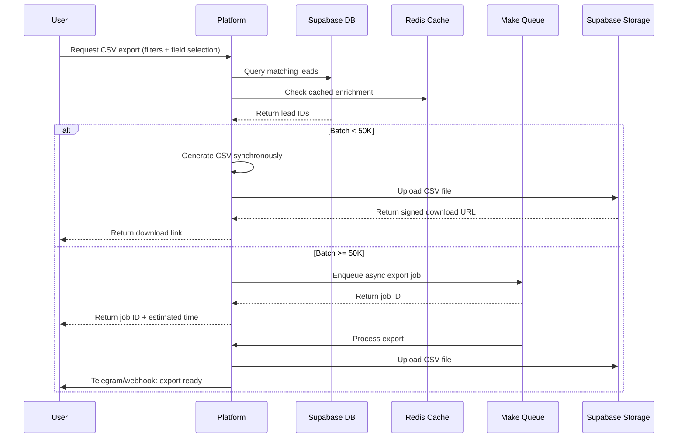

# CSV Export Specification

## Overview

The CSV export is the primary bulk-data interchange format for the Jasfo Lead Intelligence Platform. It is designed to support downstream ingestion into CRMs (Salesforce, HubSpot, Pipedrive), marketing automation tools (Marketo, Mailchimp), and analytics pipelines. Every export produces a single UTF-8 encoded `.csv` file with a BOM for Excel compatibility, CRLF line terminators, and double-quote escaping for fields containing commas or newlines.

The export spans approximately **150 columns** organized into logical field groups: identity, contact, company, enrichment, verification, intelligence, and metadata. Each value is accompanied by a confidence score, primary and secondary source attributions, source and verification URLs, and a timestamp. This structure enables consumers to make trust-aware decisions about every data point.

A standard lead export for a batch of 10,000 records produces a file of roughly 8–12 MB, depending on the depth of enrichment available for each lead. Exports are generated synchronously for batches under 50,000 records and asynchronously for larger volumes, with a download link delivered via webhook or Telegram notification.

---

## Column Specification

### Identity Fields

| # | Column | Type | Description |
|---|--------|------|-------------|
| 1 | `lead_id` | UUID v7 | Unique lead identifier |
| 2 | `first_name` | string | First name |
| 3 | `middle_name` | string | Middle name or initial |
| 4 | `last_name` | string | Last name |
| 5 | `full_name` | string | Full name (display format) |
| 6 | `name_prefix` | string | Dr., Mr., Ms., etc. |
| 7 | `name_suffix` | string | Jr., III, etc. |
| 8 | `nickname` | string | Professional or preferred name |
| 9 | `job_title` | string | Current job title |
| 10 | `job_title_level` | enum | C-Level / VP / Director / Manager / IC |
| 11 | `job_title_category` | string | Normalized role category |
| 12 | `email` | string | Primary email address |
| 13 | `email_alternative` | string | Secondary email |
| 14 | `email_pattern` | string | Pattern: `first.last@domain` |
| 15 | `phone` | string | Primary phone (E.164) |
| 16 | `phone_alternative` | string | Secondary phone |
| 17 | `phone_type` | enum | Mobile / Direct / Switchboard / Fax |
| 18 | `phone_country_code` | string | Country code from number |
| 19 | `mobile_phone` | string | Mobile phone (E.164) |
| 20 | `linkedin_url` | string | LinkedIn profile URL |
| 21 | `linkedin_id` | string | LinkedIn numeric ID |
| 22 | `twitter_handle` | string | X/Twitter username |
| 23 | `github_handle` | string | GitHub username |
| 24 | `facebook_url` | string | Facebook profile URL |
| 25 | `personal_website` | string | Personal domain or URL |
| 26 | `photo_url` | string | Profile photo URL |
| 27 | `bio` | string | Professional biography |
| 28 | `timezone` | string | IANA timezone identifier |
| 29 | `location_city` | string | City from profile |
| 30 | `location_state` | string | State or region |
| 31 | `location_country` | string | ISO 3166-1 alpha-2 country code |
| 32 | `location_metro` | string | Metro/DMA area |
| 33 | `languages` | string | Comma-separated language list |

### Enrichment Fields

| # | Column | Type | Description |
|---|--------|------|-------------|
| 34 | `email_verified` | boolean | SMTP RCPT TO verification result |
| 35 | `email_quality_score` | float | 0.0–1.0 deliverability score |
| 36 | `email_verification_method` | string | Method: smtp / api / pattern / catch-all |
| 37 | `email_catch_all` | boolean | Domain accepts catch-all |
| 38 | `email_disposable` | boolean | Disposable email domain |
| 39 | `email_role_account` | boolean | Role-based (info@, sales@) |
| 40 | `email_accept_all` | boolean | Accept-all server |
| 41 | `email_deliverable` | enum | Deliverable / Risky / Undeliverable / Unknown |
| 42 | `phone_verified` | boolean | Phone verification result |
| 43 | `phone_verification_method` | string | Method: sms / api / carrier-lookup |
| 44 | `phone_active` | boolean | Phone line is active |
| 45 | `phone_carrier` | string | Mobile carrier name |
| 46 | `phone_line_type` | string | Mobile / VoIP / Landline |

### Company Fields

| # | Column | Type | Description |
|---|--------|------|-------------|
| 47 | `company_name` | string | Current employer name |
| 48 | `company_domain` | string | Company primary domain |
| 49 | `company_legal_name` | string | Registered legal name |
| 50 | `company_website` | string | Company website URL |
| 51 | `company_description` | string | Company description |
| 52 | `company_industry` | string | Industry classification |
| 53 | `company_industry_naics` | string | NAICS code |
| 54 | `company_industry_sic` | string | SIC code |
| 55 | `company_size` | integer | Employee count |
| 56 | `company_size_range` | string | 1-10 / 11-50 / 51-200 / 201-1000 / 1001+ |
| 57 | `company_revenue` | integer | Annual revenue (USD) |
| 58 | `company_revenue_range` | string | Revenue range bucket |
| 59 | `company_funding_total` | integer | Total funding (USD) |
| 60 | `company_funding_rounds` | integer | Number of funding rounds |
| 61 | `company_funding_last_round` | string | Last funding round type |
| 62 | `company_funding_last_date` | date | Last funding date |
| 63 | `company_investors` | string | Key investors |
| 64 | `company_stock_symbol` | string | Public stock ticker |
| 65 | `company_stock_exchange` | string | Exchange: NYSE / NASDAQ / LSE |
| 66 | `company_founded_year` | integer | Year founded |
| 67 | `company_headquarters_city` | string | HQ city |
| 68 | `company_headquarters_state` | string | HQ state |
| 69 | `company_headquarters_country` | string | HQ country (ISO 3166-1 alpha-2) |
| 70 | `company_headquarters_address` | string | Full HQ address |
| 71 | `company_phone` | string | Company main phone |
| 72 | `company_email` | string | Company contact email |
| 73 | `company_linkedin_url` | string | Company LinkedIn URL |
| 74 | `company_twitter_handle` | string | Company X/Twitter |
| 75 | `company_crunchbase_url` | string | Crunchbase URL |
| 76 | `company_facebook_url` | string | Company Facebook |
| 77 | `company_technologies` | string | Technology stack tags |
| 78 | `company_alexa_rank` | integer | Alexa web ranking |
| 79 | `company_domain_authority` | integer | Domain authority score |
| 80 | `company_social_links` | string | JSON array of social URLs |

### Intelligence Fields

| # | Column | Type | Description |
|---|--------|------|-------------|
| 81 | `intent_score` | float | 0.0–1.0 buying intent score |
| 82 | `intent_signal` | string | Primary intent signal detected |
| 83 | `intent_keywords` | string | Trigger keywords found |
| 84 | `intent_source` | string | Where intent was detected |
| 85 | `intent_last_detected` | datetime | Last intent signal timestamp |
| 86 | `engagement_score` | float | 0.0–1.0 engagement likelihood |
| 87 | `engagement_channels` | string | Active engagement channels |
| 88 | `technology_affinity` | string | Technologies the lead uses |
| 89 | `seniority_level` | string | Estimated seniority level |
| 90 | `decision_making_power` | string | Likely: Decision Maker / Influencer / User |
| 91 | `budget_estimate` | string | Estimated budget tier |
| 92 | `purchase_timeframe` | string | Estimated buying timeline |
| 93 | `pain_points` | string | Detected pain points |
| 94 | `competitor_usage` | string | Competitor products in use |
| 95 | `content_consumed` | string | Content topics engaged with |
| 96 | `event_attendance` | string | Events attended or registered |
| 97 | `certifications` | string | Professional certifications |

### Source & Verification Fields

| # | Column | Type | Description |
|---|--------|------|-------------|
| 98–143 | `{field}_value` | varies | The value itself |
| 98–143 | `{field}_confidence` | float | 0.0–1.0 confidence score |
| 98–143 | `{field}_primary_source` | string | Primary data source |
| 98–143 | `{field}_secondary_source` | string | Corroborating source |
| 98–143 | `{field}_source_url` | string | URL where value was found |
| 98–143 | `{field}_verification_url` | string | URL of verification evidence |
| 98–143 | `{field}_verified_at` | datetime | When the value was last verified |

The above applies to each of the 6 core evidence fields per value. In the actual CSV, each significant value column is followed by its 6 metadata columns. For example, for `email`:

```
email_value,email_confidence,email_primary_source,email_secondary_source,email_source_url,email_verification_url,email_verified_at
john@acme.com,0.95,Apollo.io,Hunter.io,https://apollo.io/...,https://hunter.io/...,2026-07-12T10:30:00Z
```

### Metadata Fields

| # | Column | Type | Description |
|---|--------|------|-------------|
| 144 | `created_at` | datetime | Lead creation timestamp |
| 145 | `updated_at` | datetime | Last update timestamp |
| 146 | `exported_at` | datetime | Export generation timestamp |
| 147 | `batch_id` | UUID | Export batch identifier |
| 148 | `source_campaign` | string | Campaign that sourced lead |
| 149 | `lead_status` | enum | New / Contacted / Qualified / Converted / Archived |
| 150 | `tags` | string | Comma-separated user tags |
| 151 | `notes` | string | Internal notes |

---

## Schema Definition

### Column Mapping Convention

Every value-bearing field `{field}` generates 7 columns in the following order:

```
{field}_value
{field}_confidence
{field}_primary_source
{field}_secondary_source
{field}_source_url
{field}_verification_url
{field}_verified_at
```

This applies to all identity, company, and intelligence fields. Fields that are system-generated (`lead_id`, `created_at`, etc.) do not carry source metadata.

### Data Types

| CSV Type | Encoding | Example |
|----------|----------|---------|
| string | UTF-8, quoted | `"John Smith"` |
| integer | Plain digits | `450` |
| float | Decimal notation | `0.92` |
| boolean | `true` / `false` | `false` |
| datetime | ISO 8601 UTC | `2026-07-12T10:30:00Z` |
| date | ISO 8601 date | `2026-07-12` |
| UUID | Hyphenated hex | `0194f1c0-...` |
| enum | Controlled string | `C-Level` |
| array | JSON string | `"[\"AWS\",\"GCP\"]"` |

### Field Rules

- Empty string for unknown string fields
- Empty string for unknown enum fields
- `0` for unknown integer fields (not nullable)
- `0.0` for unknown float fields
- Empty string for unknown datetime fields
- Confidence is always populated (0.0 when unknown)
- Source fields are empty when derived internally (system-generated)

---

## Header Row

```csv
lead_id,first_name_value,first_name_confidence,first_name_primary_source,first_name_secondary_source,first_name_source_url,first_name_verification_url,first_name_verified_at,last_name_value,...
```

The header uses lowercase snake_case. Every column in the schema appears exactly once.

---

## Export Flow



---

## File Format Parameters

| Parameter | Value |
|-----------|-------|
| Encoding | UTF-8 with BOM |
| Line terminator | CRLF (`\r\n`) |
| Quote character | `"` (double quote) |
| Escape character | `""` (double-double quote) |
| Delimiter | `,` (comma) |
| Header row | Included |
| Null representation | Empty string `""` |
| File extension | `.csv` |
| Max file size (sync) | 50 MB |
| Max file size (async) | 500 MB |
| Max rows (sync) | 50,000 |
| Max rows (async) | 2,000,000 |

---

## Error Handling

| Condition | Behavior |
|-----------|----------|
| Empty result set | CSV with header row only |
| Timeout during sync export | Returns error; suggest async |
| Storage upload failure | Retries 3 times; fails with error code |
| Partial enrichment | Emits best available data; confidence reflects completeness |
