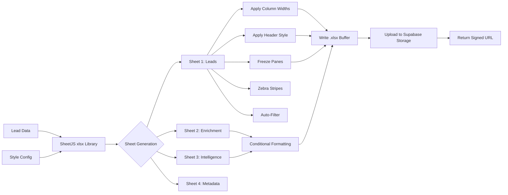

# Excel Export Specification

## Overview

The Excel export provides a formatted, human-readable `.xlsx` representation of lead intelligence data. It is designed for sales teams, account executives, and managers who need to review, annotate, and share lead data in spreadsheet form. The export supports multi-sheet workbooks with frozen header rows, column auto-width, conditional formatting for confidence scoring, and branded styling.

The workbook uses the Open XML Spreadsheet (`.xlsx`) format (ISO 29500), generated server-side via the SheetJS library. Each workbook contains a configurable subset of the 150-column schema, organized across dedicated sheets. The file is fully compatible with Microsoft Excel 2016+, Google Sheets, Apple Numbers, and LibreOffice Calc.

---

## Workbook Structure

### Sheet 1: Leads (Main)

The primary data sheet contains one lead per row with the selected column set. Default selection includes approximately 40 core columns focused on identity, contact, and company data.

**Column Widths**

| Column Group | Default Width | Measurement |
|-------------|---------------|-------------|
| Identity (name, title) | 28 characters | ~22.5 Excel units |
| Email / Phone | 35 characters | ~28 Excel units |
| Company name | 30 characters | ~24 Excel units |
| URLs | 45 characters | ~36 Excel units |
| Scores (confidence, intent) | 12 characters | ~10 Excel units |
| Dates | 18 characters | ~14 Excel units |
| Tags / Notes | 40 characters | ~32 Excel units |

**Header Style**

```
Font: Calibri Bold, 11pt, White (#FFFFFF)
Fill: Dark Blue (#1B3A5C)
Border: Bottom thin white line
Alignment: Center vertical, Wrap text on
Row height: 30pt
```

**Data Rows**

```
Font: Calibri Regular, 10pt, Black (#333333)
Zebra striping: Light gray (#F5F7FA) on even rows
Row height: 20pt (auto-height for wrapped text)
```

**Frozen Rows**

Row 1 (header) is frozen. When the user scrolls down, the header remains visible. Column A (Lead ID) is also frozen when scrolling horizontally.

### Sheet 2: Enrichment Details

Contains the per-field verification metadata for the lead: confidence scores, sources, source URLs, verification URLs, and timestamps. One row per lead-field combination. This sheet is the raw evidence trail.

| Column | Width | Description |
|--------|-------|-------------|
| Lead ID | 32 | UUID reference |
| Field Name | 22 | Field identifier |
| Value | 35 | Current value |
| Confidence | 12 | 0.00–1.00 |
| Primary Source | 20 | Source provider |
| Secondary Source | 20 | Corroborating provider |
| Source URL | 45 | Origin URL |
| Verification URL | 45 | Verification evidence |
| Verified At | 20 | Timestamp |

**Conditional Formatting**

- Confidence >= 0.90: Green fill (#E8F5E9)
- Confidence 0.70–0.89: Yellow fill (#FFF8E1)
- Confidence < 0.70: Red fill (#FFEBEE)

### Sheet 3: Intelligence Summary

Aggregated intelligence scores and signals. One row per lead with intent, engagement, and behavioral data.

| Column | Width | Description |
|--------|-------|-------------|
| Lead ID | 32 | UUID reference |
| Intent Score | 12 | 0.0–1.0 |
| Intent Signal | 28 | Primary signal |
| Engagement Score | 12 | 0.0–1.0 |
| Seniority Level | 18 | Estimated seniority |
| Decision Power | 22 | Decision maker type |
| Budget Estimate | 18 | Budget tier |
| Pain Points | 40 | Detected pain points |
| Competitor Usage | 30 | Competitor products |
| Content Consumed | 40 | Topics engaged with |
| Last Updated | 20 | Timestamp |

**Conditional Formatting**

- Intent Score > 0.80: Hot orange gradient to red
- Intent Score 0.50–0.80: Yellow gradient
- Intent Score < 0.50: No highlight

### Sheet 4: Export Metadata

Single-table metadata sheet documenting export parameters.

| Parameter | Value |
|-----------|-------|
| Export Timestamp | ISO 8601 UTC |
| Export Type | Full / Incremental / Filtered |
| Lead Count | Integer |
| Filter Criteria | Applied filters JSON |
| Platform Version | Semver |
| Generated By | System user ID |

---

## Formatting Specifications



### Style Definitions

| Element | Style |
|---------|-------|
| Header font | Calibri Bold, 11pt |
| Header fill | `#1B3A5C` solid |
| Header font color | `#FFFFFF` |
| Data font | Calibri Regular, 10pt |
| Data font color | `#333333` |
| Even row fill | `#F5F7FA` |
| URL styling | Hyperlink, blue underline |
| Number format | `#,##0` for integers |
| Float format | `0.00` for scores |
| Date format | `yyyy-mm-dd hh:mm:ss` |
| Border style | Thin gray `#D0D5DD` |

---

## Export Options

| Option | Default | Description |
|--------|---------|-------------|
| `sheets` | All 4 | Which sheets to include |
| `columns` | Default set | Specific columns for Leads sheet |
| `freeze_headers` | true | Freeze row 1 |
| `auto_filter` | true | Add auto-filter dropdown |
| `conditional_formatting` | true | Apply score color coding |
| `brand_header` | true | Include platform branding |
| `password` | None | Optional sheet protection password |
| `max_rows` | 1,000,000 | Excel row limit |

---

## File Size Estimates

| Leads | Sheets | File Size |
|-------|--------|-----------|
| 100 | All 4 | ~250 KB |
| 1,000 | All 4 | ~1.8 MB |
| 10,000 | Leads only | ~6 MB |
| 10,000 | All 4 | ~14 MB |
| 100,000 | Leads only | ~55 MB |
