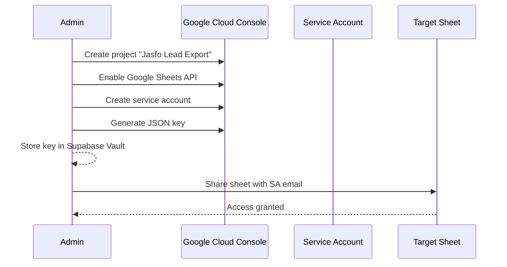

# Google Sheets Integration

## Overview

The Google Sheets integration enables automatic export of lead intelligence data directly into a shared Google Sheet. This is designed for teams that collaborate in Google Workspace — sales ops managers who maintain shared lead trackers, revenue operations teams building dashboards on top of live lead data, and stakeholders who prefer viewing data in Google Sheets rather than the platform UI.

The integration uses the Google Sheets API v4 via OAuth 2.0 service account credentials. Once configured, the platform can push new leads, update existing rows, and maintain a live view of the lead pipeline. The sheet is updated incrementally — only new or changed fields are written on each sync, minimizing API quota consumption.

---

## Authentication Setup

### Service Account Configuration



1. Create a Google Cloud project and enable the Google Sheets API
2. Create a service account with the `editor` role
3. Generate and download a JSON key file
4. Store the key file contents in **Supabase Vault** as `sheets.service_account_key`
5. Share the target Google Sheet with the service account email (as Editor)

### OAuth Scopes

```
https://www.googleapis.com/auth/spreadsheets
```

The integration requires only the `spreadsheets` scope. No other Google APIs are needed.

---

## Sheet Structure

### Tab: Leads (Primary)

The primary tab mirrors the CSV column schema. Columns are written in the same order as the CSV specification. The first row contains column headers with bold formatting.

**Column Layout**

| A | B | C | ... |
|---|---|---|---|
| Lead ID | First Name | Last Name | ... |
| 0194f1c0.. | John | Smith | ... |
| ... | ... | ... | ... |

Column widths are auto-sized on first write. The header row is frozen.

### Tab: Schema (Reference)

A read-only reference tab documenting:

| Column | Column Name | Type | Description |
|--------|-------------|------|-------------|
| 1 | `lead_id` | UUID | Primary key |
| 2 | `first_name_value` | string | ... |

This tab is auto-generated and updated when the schema changes.

### Tab: Sync Log

| Timestamp | Action | Rows Written | Status |
|-----------|--------|-------------|--------|
| 2026-07-12T10:30:00Z | upsert | 45 | success |
| 2026-07-12T08:00:00Z | full | 1200 | success |

---

## Sync Operations

### Full Export

Replaces the entire Leads tab with fresh data. Used for initial setup or complete refreshes.

```
POST https://sheets.googleapis.com/v4/spreadsheets/{sheet_id}/values/Leads!A1:clear
PUT https://sheets.googleapis.com/v4/spreadsheets/{sheet_id}/values/Leads!A1:append
```

### Incremental Update

Only writes rows where data has changed since the last sync. Uses the `lead_id` column as the lookup key.

```
GET https://sheets.googleapis.com/v4/spreadsheets/{sheet_id}/values/Leads!A:A
-- Compare lead IDs locally --
POST range update for changed rows only
```

### Append New Leads

Adds new leads at the end of the sheet without modifying existing rows.

```
POST https://sheets.googleapis.com/v4/spreadsheets/{sheet_id}/values/Leads!A:append
```

---

## Implementation in Make.com

### Scenario: Export Leads to Google Sheets

| Module | Purpose |
|--------|---------|
| Webhook | Receive export trigger |
| Supabase: Search rows | Query leads matching filter |
| Iterator | Process in batches of 100 |
| Google Sheets: Update Row | Upsert each lead |
| Google Sheets: Append Row | Insert new leads |
| Slack / Telegram | Notify on completion |

### Rate Limiting

The Google Sheets API has a quota of 300 requests per 60 seconds per project. The integration maintains a token bucket to stay within limits. Large exports are batched using the `valueInputOption=USER_ENTERED` batch update API.

---

## Configuration

| Parameter | Environment Variable | Default |
|-----------|---------------------|---------|
| Sheet ID | `SHEETS_SHEET_ID` | — |
| Service Account Key | `SHEETS_SERVICE_ACCOUNT` | (Vault) |
| Sync Interval | `SHEETS_SYNC_INTERVAL` | 15 minutes |
| Max Rows | `SHEETS_MAX_ROWS` | 500,000 |
| Incremental Only | `SHEETS_INCREMENTAL` | true |

---

## Error Handling

| Error | Handling |
|-------|----------|
| Quota exceeded | Retry with exponential backoff (max 3 retries) |
| Sheet not found | Recreate tab and re-run full export |
| Permission denied | Alert admin to re-share sheet with SA |
| Rate limited | Queue and batch; resume when token bucket refills |
