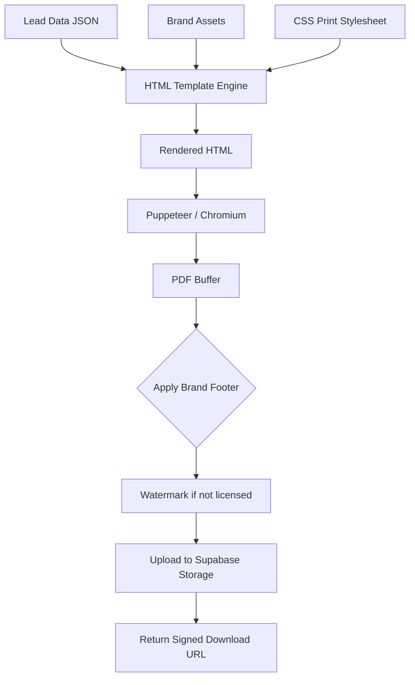

# PDF Export Specification

## Overview

The PDF export produces a branded, print-ready Lead Intelligence Report for each lead. It is designed for sales professionals who need a portable, professional document they can share with stakeholders, print for meetings, or attach to CRM records. Each report presents the lead's complete intelligence profile in a clean, scannable layout with clear visual hierarchy.

The PDF is generated server-side using Puppeteer (headless Chromium) to render an HTML template into a PDF document. This approach gives pixel-perfect control over layout, typography, and branding while supporting standard CSS print features like page breaks, headers, and footers.

---

## Document Structure

### Cover Page

The first page serves as a cover sheet containing:

- Platform logo and branding header
- Document title: "Lead Intelligence Report"
- Lead full name and job title
- Company name and domain
- Report generation date and batch ID
- Classification badge (internal only)
- A prominent intent score gauge (visual)
- QR code linking to the lead's platform profile

### Page 2: Executive Summary

A one-page overview with:

- Lead identity card (name, title, email, phone, LinkedIn)
- Company snapshot (domain, industry, size, revenue range, HQ location)
- Verification status summary with color indicators
- Intent and engagement scores with confidence bars
- Key intelligence highlights (pain points, competitor usage, decision power)

### Page 3: Identity & Contact Details

Detailed identity information with per-field evidence:

- Full name with prefix/suffix
- Job title, seniority level, role category
- Email address with verification badge (Verified / Risky / Unknown)
- Phone numbers with type and carrier
- Social media profiles with linked URLs
- Location (city, state, country, timezone)
- Professional bio and certifications

Each contact method has an associated confidence bar and source attribution.

### Page 4: Company Profile

Company intelligence presented in a two-column layout:

- Company name, legal name, website
- Industry (NAICS / SIC codes)
- Employee count and revenue range
- Funding history: total raised, last round, key investors
- Stock information (if public)
- Headquarters address and phone
- Technology stack tags
- Social presence and domain authority

### Page 5: Intelligence & Signals

Advanced intelligence section:

- Intent score breakdown with signal sources
- Engagement probability metrics
- Pain points as a ranked list
- Competitor products detected in use
- Content consumption patterns
- Event attendance history
- Purchase timeframe estimate
- Budget tier recommendation

### Page 6: Verification Evidence

Complete verification evidence for every field:

- Email verification method, quality score, catch-all status
- Phone verification method, carrier, line type
- Source attribution for all enriched fields
- URLs where data was discovered
- Verification URLs with methodology notes
- Confidence scores for every data point

### Page 7: Data Sources

Provenance documentation:

- Each source provider used (Apollo.io, Hunter.io, Snov.io, LinkedIn, etc.)
- For each source: fields contributed, confidence contribution, query timestamp
- Verification methods employed
- Data freshness indicators

### Page 8: Export Metadata

Document metadata:

```
Report Generated: 2026-07-12T10:30:00Z
Lead ID: 0194f1c0-...
Batch ID: 0194f1c0-...
Platform Version: 2.1.0
Generated By: system
Total Fields Exported: 151
Sources Queried: 7
Verification Methods: 3
```

---

## Formatting Specifications



### Page Layout

| Parameter | Value |
|-----------|-------|
| Page size | A4 (210mm × 297mm) |
| Orientation | Portrait |
| Margins | 15mm top, 15mm bottom, 12mm left, 12mm right |
| Header | 10mm (brand logo + page title) |
| Footer | 10mm (page X of Y, export date) |
| Font family | Inter (body), Inter Semi-Bold (headings) |
| Body size | 9pt |
| Heading sizes | 18pt (h1), 14pt (h2), 11pt (h3) |
| Line height | 1.5x body |
| Color space | CMYK-compatible RGB |

### Brand Header

- Left: 24px × 24px logo
- Center: "Jasfo Lead Intelligence" in 8pt caps
- Right: Document classification badge
- Bottom: 0.5pt divider line in brand blue (`#1B3A5C`)

### Brand Footer

- Left: "Confidential — Jasfo Lead Intelligence Platform"
- Center: "Page X of Y"
- Right: Export timestamp
- Top: 0.5pt divider line

### Color Palette

| Element | Color | Usage |
|---------|-------|-------|
| Primary text | `#1A1A2E` | Body, headings |
| Secondary text | `#6B7280` | Labels, metadata |
| Brand accent | `#1B3A5C` | Dividers, badges |
| Success | `#10B981` | Verified badges |
| Warning | `#F59E0B` | Risky indicators |
| Error | `#EF4444` | Failed verification |
| Background | `#FFFFFF` | Page |
| Alt background | `#F8FAFC` | Card backgrounds |

---

## Print Behavior

| Feature | Implementation |
|---------|---------------|
| Page breaks | `page-break-after: always` between sections |
| Orphan control | `orphans: 3` minimum lines |
| Widow control | `widows: 3` minimum lines |
| Table breaks | `page-break-inside: avoid` on tables |
| Image rendering | `print-color-adjust: exact` to preserve colors |
| Hyperlinks | Underlined, blue, printed URL in parentheses |
| Backgrounds | Forced rendering (`-webkit-print-color-adjust: exact`) |

---

## File Characteristics

| Property | Value |
|----------|-------|
| Format | PDF 2.0 (ISO 32000-2) |
| PDF/A | PDF/A-2b compliant |
| Compression | Deflate for text, JPEG for images |
| Font embedding | Inter subset (Latin) |
| Metadata | XMP metadata embedded |
| Tagged | Tagged PDF for accessibility |
| File size | ~300–500 KB (8 pages) |
| Encryption | AES-256 if password-protected |

---

## Download & Delivery

PDFs are generated on demand and cached for 24 hours. Delivery options:

- Direct download via signed S3-compatible URL (expires in 1 hour)
- Email attachment (if explicitly requested)
- Telegram document upload (for mobile access)
- Webhook URL delivery
