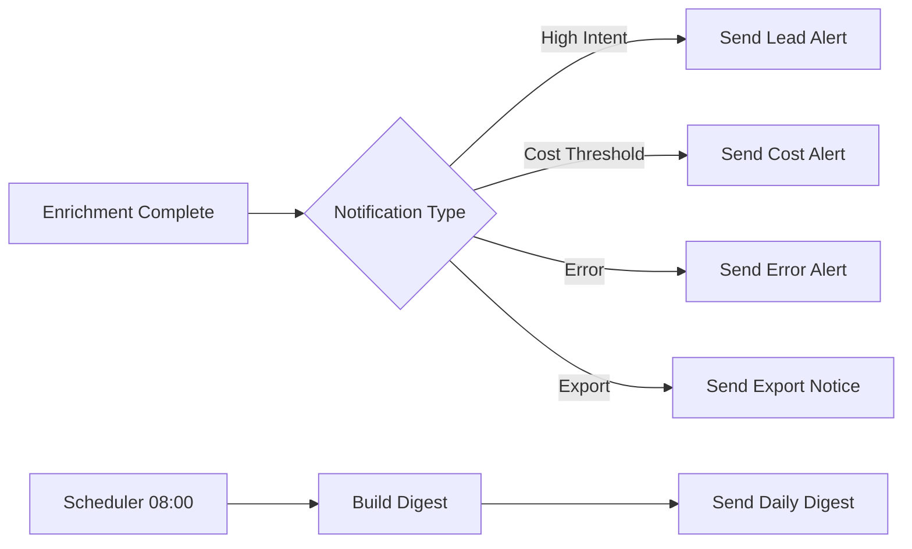

# Telegram Notification System

## Overview

The Telegram notification system provides real-time alerts and daily digests delivered to the platform operator via a Telegram bot. It is designed for mobile-first incident response — enabling the operator to monitor lead flow, enrichment costs, system errors, and export completions without logging into the platform. Notifications are sent to a single chat (the broker/operator's chat) using the Telegram Bot API.

The system uses a tiered notification model: **alerts** are immediate and critical (errors, cost limit reached), **updates** are near-real-time (new lead batch processed), and **digests** are scheduled daily summaries. All notifications use styled markdown messages with optional inline keyboards for actionable responses.

---

## Bot Setup

### Creating the Bot

1. Open Telegram and search for **BotFather**
2. Send `/newbot` and follow the prompts
3. Copy the API token: `123456:ABC-DEF1234ghIkl-zyx57W2v1u123ew11`
4. Store the token in Supabase Vault as `telegram.bot_token`
5. Start a chat with the bot and send `/start`
6. Retrieve the chat ID by visiting `https://api.telegram.org/bot<token>/getUpdates`
7. Store the chat ID in configuration as `telegram.chat_id`

### Environment Variables

| Variable | Description |
|----------|-------------|
| `TELEGRAM_BOT_TOKEN` | Bot API token (from BotFather) |
| `TELEGRAM_CHAT_ID` | Target chat ID (operator's chat) |
| `TELEGRAM_NOTIFICATION_LEVEL` | `all` / `errors` / `digest_only` |

---

## Notification Types

### Lead Alert

Triggered when a new high-intent lead is discovered (intent score ≥ 0.8).

```
🔔 **High-Intent Lead Detected**

👤 John Smith
   CTO at Acme Corp
   📧 john@acme.com
   📍 San Francisco, US

🎯 Intent Score: **0.92** ⭐
💼 Seniority: C-Level
💰 Budget: $50K-$100K
🔄 Using: Salesforce, HubSpot

[View in Platform](https://app.jasfo.com/lead/0194f1c0-...)
```

### Cost Alert

Triggered when cumulative API costs exceed a configurable threshold (default: $50/day).

```
💰 **Cost Alert — Day Limit Reached**

Daily API spend: **$52.40**
Budget: $50.00

Breakdown:
• Apollo.io: $18.20
• Hunter.io: $12.50
• Snov.io: $8.70
• Firecrawl: $13.00

⏰ Reset in: 11h 30m
```

### Error Alert

Triggered on any platform error requiring operator attention.

```
❌ **Error: API Quota Exceeded**

Source: Apollo.io
Error: 429 Too Many Requests
Impact: Enrichment paused for 15m
Time: 2026-07-12T14:30:00Z

[Retry Now] [View Dashboard]
```

### Export Complete Notification

```
✅ **Export Complete**

Format: CSV
Leads: 1,247
Size: 8.2 MB
Duration: 34s

[Download](https://storage.jasfo.com/exports/...)
```

---

## Daily Digest Format

The daily digest is sent at a configurable time (default: 08:00 AM operator timezone).

```
📊 **Jasfo Daily Digest — Jul 12, 2026**

━━━━━━━━━━━━━━━━━━━━━━━
**Lead Activity**
━━━━━━━━━━━━━━━━━━━━━━━
• New leads: 247
• High-intent: 18 (7.3%)
• Emails verified: 203
• Phones verified: 89

━━━━━━━━━━━━━━━━━━━━━━━
**Enrichment Costs**
━━━━━━━━━━━━━━━━━━━━━━━
• Apollo.io: $18.20
• Hunter.io: $12.50
• Snov.io: $8.70
• Firecrawl: $13.00
• **Total: $52.40**

━━━━━━━━━━━━━━━━━━━━━━━
**System Health**
━━━━━━━━━━━━━━━━━━━━━━━
• Success rate: 98.7%
• Errors: 3 (all resolved)
• Queue depth: 0

━━━━━━━━━━━━━━━━━━━━━━━
**Exports**
━━━━━━━━━━━━━━━━━━━━━━━
• CSV: 2 exports (3,412 leads)
• JSON: 1 export (1,200 leads)
• Telegram: 14 alerts sent

[View Dashboard](https://app.jasfo.com/dashboard)
```

---

## Inline Keyboards

Some notifications include inline keyboards for quick actions:

```json
{
  "reply_markup": {
    "inline_keyboard": [
      [
        { "text": "🔍 View Lead", "url": "https://app.jasfo.com/lead/..." },
        { "text": "⏸ Pause Source", "callback_data": "pause:apollo" }
      ],
      [
        { "text": "📊 Dashboard", "url": "https://app.jasfo.com/dashboard" },
        { "text": "✅ Dismiss", "callback_data": "dismiss:..." }
      ]
    ]
  }
}
```

---

## Implementation in Make.com



### Make.com Modules

| Module | Use |
|--------|-----|
| Telegram: Send Text Message | Primary delivery |
| Telegram: Send Photo | Charts or QR codes |
| Telegram: Edit Message | Update existing alert |
| Telegram: Answer Inline Query | Handle button callbacks |

---

## Rate Limits & Throttling

| Constraint | Limit | Handling |
|-----------|-------|----------|
| Messages per second | 30 | Queue with 35ms interval |
| Message length | 4096 chars | Split into multiple messages |
| Group messages/min | 20 | N/A (single chat only) |
| Inline queries/min | 30 | N/A |

---

## Configuration

| Setting | Default | Range |
|---------|---------|-------|
| Notification level | `all` | `all`, `errors`, `digest_only` |
| Daily cost threshold | $50.00 | $10–$500 |
| Lead alert minimum score | 0.80 | 0.0–1.0 |
| Digest time | 08:00 | Any hour |
| Digest timezone | America/New_York | Any IANA |
