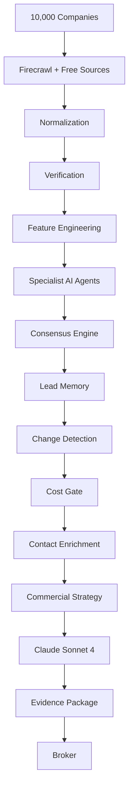

# 🏢 Jasfo Lead Intelligence Platform

> **Master PRD v4.0**
>
> AI-Powered Commercial Real Estate Intelligence Platform

---

# Welcome

Welcome to the official documentation for the **Jasfo Lead Intelligence Platform**.

Jasfo is an AI-native commercial real estate intelligence system that discovers companies most likely to relocate, expand, or lease office space by combining large-scale web intelligence, multi-agent reasoning, evidence verification, and cost-optimized AI orchestration.

This documentation serves as the **single source of truth** for:

- Developers
- AI Coding Agents
- Architects
- Product Managers
- Future Employees
- Business Stakeholders

---

# Mission

Transform approximately **10,000 companies every week** into only **20–30 evidence-backed, broker-ready commercial real estate opportunities**.

Rather than maximizing lead quantity, Jasfo maximizes **lead quality**, **confidence**, and **broker productivity**.

---

# Core Principles

## Evidence First

Every AI conclusion must be backed by evidence.

No unsupported assumptions are allowed.

---

## Firecrawl First

Firecrawl is the default intelligence engine.

Only use Apify when Firecrawl cannot retrieve required information.

---

## AI First

Every decision should be made by AI before human review.

---

## Free APIs First

Paid APIs are reserved only for qualified companies.

---

## Quality Over Quantity

20 verified opportunities are more valuable than 10,000 unqualified companies.

---

# Weekly Intelligence Workflow

```text
10,000 Companies
        │
        ▼
Free Intelligence Collection
        │
        ▼
Normalization
        │
        ▼
Verification
        │
        ▼
Feature Engineering
        │
        ▼
Specialist AI Agents
        │
        ▼
Consensus Engine
        │
        ▼
Lead Memory
        │
        ▼
Change Detection
        │
        ▼
Cost Optimization
        │
        ▼
Contact Enrichment
        │
        ▼
Commercial Strategy
        │
        ▼
Claude Sonnet 4 Judge
        │
        ▼
Evidence Package
        │
        ▼
CSV / Excel / PDF
```

---

# High-Level Architecture



---

# Technology Stack

| Category | Technology |
|-----------|------------|
| Automation | Make.com |
| Database | Supabase |
| Primary Scraper | Firecrawl |
| Backup Scraper | Apify |
| AI Workers | OpenCode GO |
| Final Judge | Claude Sonnet 4 |
| Notifications | Telegram |
| Email | SMTP |
| Hosting | Railway |
| CDN | Cloudflare |

---

# AI Model Routing

| Layer | Model |
|--------|-------|
| Discovery | DeepSeek V4 Flash |
| Normalization | DeepSeek V4 Flash |
| Verification | MiMo V2.5 |
| Feature Engineering | DeepSeek V4 Flash |
| Specialist Agents | DeepSeek V4 Flash + MiMo V2.5 |
| Consensus | MiMo V2.5 |
| Strategy | MiMo V2.5 |
| Outreach | DeepSeek V4 Flash |
| Final Judge | Claude Sonnet 4 |

---

# Documentation Map

## Vision

Business goals and success metrics.

---

## Architecture

Complete 14-layer system.

---

## AI

Model routing, prompts, specialist agents, consensus and reflection.

---

## Firecrawl

Primary scraping strategy and optimization.

---

## Make.com

Automation scenarios, routers, filters, retries, and scheduling.

---

## Database

Supabase schema, tables, RLS policies, SQL, and functions.

---

## Lead Engine

Scoring, memory, cooldowns, and change detection.

---

## Evidence

Evidence engine, verification, and explainability.

---

## Exports

CSV, Excel, JSON, and PDF specifications.

---

## APIs

All external integrations and usage policies.

---

## Deployment

Railway, Supabase, Cloudflare, GitHub.

---

## Testing

Prompt evaluation, regression testing, golden datasets, and performance.

---

# AI Coding Agent Instructions

Before implementing any feature:

1. Read the relevant architecture page.
2. Review the corresponding ADR.
3. Follow the documented naming conventions.
4. Do not invent database fields.
5. Do not modify unrelated components.
6. Implement exactly as specified.
7. Write tests before marking the feature complete.

---

# Current Status

| Item | Status |
|------|--------|
| Documentation | 🚧 In Progress |
| Architecture | ✅ Stable |
| AI Design | ✅ Stable |
| Database Design | 🚧 In Progress |
| Make.com Workflows | 🚧 In Progress |
| Prompt Library | 🚧 In Progress |
| Implementation | ⏳ Not Started |

---

# Quick Links

- 📖 Getting Started
- 🏗 14-Layer Architecture
- 🤖 AI Agents
- 🕸 Firecrawl Strategy
- ⚙ Make.com Workflows
- 🗄 Database Schema
- 📦 API Documentation
- 🧠 Prompt Library
- 🧪 Testing Guide
- 🚀 Deployment Guide

---

# Philosophy

> **Collect everything.**
>
> **Verify everything.**
>
> **Reason carefully.**
>
> **Spend money only when justified.**
>
> **Deliver evidence, not guesses.**
