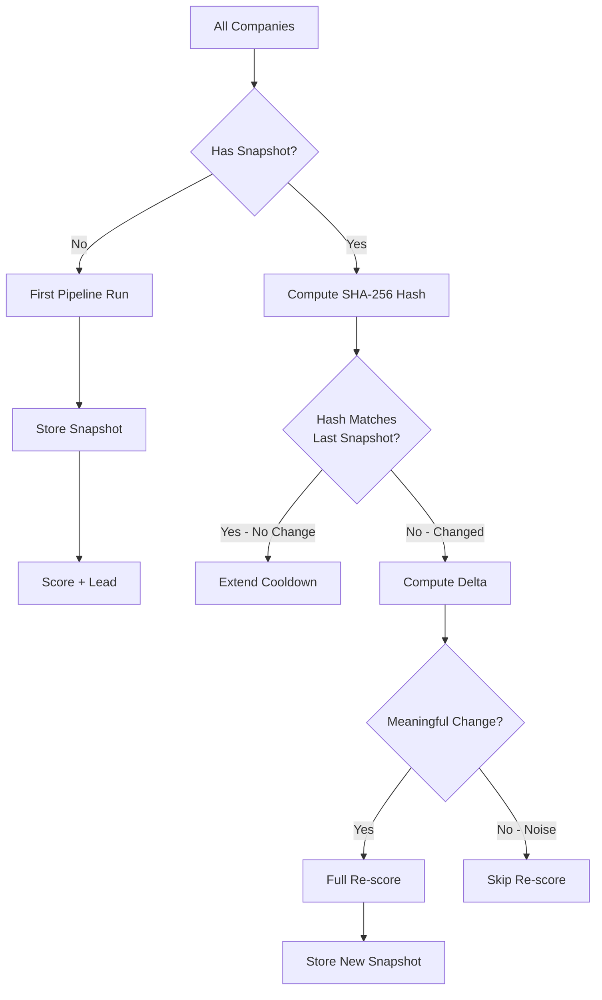
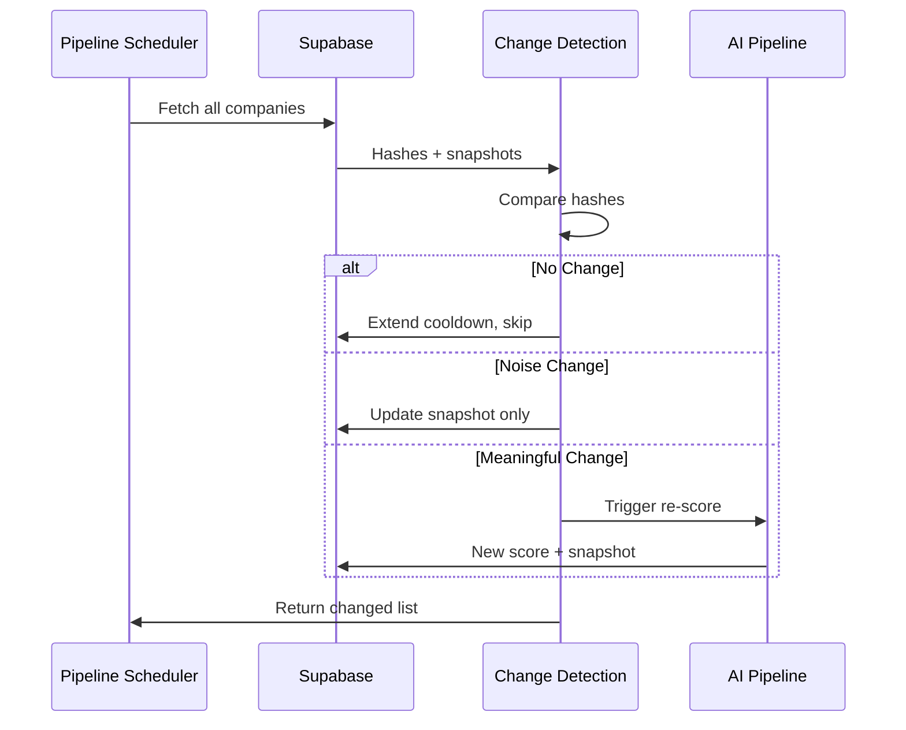

# Change Detection

> Identifies which companies have meaningfully changed between pipeline runs. The most important cost-control mechanism in the platform.

## Why Change Detection Matters

The 14-layer AI pipeline costs approximately $0.02 per company to run. Processing 10,000 companies every week would cost $200/week — quadruple the monthly budget. Change detection solves this by identifying which companies actually changed and only running the pipeline on those. In practice, 5–10% of companies change week-over-week, reducing pipeline costs to $10–20/week.

## How It Works



### Step 1: Snapshot Creation

After each successful pipeline run, a snapshot of the company's canonical signal fields is stored:

```sql
INSERT INTO companies_snapshots (company_id, sha256_hash, snapshot_data)
VALUES (
    'a1b2c3d4-...',
    compute_company_hash('a1b2c3d4-...'),
    jsonb_build_object(
        'employee_range', c.employee_range,
        'revenue_range', c.revenue_range,
        'description', c.description,
        'tech_stack', c.tech_stack,
        'management_team', c.management_team,
        'industry', c.industry,
        'founded_year', c.founded_year
    )
)
FROM companies c
WHERE c.id = 'a1b2c3d4-...';
```

Only signal-relevant fields are included. Metadata fields (`updated_at`, `discovered_at`, etc.) are excluded to avoid false hash mismatches.

### Step 2: Hash Comparison

At the start of each weekly run, every company's current hash is compared against its most recent snapshot:

```sql
WITH latest_snapshot AS (
    SELECT DISTINCT ON (company_id)
        company_id, sha256_hash, snapshot_data
    FROM companies_snapshots
    ORDER BY company_id, captured_at DESC
)
SELECT
    c.id AS company_id,
    c.company_name,
    ls.sha256_hash AS previous_hash,
    compute_company_hash(c.id) AS current_hash,
    ls.sha256_hash IS DISTINCT FROM compute_company_hash(c.id) AS has_changed
FROM companies c
LEFT JOIN latest_snapshot ls ON ls.company_id = c.id;
```

### Step 3: Delta Computation

When a hash mismatch is detected, the system computes a structured delta showing exactly what changed:

```sql
-- Example delta output
{
  "changed_fields": ["employee_range", "description"],
  "changes": [
    {
      "field": "employee_range",
      "old_value": "51-200",
      "new_value": "201-500"
    },
    {
      "field": "description",
      "old_value": "A small software company...",
      "new_value": "Leading enterprise SaaS platform..."
    }
  ],
  "change_type": "meaningful",
  "score_impact": "likely_positive"
}
```

## Meaningful vs. Noise Changes

Not every hash mismatch triggers a re-score. Some changes are noise:

| Change Type | Example | Re-score? |
|-------------|---------|-----------|
| Employee range changed | "51-200" → "201-500" | Yes |
| Revenue range changed | "$10M-$50M" → "$50M-$100M" | Yes |
| Description rewritten | Minor rewording | No (unless tone/claim changes) |
| Tech stack addition | "React" added to stack | Yes |
| Management team change | New CTO listed | Yes |
| Industry reclassified | "IT" → "Software" | No (normalization artifact) |
| Founded year changed | 2014 → 2015 | No (data correction) |

The distinction is applied by a lightweight AI classifier (DeepSeek V4 Flash) that examines the before/after snapshot and produces a `change_type` label. If the classifier determines the change is "noise," the snapshot is updated with the new hash but no re-scoring is triggered.

```sql
-- Update snapshot without triggering re-score (noise changes)
INSERT INTO companies_snapshots (company_id, sha256_hash, snapshot_data)
VALUES ('a1b2c3d4-...', 'new_hash', '...snapshot...');
```

## Pipeline Integration



## Performance

Change detection processes 50,000 companies in under 60 seconds. The bottleneck is hash computation, which requires reading the current state of each company from the `companies` table. With the `idx_companies_id` primary key index, this is a sequential scan followed by HMAC computation — no JOINs, no sorting.

Estimated time breakdown:
- **Hash computation**: 30 seconds (50,000 HMACs)
- **Snapshot comparison**: 15 seconds (indexed JOIN)
- **Delta classification**: 5 seconds per changed company (AI call)
- **Total**: < 60 seconds for 50,000 companies with ~500 changes
