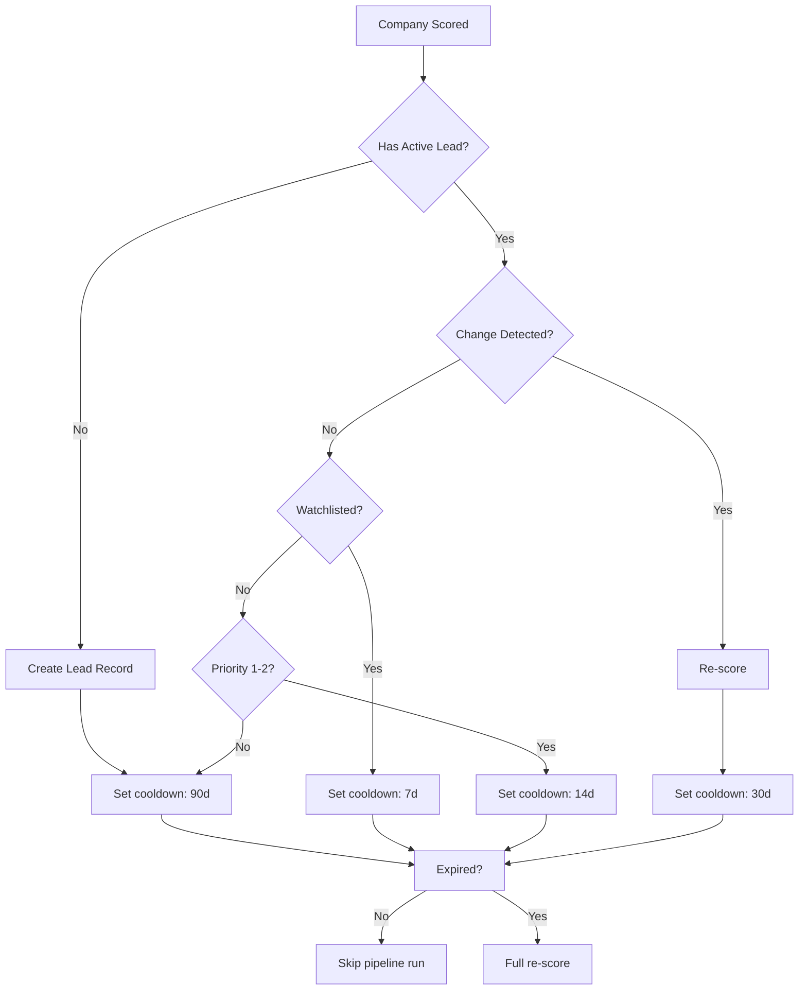

# Cooldown System

> Prevents redundant re-processing of stable companies. Every scored company enters cooldown; cooldown duration depends on lead state and detected changes.

## Purpose

The cooldown system is the platform's primary cost-control mechanism. Without cooldown, every company in the database would be re-processed through the AI pipeline every week, consuming the full $50/month budget on companies whose signals have not changed. Cooldown ensures that 95% of processing budget is spent on companies that have actually changed or are high-priority leads.

## Default: 90-Day Cooldown

A company that completes the pipeline without triggering any exceptions enters a 90-day cooldown:

```sql
-- Applied when a company finishes scoring without detected changes
UPDATE leads
SET cooldown_until = now() + interval '90 days',
    updated_at = now()
WHERE company_id = 'a1b2c3d4-...';
```

The 90-day default is based on commercial real estate decision cycles. Most companies evaluate space needs on a quarterly cadence. Re-processing a stable company before 90 days is unlikely to reveal new signals and wastes pipeline capacity.

## Cooldown Durations by Scenario

| Scenario | Cooldown | Rationale |
|----------|----------|-----------|
| No change detected, not watchlisted | 90 days | Standard cycle |
| No change detected, watchlisted | 7 days | Watchlisted companies get weekly monitoring |
| No change detected, priority band 1–2 | 14 days | Hot leads are checked more frequently |
| Change detected, re-scored | 30 days | Recently changed; monitor for follow-up signals |
| Lead state = `lost` | 180 days | Lost leads get longest cooldown |
| Lead state = `dormant` | 90 days | Dormant leads use standard cooldown |
| Lead state = `archived` | Permanent | Archived leads are never re-processed |
| Evidence confidence < 30 | 14 days | Low-confidence leads get re-evaluated sooner |

## Cooldown State Machine



## Exceptions: When Cooldown Is Bypassed

Cooldown is bypassed entirely when meaningful changes are detected:

1. **Hash mismatch**: The company's signal hash changed since the last snapshot. The change detection system (see `change-detection.md`) compares SHA-256 hashes week-over-week. Any hash difference immediately clears cooldown.

2. **Manual broker intervention**: The broker can force re-scoring of any lead by calling a Telegram command. This sets `cooldown_until = NULL` and schedules the company for the next pipeline run.

3. **Watchlist promotion**: A watchlisted company whose signals change is automatically promoted to full re-scoring, bypassing any remaining cooldown.

4. **New evidence from external source**: If the Evidence Engine receives a new, high-quality source about a company (e.g., a verified funding announcement), it can trigger early re-scoring.

## Cooldown Expiry Check

At the start of each weekly pipeline run, the cooldown expiry function runs:

```sql
-- Activate all leads whose cooldown has expired
UPDATE leads
SET cooldown_until = NULL,
    updated_at = now()
WHERE cooldown_until IS NOT NULL
  AND cooldown_until < now()
  AND state NOT IN ('lost', 'archived');
```

This returns the activated leads to the pipeline for change detection and potential re-scoring.

## Managing Cooldown in the Database

```sql
-- Check cooldown status for all leads
SELECT c.company_name, l.state, l.cooldown_until,
    CASE
        WHEN l.cooldown_until IS NULL THEN 'active'
        WHEN l.cooldown_until > now() THEN 'in_cooldown (' || (l.cooldown_until - now())::text || ' remaining)'
        ELSE 'expired'
    END AS cooldown_status
FROM leads l
JOIN companies c ON c.id = l.company_id
ORDER BY l.cooldown_until ASC NULLS FIRST;

-- Manually clear cooldown (force re-scoring)
UPDATE leads
SET cooldown_until = NULL, updated_at = now()
WHERE company_id = 'a1b2c3d4-...';
```
