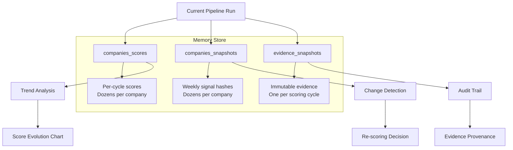
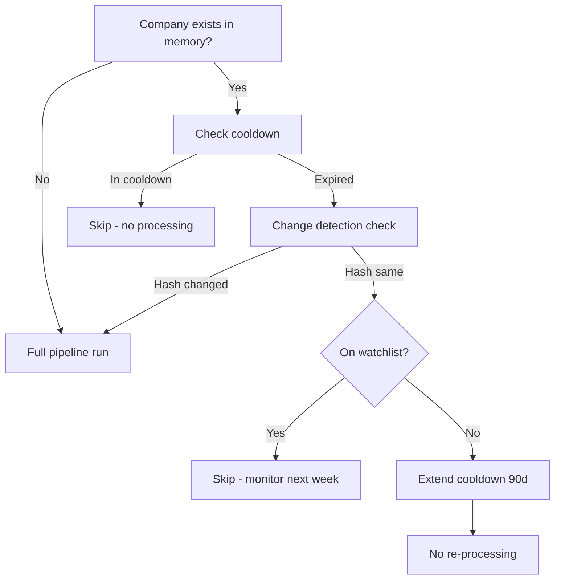

# Lead Memory System

> Persistent storage of every company's scoring history, evidence, and detected changes across pipeline cycles.

## Purpose

The Lead Memory system ensures that the platform learns from each pipeline run. Instead of treating each week's analysis as a fresh start, it maintains a complete history that powers change detection, trend analysis, and intelligent re-scoring decisions. Memory is what transforms the platform from a batch processor into a continuous intelligence system.

## Storage Architecture

Memory is stored across three Supabase tables:



### `companies_scores` — Scoring History

Each weekly pipeline run produces a new row. Over 50 weeks, a company may have 50 score records. This enables:

```sql
-- Score trend for a specific company
SELECT scored_at, total_score, growth_score, space_need_score
FROM companies_scores
WHERE company_id = 'a1b2c3d4-...'
ORDER BY scored_at DESC
LIMIT 12;

-- Companies whose score improved by 50+ points
SELECT company_id, total_score - LAG(total_score) OVER (
    PARTITION BY company_id ORDER BY scored_at
) AS score_delta
FROM companies_scores
WHERE scored_at > now() - interval '30 days'
  AND total_score - LAG(total_score) OVER (
      PARTITION BY company_id ORDER BY scored_at
  ) >= 50;
```

### `companies_snapshots` — Change Detection Data

Weekly snapshots store the full signal payload as JSONB plus a SHA-256 hash. The snapshot is the source of truth for change detection:

```sql
-- Has this company changed since last week?
SELECT cs1.sha256_hash = cs2.sha256_hash AS identical
FROM companies_snapshots cs1
JOIN companies_snapshots cs2 ON cs2.company_id = cs1.company_id
    AND cs2.captured_at = cs1.captured_at - interval '7 days'
WHERE cs1.company_id = 'a1b2c3d4-...'
ORDER BY cs1.captured_at DESC
LIMIT 1;
```

### `evidence_snapshots` — Immutable Evidence Bundles

At the end of each successful pipeline run for a company, an evidence snapshot is created. This bundle contains all claims, sources, scores, and reasoning for that run. Snapshots are immutable — once written, they are never modified:

```sql
-- All evidence for a company at a point in time
SELECT bundle, sha256_hash, captured_at
FROM evidence_snapshots
WHERE company_id = 'a1b2c3d4-...'
ORDER BY captured_at DESC;
```

## Revisit Logic

The memory system determines when a company needs re-processing:



The revisit logic is implemented as a function:

```sql
CREATE OR REPLACE FUNCTION should_reprocess(p_company_id uuid)
RETURNS text AS $$
DECLARE
    v_result text;
    v_last_score timestamptz;
    v_cooldown_until timestamptz;
    v_watchlisted boolean;
    v_hash_changed boolean;
BEGIN
    -- Get latest score time
    SELECT MAX(scored_at) INTO v_last_score
    FROM companies_scores
    WHERE company_id = p_company_id;

    -- If never scored, needs full processing
    IF v_last_score IS NULL THEN
        RETURN 'full_processing';
    END IF;

    -- Check cooldown
    SELECT l.cooldown_until, l.is_watchlisted
    INTO v_cooldown_until, v_watchlisted
    FROM leads l
    WHERE l.company_id = p_company_id;

    IF v_cooldown_until IS NOT NULL AND v_cooldown_until > now() THEN
        RETURN 'in_cooldown';
    END IF;

    -- Check hash change
    SELECT (cs1.sha256_hash IS DISTINCT FROM cs2.sha256_hash)
    INTO v_hash_changed
    FROM companies_snapshots cs1
    LEFT JOIN companies_snapshots cs2
        ON cs2.company_id = cs1.company_id
        AND cs2.captured_at < cs1.captured_at
    WHERE cs1.company_id = p_company_id
    ORDER BY cs1.captured_at DESC
    LIMIT 1;

    IF v_hash_changed THEN
        RETURN 'changed_detected';
    ELSIF v_watchlisted THEN
        RETURN 'watchlist_monitor';
    ELSE
        RETURN 'no_change_extend_cooldown';
    END IF;
END;
$$ LANGUAGE plpgsql;
```

## Memory Pruning

To prevent unbounded storage growth, old memory records are pruned:

- **companies_scores**: Keep all records for the most recent 52 weeks. Older records are aggregated into monthly averages and the raw records deleted.
- **companies_snapshots**: Keep weekly snapshots for 180 days. Older snapshots are collapsed to one per month.
- **evidence_snapshots**: Keep all snapshots for 365 days. These are the primary audit mechanism and are retained longest.

Pruning runs monthly via `pg_cron` and logs the number of records removed.
