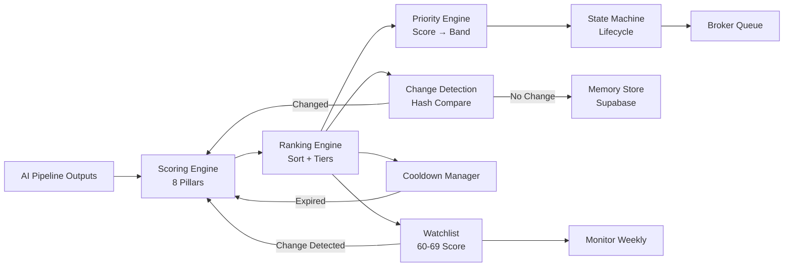
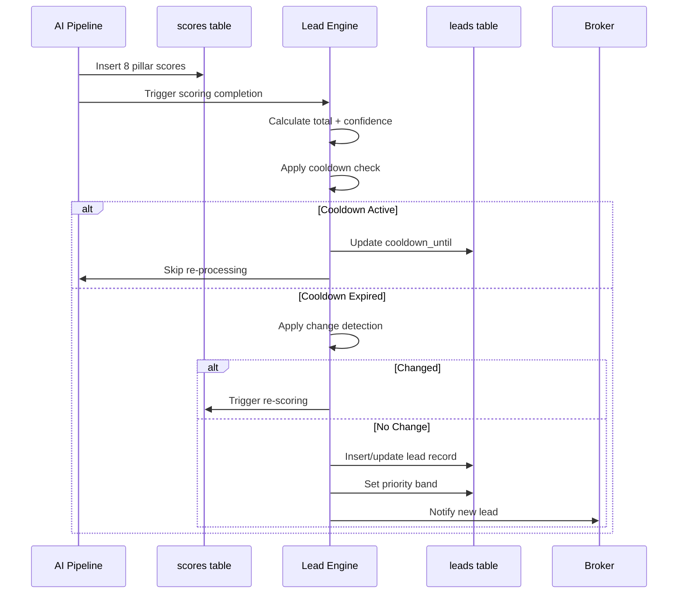

# Lead Engine Overview

> The core decision-making system that transforms raw company signals into ranked, actionable commercial real estate opportunities.

## Purpose

The Lead Engine is the brain of the Jasfo platform. It receives enriched company profiles from the 14-layer AI pipeline and produces a prioritized queue of broker-ready leads. Unlike a simple scoring model that outputs a single number, the Lead Engine manages the full lead lifecycle: scoring, ranking, memory, cooldown, change detection, watchlisting, and state transitions. It is designed to answer one question: **which companies should the broker contact this week, and why?**

## Core Subsystems

### Scoring

Eight independent pillars evaluate every company on a 0–100 scale. Four pillars are **leading indicators** (predictive of future space need) and four are **lagging indicators** (evidence of existing demand). The total score (0–800) drives all downstream decisions. Each pillar score includes a confidence sub-score derived from evidence quality and source count.

### Ranking

Companies are ranked by total score descending. Tiebreaker rules resolve equal scores: higher confidence wins, then higher growth score, then earlier discovery date. The ranked list is split into priority bands: Critical (500+), Hot (400-499), Warm (300-399), Cool (200-299), and Cold (0-199).

### Memory

Every company's scoring history, evidence package, and detected changes are stored in Supabase. The memory system ensures no company is processed redundantly — if nothing changed since the last pipeline run, the existing score is reused. Memory also powers the audit trail: the broker can see how a company's score evolved over weeks.

### Cooldown

After scoring, companies enter a cooldown period during which they are not re-processed. The default cooldown is 90 days. Companies with detected changes or on the watchlist have shorter or bypassed cooldowns. Cooldown prevents the platform from wasting budget re-scoring static companies.

### Change Detection

SHA-256 hashes of canonical signal fields are compared week-over-week. If a company's employee range, revenue range, description, tech stack, or management team changes, the hash changes and the company is flagged for re-scoring. Change detection is the most important cost-control mechanism — it prevents unnecessary AI pipeline execution.

### Watchlist

Companies scoring 60–69 (just below the "qualified" threshold of 70) enter the watchlist. They are monitored weekly via change detection. If a watchlisted company's signals change, it is promoted to full re-scoring without waiting for cooldown expiry.

### State Machine

Every lead follows a defined state machine: `new → qualified → contacted → meeting_booked → deal | lost | dormant → archived`. State transitions are tracked in `leads_events` and trigger Telegram notifications. The state machine ensures the broker always knows the current status of every lead.

## Data Flow

## Design Principles

1. **Score first, rank second**: Raw scores are computed independently, then ranking and priority are derived. This separation means any pillar's rubric can be updated without affecting the others.
2. **Leading over lagging**: Leading indicators (growth signals, space-need triggers) are weighted higher than lagging indicators (digital footprint, regulatory exposure) because they predict future behavior rather than describe current state.
3. **Evidence gates everything**: No score is accepted without supporting evidence. A high score with low confidence is ranked below a moderate score with high confidence.
4. **Cost awareness**: Every re-scoring decision passes through a cost gate. The engine asks: "Is the potential value of re-scoring this company worth the AI pipeline cost?" If not, the company stays in cooldown.
