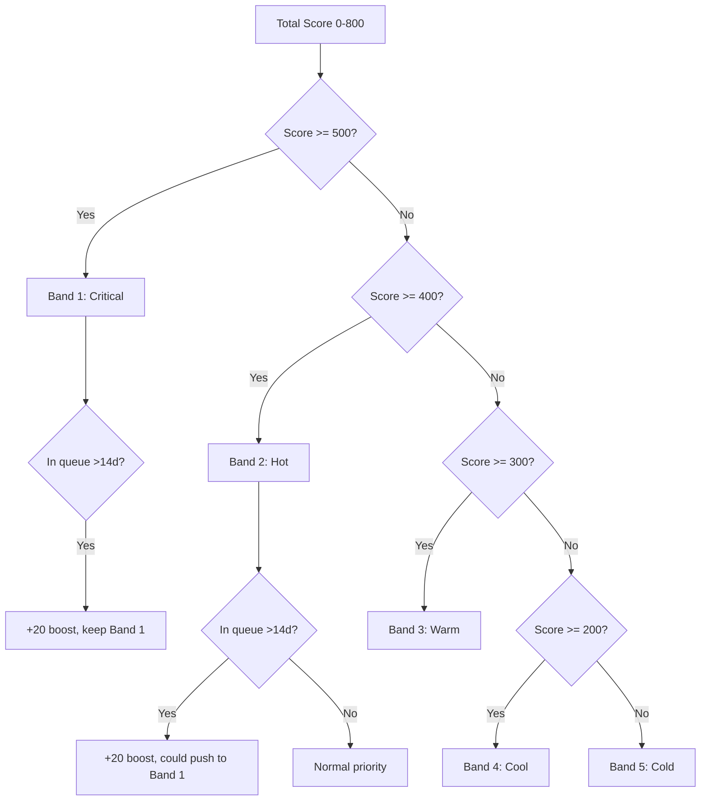

# Priority Engine

> Maps raw total scores to actionable priority bands. Manages time-in-queue boosts and urgency decay to ensure leads are acted upon before they go stale.

## Score-to-Band Mapping

The priority engine converts a company's total score (0–800) into a priority band (1–5) using fixed thresholds:

```sql
SELECT
    total_score,
    CASE
        WHEN total_score >= 500 THEN 1 -- Critical
        WHEN total_score >= 400 THEN 2 -- Hot
        WHEN total_score >= 300 THEN 3 -- Warm
        WHEN total_score >= 200 THEN 4 -- Cool
        ELSE 5                          -- Cold
    END AS priority_band,
    CASE
        WHEN total_score >= 500 THEN 'Immediate outreach required'
        WHEN total_score >= 400 THEN 'Contact this week'
        WHEN total_score >= 300 THEN 'Contact this cycle'
        WHEN total_score >= 200 THEN 'Monitor for changes'
        ELSE 'Long-term pipeline'
    END AS action
FROM companies_scores
ORDER BY total_score DESC;
```

## Priority Band Configuration

Bands are configured in `scoring_config` and can be adjusted without code changes:

| Key | Default | Description |
|-----|---------|-------------|
| `band_1_threshold` | 500 | Minimum score for Critical |
| `band_2_threshold` | 400 | Minimum score for Hot |
| `band_3_threshold` | 300 | Minimum score for Warm |
| `band_4_threshold` | 200 | Minimum score for Cool |
| `band_1_max` | 5 | Max leads in Critical |
| `band_2_max` | 10 | Max leads in Hot |
| `band_3_max` | 15 | Max leads in Warm |
| `band_4_max` | 20 | Max leads in Cool |

Thresholds are stored in a dedicated config table for easy adjustment:

```sql
UPDATE scoring_config SET value = 450 WHERE key = 'band_1_threshold';
```

## Time-in-Queue Boost

A lead that remains in the same priority band for multiple weeks without action receives a time-in-queue boost. This prevents leads from stagnating — every week a qualified lead sits untouched, its effective priority increases slightly.

```sql
-- Time-in-queue boost calculation
SELECT
    l.id,
    l.entered_state_at,
    cs.total_score,
    cs.total_score + (
        CASE
            WHEN l.entered_state_at < now() - interval '14 days' THEN 20
            WHEN l.entered_state_at < now() - interval '7 days' THEN 10
            ELSE 0
        END
    ) AS effective_score,
    CASE
        WHEN l.entered_state_at < now() - interval '14 days' THEN 1 -- Push up one band
        ELSE l.priority_band
    END AS boosted_band
FROM leads l
JOIN companies_scores cs ON cs.company_id = l.company_id
WHERE l.state = 'qualified'
  AND l.cooldown_until IS NULL;
```

The boost is capped at 20 points to prevent stale leads from surpassing genuinely higher-scoring companies. The boost resets when the lead transitions to a new state (e.g., `contacted`).

## Urgency Decay

Conversely, a lead in `meeting_booked` or `deal` state that has not progressed within a configured window receives urgency decay — its effective priority decreases, signaling the broker to either push for closure or move on:

```sql
-- Urgency decay: meeting booked but no update in 14 days
UPDATE leads
SET priority_band = LEAST(priority_band + 1, 5), -- Lower priority
    updated_at = now()
WHERE state = 'meeting_booked'
  AND updated_at < now() - interval '14 days';
```

## Priority Visualization



## Telegram Notification by Band

Each band triggers a different notification style when new leads appear:

| Band | Notification | Frequency |
|------|-------------|-----------|
| Critical | Direct message with company name, score, and key signal | Immediate |
| Hot | Daily digest | Daily at 09:00 |
| Warm | Weekly summary | Sunday |
| Cool | Weekly summary (aggregated) | Sunday |
| Cold | No notification | — |

The broker can also query leads by band via Telegram commands:
- `/critical` — Show all Critical leads
- `/hot` — Show all Hot leads
- `/priority <band>` — Show leads in a specific band
