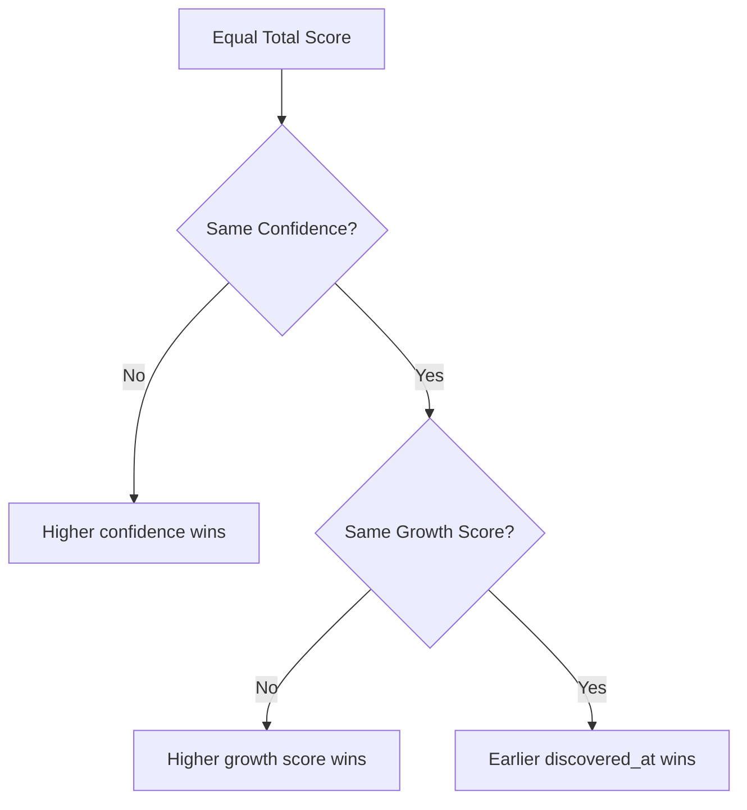
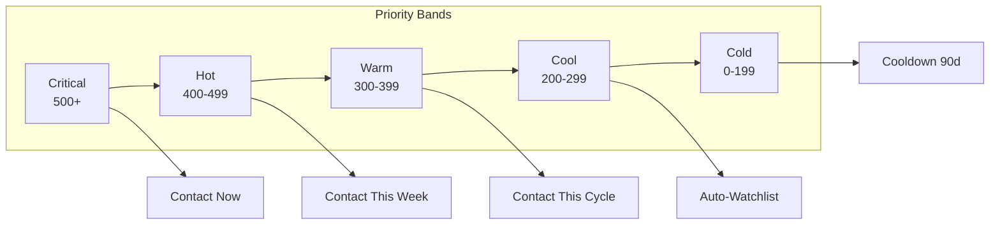

# Ranking Methodology

> How raw scores are converted into an ordered, tiered lead queue.

## Primary Sort: Total Score

The primary ranking is a simple descending sort by `total_score`:

```sql
SELECT company_id, total_score, confidence_score, growth_score, discovered_at
FROM v_top_leads
ORDER BY total_score DESC;
```

The company with the highest total score appears first in the broker's queue. This gives the broker an immediately actionable list: start at the top and work down.

## Tiebreaker Rules

When two or more companies have the same total score, a three-level tiebreaker resolves the order:



**Level 1: Confidence Score**. Between tied total scores, the company with higher evidence confidence ranks first. This ensures that a well-corroborated 450 beats a speculative 450.

**Level 2: Growth Score**. If confidence is also tied, the company with higher growth score wins. Growth is the strongest leading indicator — two companies with equal scores but different growth trajectories should be ranked by momentum.

**Level 3: Discovery Date**. If all else is equal, the company discovered earlier ranks higher. This rewards companies that have been in the pipeline longer — they have had more time for signals to mature.

```sql
SELECT company_id, total_score, confidence_score, growth_score, discovered_at,
    ROW_NUMBER() OVER (
        ORDER BY total_score DESC,
                 confidence_score DESC,
                 growth_score DESC,
                 discovered_at ASC
    ) AS rank
FROM v_top_leads;
```

## Priority Tiers

After ranking, companies are assigned to priority bands:

| Band | Score Range | Label | Action | Max Leads |
|------|-------------|-------|--------|-----------|
| 1 | 500–800 | Critical | Immediate outreach | 5 |
| 2 | 400–499 | Hot | This week | 10 |
| 3 | 300–399 | Warm | This cycle | 15 |
| 4 | 200–299 | Cool | Monitor | 20 |
| 5 | 0–199 | Cold | Long tail | — |



### Band Capacity Limits

Each band has a maximum number of leads it can hold. If a band is over capacity, the lowest-ranked leads in that band are pushed down to the next band. This prevents the broker from being overwhelmed — they receive at most 30 leads per week across bands 1–3, with Critical and Hot being the primary focus.

Band capacities are stored as configuration in a `scoring_config` table:

```sql
CREATE TABLE scoring_config (
    key text PRIMARY KEY,
    value integer NOT NULL
);

INSERT INTO scoring_config VALUES
    ('band_1_max', 5),
    ('band_2_max', 10),
    ('band_3_max', 15),
    ('band_4_max', 20),
    ('weekly_max_total', 30);
```

## Weekly Output

The final ranked output delivered to the broker includes:

1. **Top 5 Critical leads** with full evidence packages — these are the broker's priority
2. **Next 10 Hot leads** — to be contacted this week if time permits
3. **Watchlist summary** — companies just below threshold, being monitored
4. **Change notifications** — any existing leads whose score changed meaningfully

The ranking is regenerated every Sunday night after the pipeline completes. The ranked list is exported as a CSV and pushed to the broker's Telegram with a summary of each tier.
