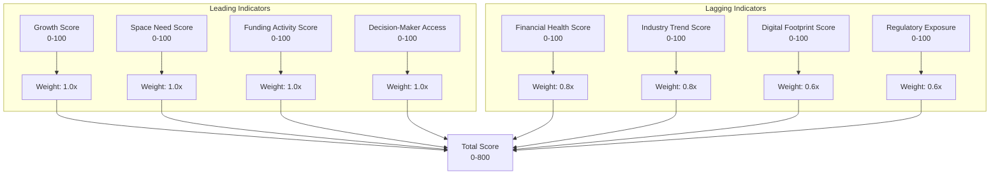

# Scoring System

> 8-pillar multi-dimensional scoring model. Each pillar produces a 0–100 score. The total is the sum (0–800). Confidence scores propagate from evidence sources up through each pillar.

## Pillar Architecture



## Pillar Rubrics

### 1. Growth Score (Leading, 1.0x weight)

Measures headcount expansion, revenue growth, and operational scaling signals.

| Score Range | Criteria | Evidence Required |
|-------------|----------|-------------------|
| 80–100 | 200+ new hires in 90 days; revenue >50% YoY; new office/expansion announced | News articles, LinkedIn hiring data, company blog |
| 60–79 | 50–199 new hires; 20–50% revenue growth; job postings for new roles | Job board data, Crunchbase growth metrics |
| 40–59 | 10–49 new hires; steady but not accelerating growth | LinkedIn headcount, Glassdoor reviews |
| 20–39 | <10 new hires; flat headcount; no growth signals | Minimal evidence of change |
| 0–19 | No detectable growth; declining headcount | Negative signals or no data |

### 2. Space Need Score (Leading, 1.0x weight)

Direct indicators of impending real estate action.

| Score Range | Criteria | Evidence Required |
|-------------|----------|-------------------|
| 80–100 | Current lease expiring <6 months; actively searching for space | Lease listings, RFP postings, broker intel |
| 60–79 | Fast headcount growth in current location; outgrown space | Headcount/square-foot ratio, employee density |
| 40–59 | Hybrid policy changes; rumored expansion | News, social media chatter |
| 20–39 | Renewal approaching (6–12 months) | Lease records, public filings |
| 0–19 | Recently renewed; no space signals | Lease records show recent renewal |

### 3. Financial Health Score (Lagging, 0.8x weight)

Financial stability and ability to commit to a lease.

| Score Range | Criteria | Evidence Required |
|-------------|----------|-------------------|
| 80–100 | Profitable; strong balance sheet; public company | Financial statements, annual report |
| 60–79 | Series C+ funded; clear revenue model | Crunchbase, news articles |
| 40–59 | Series A-B funded; growing revenue | Funding announcements |
| 20–39 | Bootstrapped; early stage; unknown financials | Limited data |
| 0–19 | Losses; down rounds; financial distress | Negative financial signals |

### 4. Industry Trend Score (Lagging, 0.8x weight)

Sector-level tailwinds or headwinds affecting the company's market.

| Score Range | Criteria | Evidence Required |
|-------------|----------|-------------------|
| 80–100 | Sector in high growth (AI, SaaS, fintech in India) | Industry reports, market data |
| 60–79 | Stable growth sector | Analyst reports |
| 40–59 | Mature sector with moderate growth | Industry data |
| 20–39 | Sector facing headwinds | News of layoffs, contraction |
| 0–19 | Declining sector | Multiple negative indicators |

### 5. Decision-Maker Access Score (Leading, 1.0x weight)

How easily the broker can reach key decision-makers.

| Score Range | Criteria | Evidence Required |
|-------------|----------|-------------------|
| 80–100 | CEO/Founder email found; LinkedIn profile active; mutual connections | Email discovery, LinkedIn |
| 60–79 | Decision-maker identified but no direct email; LinkedIn available | LinkedIn profile |
| 40–59 | Management team identified but contact info guarded | Website team page |
| 20–39 | Only generic contact (info@) available | Website contact page |
| 0–19 | No contact information found | No data |

### 6. Digital Footprint Score (Lagging, 0.6x weight)

Online presence maturity — a proxy for operational sophistication.

| Score Range | Criteria | Evidence Required |
|-------------|----------|-------------------|
| 80–100 | Active blog, social media, Glassdoor reviews, tech blog | Multiple web properties |
| 60–79 | Website + LinkedIn presence; occasional news | Standard digital presence |
| 40–59 | Basic website; minimal social | Minimal web presence |
| 20–39 | Website only; no social or news | Single web property |
| 0–19 | No detectable web presence | No data |

### 7. Funding Activity Score (Leading, 1.0x weight)

Recent funding rounds signal capital availability for expansion.

| Score Range | Criteria | Evidence Required |
|-------------|----------|-------------------|
| 80–100 | Series D+ in last 12 months; $50M+ raised | Crunchbase, news |
| 60–79 | Series B-C in last 18 months; $10M-$50M | Crunchbase, news |
| 40–59 | Series A or Seed in last 24 months | Crunchbase |
| 20–39 | Bootstrapped; no recent funding | Crunchbase shows no funding |
| 0–19 | No funding data available | No data |

### 8. Regulatory Exposure Score (Lagging, 0.6x weight)

Compliance requirements that may force a physical presence or relocation.

| Score Range | Criteria | Evidence Required |
|-------------|----------|-------------------|
| 80–100 | New compliance requirement forcing office presence | Regulatory filings, news |
| 60–79 | Industry has moderate compliance requirements | Industry data |
| 40–59 | Some compliance considerations | General knowledge |
| 20–39 | Low regulatory exposure | Industry data |
| 0–19 | No regulatory factors | No data |

## Confidence Score Integration

Each pillar score is accompanied by a confidence sub-score (0–100). The total confidence for a scoring cycle is the weighted average of pillar confidences:

```
total_confidence = Σ(pillar_confidence × pillar_weight) / Σ(pillar_weights)
```

Pillar confidence is derived from:
- **Source count**: More sources = higher confidence (capped at 5 sources)
- **Source reliability**: Tier 1 sources (official filings) give higher confidence than Tier 5 (anonymous blogs)
- **Consistency**: Multiple sources agreeing on the same signal increases confidence
- **Freshness**: Data captured within the last 30 days receives full weight; older data decays

## Leading vs. Lagging Balance

The 4:4 split between leading and lagging indicators is intentional. Leading indicators (Growth, Space Need, Funding Access, Decision-Maker Access) predict future behavior but are inherently noisier. Lagging indicators (Financial Health, Industry Trend, Digital Footprint, Regulatory Exposure) describe current state and are more reliable but less actionable. By weighting leading indicators at 1.0x and lagging at 0.6–0.8x, the total score favors predictive signals while still grounding them in verifiable current-state evidence.
