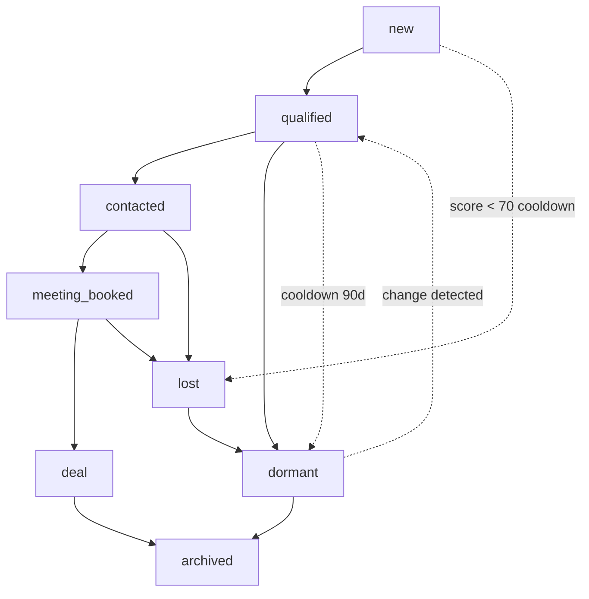

# Lead State Machine

> Every lead follows a defined lifecycle from discovery to closure or archival. State transitions are tracked in `leads_events` and trigger notifications.

## State Definitions



### `new`

A company has been discovered and initially scored but has not yet reached the qualified threshold (total score < 70). The lead exists in the database but is not visible in the broker's primary queue. New leads are subject to standard cooldown (90 days).

**Entry**: After first scoring cycle, total score < 70
**Exit**: Total score >= 70 (→ `qualified`) or cooldown without improvement (→ `lost`)
**Broker visibility**: None (not in main queue)

### `qualified`

The company has scored 70+ and is ready for broker attention. Qualified leads appear in the broker's priority-sorted queue and are included in the weekly CSV export.

**Entry**: Total score reaches 70 after scoring cycle
**Exit**: Broker initiates contact (→ `contacted`) or 90 days without action (→ `dormant`)
**Broker visibility**: Full — appears in queue, weekly export, Telegram summary

### `contacted`

The broker has initiated outreach (email, phone, LinkedIn message). The lead remains in this state until the broker records an outcome.

**Entry**: Broker records a contact attempt via Telegram command (`/contacted <company_id>`)
**Exit**: Meeting booked (→ `meeting_booked`) or deal lost (→ `lost`)
**Broker visibility**: High — tagged with "contacted" badge in queue

### `meeting_booked`

A meeting or call has been scheduled with a decision-maker. This is the most important state transition — it indicates genuine interest.

**Entry**: Broker records meeting via Telegram command (`/meeting <company_id> <date>`)
**Exit**: Deal closed (→ `deal`), deal lost (→ `lost`), or meeting falls through (→ `contacted`)
**Broker visibility**: Priority — appears in meeting list with countdown to meeting date

### `deal`

The lead converted to a commercial real estate transaction (lease signed, space acquired). This is a terminal state.

**Entry**: Broker records deal via Telegram command (`/deal <company_id>`)
**Exit**: Only to `archived`
**Broker visibility**: Reported in monthly metrics

### `lost`

The lead was pursued but did not convert. Reasons may include: no decision, chose competitor, or requirements changed.

**Entry**: Broker records loss via Telegram command (`/lost <company_id> <reason>`)
**Exit**: To `dormant` after 180-day cooldown
**Broker visibility**: Low — hidden from main queue, visible in pipeline history

### `dormant`

Leads in long-term cooldown with no recent activity. Dormant leads are not processed weekly but are re-evaluated when cooldown expires or change is detected.

**Entry**: From `qualified` after 90 days without action, or from `lost` after 180 days
**Exit**: Change detected (→ `qualified`) or 365 days without change (→ `archived`)
**Broker visibility**: None (not in queue)

### `archived`

Final terminal state. The lead is retained for historical analysis but will never be re-processed. Archived leads are excluded from all queries by default.

**Entry**: From `deal` (success archive) or `dormant` (inactivity archive)
**Exit**: None (permanent)
**Broker visibility**: Only via explicit archive query

## State Transition Logging

Every transition is recorded in `leads_events`:

```sql
INSERT INTO leads_events (lead_id, event_type, old_state, new_state, metadata)
VALUES (
    'a1b2c3d4-...',
    'state_changed',
    'qualified',
    'contacted',
    jsonb_build_object(
        'contact_method', 'email',
        'contacted_by', 'broker',
        'contacted_at', now()
    )
);
```

## Automatic Transitions

Some transitions are automated:

| From | To | Trigger | Delay |
|------|----|---------|-------|
| `qualified` | `dormant` | No broker action | 90 days |
| `new` | `lost` | Cooldown expired, no improvement | 90 days |
| `dormant` | `qualified` | Change detected | Immediate |
| `lost` | `dormant` | Cooldown expired | 180 days |
| `dormant` | `archived` | No change for 1 year | 365 days |

These are handled by a weekly maintenance function:

```sql
CREATE OR REPLACE FUNCTION process_auto_transitions()
RETURNS TABLE (lead_id uuid, old_state text, new_state text) AS $$
BEGIN
    -- qualified → dormant after 90 days no action
    RETURN QUERY
    UPDATE leads l
    SET state = 'dormant',
        entered_state_at = now(),
        cooldown_until = now() + interval '90 days',
        updated_at = now()
    WHERE l.state = 'qualified'
      AND l.entered_state_at < now() - interval '90 days'
    RETURNING l.id, 'qualified', 'dormant';

    -- dormant → archived after 365 days
    RETURN QUERY
    UPDATE leads l
    SET state = 'archived',
        entered_state_at = now(),
        cooldown_until = NULL,
        updated_at = now()
    WHERE l.state = 'dormant'
      AND l.entered_state_at < now() - interval '365 days'
    RETURNING l.id, 'dormant', 'archived';
END;
$$ LANGUAGE plpgsql;
```

## State Machine Enforcement

The application layer enforces valid transitions. Invalid transitions are rejected:

```sql
CREATE OR REPLACE FUNCTION check_state_transition()
RETURNS trigger AS $$
BEGIN
    IF OLD.state IS DISTINCT FROM NEW.state THEN
        IF NOT EXISTS (
            SELECT 1 FROM (VALUES
                ('new', 'qualified'),
                ('new', 'lost'),
                ('qualified', 'contacted'),
                ('qualified', 'dormant'),
                ('contacted', 'meeting_booked'),
                ('contacted', 'lost'),
                ('meeting_booked', 'deal'),
                ('meeting_booked', 'lost'),
                ('meeting_booked', 'contacted'),
                ('lost', 'dormant'),
                ('dormant', 'qualified'),
                ('dormant', 'archived'),
                ('deal', 'archived')
            ) AS valid_transitions(from_state, to_state)
            WHERE from_state = OLD.state AND to_state = NEW.state
        ) THEN
            RAISE EXCEPTION 'Invalid state transition: % → %', OLD.state, NEW.state;
        END IF;
    END IF;
    RETURN NEW;
END;
$$ LANGUAGE plpgsql;

CREATE TRIGGER trg_leads_state_transition
    BEFORE UPDATE OF state ON leads
    FOR EACH ROW
    EXECUTE FUNCTION check_state_transition();
```

This database-level enforcement prevents application bugs from corrupting the lead state machine.
