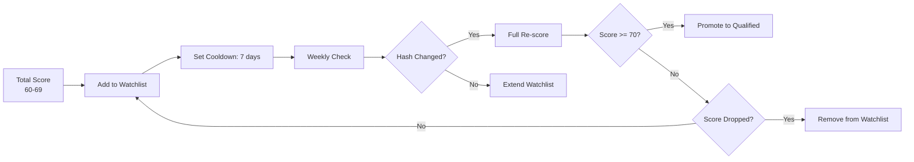

# Watchlist System

> Companies scoring 60–69 on the Move Probability Scale are too good to discard but not yet qualified for broker action. The watchlist monitors them weekly for meaningful changes.

## Purpose

The watchlist captures the "almost qualified" zone — companies that show genuine signals of intent but lack sufficient evidence to reach the 70-point broker threshold. Rather than discarding these companies or wasting pipeline budget on them, the watchlist applies lightweight weekly monitoring that can promote them to full scoring if signals improve.



## Watchlist Criteria

A company enters the watchlist when:

1. Its total score is between 60 and 69 (inclusive) after a scoring cycle
2. It has at least one verified evidence claim (not entirely data-empty)
3. It is not already in `lost`, `archived`, or `meeting_booked` state

```sql
-- Auto-add to watchlist
INSERT INTO leads (company_id, state, priority_band, is_watchlisted, cooldown_until)
SELECT
    cs.company_id,
    'qualified' AS state,
    4 AS priority_band, -- Cool band
    true AS is_watchlisted,
    now() + interval '7 days' AS cooldown_until
FROM companies_scores cs
WHERE cs.total_score BETWEEN 60 AND 69
  AND EXISTS (
      SELECT 1 FROM evidence_claims ec
      WHERE ec.company_id = cs.company_id
        AND ec.is_verified = true
        LIMIT 1
  )
  AND NOT EXISTS (
      SELECT 1 FROM leads l
      WHERE l.company_id = cs.company_id
        AND l.state IN ('lost', 'archived', 'meeting_booked')
  )
ON CONFLICT (company_id) DO UPDATE
SET is_watchlisted = true,
    cooldown_until = now() + interval '7 days',
    updated_at = now();
```

## Weekly Monitoring

Every Sunday, the pipeline runs a lightweight check on watchlisted companies:

1. **Fetch current snapshot**: Read the company's latest data from the `companies` table
2. **Compare hash**: Compute the SHA-256 hash and compare against the stored snapshot
3. **If changed**: Promote to full re-scoring through the change detection system
4. **If unchanged**: Extend watchlist cooldown for another 7 days

```sql
-- Weekly watchlist check
SELECT c.id, c.company_name, cs.sha256_hash AS stored_hash,
       compute_company_hash(c.id) AS current_hash
FROM companies c
JOIN leads l ON l.company_id = c.id
LEFT JOIN LATERAL (
    SELECT sha256_hash FROM companies_snapshots
    WHERE company_id = c.id
    ORDER BY captured_at DESC
    LIMIT 1
) cs ON true
WHERE l.is_watchlisted = true
  AND (l.cooldown_until IS NULL OR l.cooldown_until < now());
```

## Promotion and Demotion

### Promotion (Score >= 70)

When a watchlisted company's score reaches 70 or above after re-scoring:

```sql
UPDATE leads
SET is_watchlisted = false,
    priority_band = CASE
        WHEN cs.total_score >= 500 THEN 1
        WHEN cs.total_score >= 400 THEN 2
        WHEN cs.total_score >= 300 THEN 3
        ELSE 4
    END,
    cooldown_until = NULL,
    state = 'qualified',
    entered_state_at = now(),
    updated_at = now()
FROM companies_scores cs
WHERE leads.company_id = cs.company_id
  AND cs.total_score >= 70
  AND leads.is_watchlisted = true;

-- Notify broker
INSERT INTO leads_events (lead_id, event_type, old_state, new_state, metadata)
VALUES (
    (SELECT id FROM leads WHERE company_id = 'a1b2c3d4-...'),
    'watchlist_promotion',
    'qualified',
    'qualified',
    '{"previous_score": 65, "new_score": 74, "changed_fields": ["employee_range"]}'
);
```

### Demotion (Score < 60 or No Change for 4 Weeks)

When a watchlisted company's score drops below 60 or shows no change for 4 consecutive weeks:

```sql
UPDATE leads
SET is_watchlisted = false,
    cooldown_until = now() + interval '90 days',
    updated_at = now()
WHERE company_id = 'a1b2c3d4-...'
  AND (
      (SELECT total_score FROM companies_scores
       WHERE company_id = 'a1b2c3d4-...'
       ORDER BY scored_at DESC LIMIT 1) < 60
      OR
      entered_state_at < now() - interval '28 days'
  );
```

Demoted companies enter standard 90-day cooldown. They are not re-processed until cooldown expires.

## Watchlist Capacity

The watchlist is capped at 200 companies to prevent unbounded monitoring costs:

```sql
SELECT COUNT(*) FROM leads WHERE is_watchlisted = true;
-- If > 200, demote the oldest unchanged entries
```

When the watchlist exceeds capacity, the companies that have been watchlisted the longest without any detected change are demoted first.

## Broker Interaction

The broker can interact with the watchlist via Telegram:
- `/watchlist` — Show current watchlist count and recent additions
- `/watch <company_name>` — Manually add a company to watchlist
- `/unwatch <company_name>` — Remove a company from watchlist

Manual additions respect the same scoring criteria — a company manually added must have at least some evidence to remain on the watchlist.
