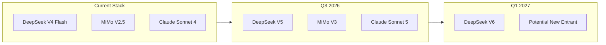
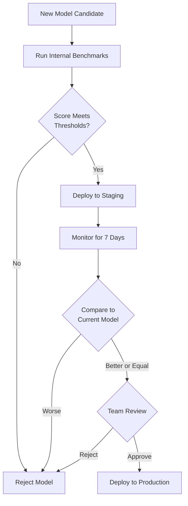

# Future Models

This document outlines the roadmap for model upgrades, evaluation criteria for new models, and cost projections as the platform scales.

## Roadmap



## Planned Upgrades

### Q3 2026

| Model | Target | Expected Improvement | Cost Impact |
|-------|--------|---------------------|-------------|
| DeepSeek V5 | Replace V4 Flash | 2× faster, 1.5× better reasoning | Same or lower cost |
| MiMo V3 | Replace V2.5 | Better multi-step, lower latency | Same cost |
| Claude Sonnet 5 | Replace Sonnet 4 | Enhanced nuance, lower hallucination | Same or +20% |

### Q1 2027

| Model | Target | Expected Improvement | Cost Impact |
|-------|--------|---------------------|-------------|
| DeepSeek V6 | Replace V5 | 3× current performance | Lower cost |
| New entrant | Alternative to MiMo | Competitive reasoning at lower cost | Unknown |

## Upgrade Decision Framework

Each potential model upgrade is evaluated against five criteria:

### 1. Cost Efficiency

```
cost_efficiency_score = (accuracy_improvement / cost_increase) × 100
```

Evaluate: Does the new model provide proportionally better accuracy for its cost?

- If $/task is lower AND accuracy ≥ current → Upgrade immediately
- If $/task is higher BUT accuracy gain > 20% → Consider for premium layers only
- If $/task is higher AND accuracy gain < 10% → Do not upgrade

### 2. Accuracy on Benchmarks

Every candidate model runs on the platform's internal benchmark suite:

| Benchmark | Description | Minimum Score |
|-----------|-------------|---------------|
| Extraction accuracy | Correct field extraction from 100 test pages | > 92% |
| Verification accuracy | Correct fact-check on 50 test claims | > 88% |
| JSON compliance | Valid JSON output on 500 test prompts | > 95% |
| Hallucination rate | Hallucinated claims per 100 outputs | < 1% |
| Instruction adherence | Followed all prompt instructions | > 90% |

### 3. Latency Profile

| Class | Max Acceptable P95 |
|-------|-------------------|
| Real-time (user-facing) | 5 seconds |
| Batch processing | 20 seconds |
| Background (non-blocking) | 60 seconds |

### 4. Reliability

- Uptime over trailing 30 days: > 99.5%
- Error rate (5xx, timeout): < 2%
- Rate limit frequency: < 1 per 100 calls

### 5. Provider Stability

- Provider has been operating for 12+ months
- API has no breaking changes in last 6 months
- Provider offers SLA or has consistent track record

## Evaluation Pipeline



## Cost Projection

| Scenario | Monthly Cost (1K leads) | Monthly Cost (10K leads) |
|----------|------------------------|--------------------------|
| Current (Q2 2026) | $46 | $310 |
| Q3 2026 upgrades | $38 (−17%) | $245 (−21%) |
| Q1 2027 upgrades | $30 (−35%) | $195 (−37%) |
| Best case (lower costs + caching) | $22 (−52%) | $140 (−55%) |

Projected cost per lead decreases over time as:

- Newer models offer better performance at lower prices
- Cache hit rates improve with more data
- Routing becomes more sophisticated
- Competition drives down API pricing

## Model Sunset Policy

When a model is replaced:

1. **Deprecation notice** is issued 30 days before removal
2. **Old model remains available** for fallback for 60 days
3. **Cache entries** for the old model are bulk-invalidated
4. **Cost tracking** is updated to reflect new pricing
5. **Prompt templates** are re-evaluated and updated if needed

## Monitoring New Entrants

The platform continuously monitors the AI model landscape:

| Source | What We Watch | Action |
|--------|---------------|--------|
| OpenRouter model list | New model additions | Evaluate within 7 days |
| LMSYS Chatbot Arena | Leaderboard changes | Re-run benchmarks for top models |
| Provider announcements | New versions/pricing | Add to evaluation queue |
| Community reports | Real-world performance | Cross-reference with own benchmarks |

Any model that enters the **top 5 on LMSYS** with competitive pricing is automatically queued for evaluation within 14 days.
