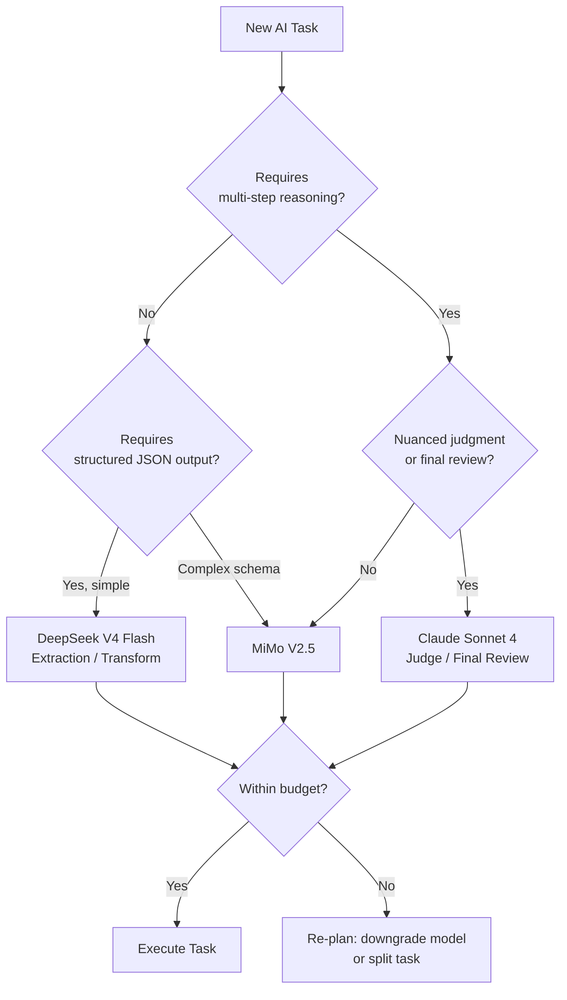
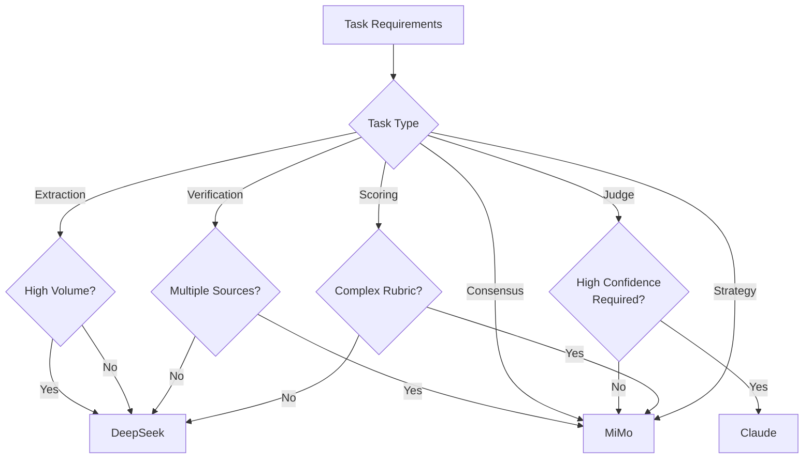

# Model Selection Decision Tree

Choosing the right model for each task directly impacts cost, quality, and throughput. This document provides a structured decision framework for selecting the appropriate model based on task type, complexity, and constraints.

## Quick Reference



## Decision Factors

### 1. Task Type

| Task Type | Recommended Model | Rationale |
|-----------|------------------|-----------|
| Data extraction | DeepSeek V4 Flash | High volume, well-defined schema |
| Format normalisation | DeepSeek V4 Flash | Deterministic rules |
| Simple classification | DeepSeek V4 Flash | Few categories, clear boundaries |
| Fact verification | MiMo V2.5 | Requires cross-referencing |
| Multi-agent consensus | MiMo V2.5 | Weighted reasoning needed |
| Self-reflection/critique | MiMo V2.5 | Meta-cognitive task |
| Intent prediction | MiMo V2.5 | Multi-signal synthesis |
| Engagement strategy | MiMo V2.5 | Strategic reasoning |
| Final quality gate | Claude Sonnet 4 | Highest stakes, needs nuance |
| Human-review triage | Claude Sonnet 4 | Must be reliable |

### 2. Cost Budget

| Per-Task Budget | Model Options | Strategies |
|----------------|--------------|------------|
| < $0.001 | DeepSeek V4 Flash only | Batch similar tasks, maximise cache hits |
| $0.001–$0.01 | DeepSeek V4 Flash or MiMo V2.5 | Use MiMo only for verification, DeepSeek for everything else |
| $0.01–$0.05 | MiMo V2.5 primary | Reserve for complex tasks |
| > $0.05 | Claude Sonnet 4 | Only for final review |

### 3. Accuracy Requirements

| Required Accuracy | Acceptable Models | Fallback |
|-----------------|-------------------|----------|
| > 95% | Claude Sonnet 4 | MiMo V2.5 with confidence penalty |
| 85–95% | MiMo V2.5 | DeepSeek V4 Flash with -10 confidence |
| 75–85% | DeepSeek V4 Flash | Queue for retry |
| < 75% | DeepSeek V4 Flash (bulk) | Acceptable for initial passes |

### 4. Latency Constraints

| Max Acceptable Latency | Eligible Models | Notes |
|----------------------|----------------|-------|
| < 2 seconds | DeepSeek V4 Flash | Only simple tasks |
| 2–5 seconds | DeepSeek V4 Flash | Most tasks |
| 5–15 seconds | MiMo V2.5 | Acceptable for verification/consensus |
| > 15 seconds | Claude Sonnet 4 | Only when quality is critical |

## Decision Matrix



## Routing by Lead Priority

Leads themselves have priority levels that influence model selection:

| Lead Priority | Discovery | Verification | Consensus | Judge |
|--------------|-----------|-------------|-----------|-------|
| **High** (target accounts) | DeepSeek | MiMo | MiMo | Claude Sonnet 4 |
| **Medium** (qualified leads) | DeepSeek | MiMo | MiMo | MiMo |
| **Low** (bulk enrichment) | DeepSeek | DeepSeek | DeepSeek | N/A |

## Task Splitting

When a task is too complex for a cheap model but too expensive for a premium model, split it:

```
Single complex task ($0.04 on MiMo)
  ↓
Split into 3 simple sub-tasks ($0.001 each on DeepSeek = $0.003 total)
  ↓
Merge results with a lightweight aggregation step ($0.001 on DeepSeek)
  ↓
Total: $0.004 vs $0.04 — 90% cost reduction
```

## Decision Log

Every model selection decision is logged:

```json
{
  "lead_id": "lead-1234",
  "layer": 3,
  "task": "verification",
  "selected_model": "mimo-v2.5",
  "selection_factors": {
    "task_type": "verification",
    "requires_reasoning": true,
    "cost_budget": 0.15,
    "accuracy_required": 0.9,
    "max_latency_seconds": 15
  },
  "alternatives_considered": ["deepseek-v4-flash"],
  "rejection_reason": "requires multi-step cross-referencing",
  "actual_cost": 0.0021,
  "actual_confidence": 88
}
```

This log is reviewed weekly to identify opportunities for model downgrading (saving cost) or upgrading (improving quality).
