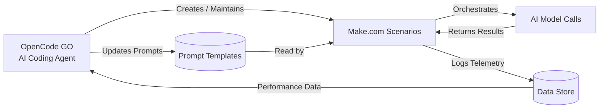
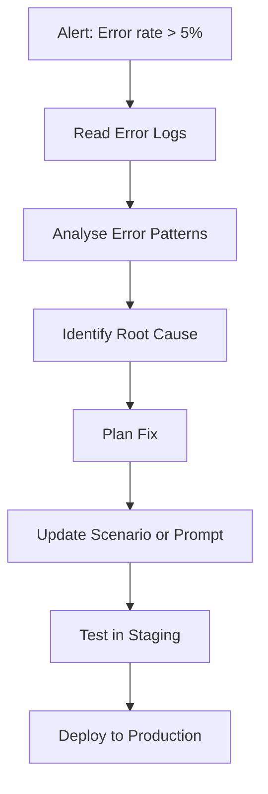

# OpenCode GO

OpenCode GO is the **orchestration layer** for the Jasfo Lead Intelligence Platform. It is an AI coding agent that manages, maintains, and evolves the Make.com pipelines that drive the 14-layer lead intelligence architecture.

## Role in the Pipeline

OpenCode GO does not process lead data directly. Instead, it:

1. **Maintains Make.com scenarios** — Creates, updates, and debugs the Make.com modules that call AI models
2. **Manages prompt templates** — Stores, versions, and deploys prompt templates used by all agents
3. **Monitors pipeline health** — Tracks error rates, latency, cache hit rates, and cost across all layers
4. **Evolves the system** — Analyses performance data and suggests improvements to prompts, routing, or architecture

## Relationship to Make.com



## Capabilities

### Scenario Management

OpenCode GO can:

- **Read** existing Make.com scenario configurations via the Make.com API
- **Create** new scenarios for new pipeline layers or processing paths
- **Update** existing scenarios to change routing rules, prompts, or error handling
- **Debug** failing scenarios by reading error logs and comparing expected vs actual outputs

### Prompt Management

All prompt templates are stored as **versioned text files** managed by OpenCode GO:

```
prompts/
├── v1/
│   ├── discovery.txt
│   ├── verification.txt
│   ├── consensus.txt
│   └── judge.txt
├── v2/
│   ├── discovery.txt
│   ├── verification.txt
│   └── ...
└── current -> v2/
```

When a prompt is updated, OpenCode GO:

1. Writes the new prompt to a new version directory
2. Updates the `current` symlink
3. Invalidates cache entries with the old prompt hash
4. Logs the change and rationale

### Pipeline Monitoring

OpenCode GO has access to pipeline telemetry stored in Make.com data stores:

| Metric | Source | Action if Degraded |
|--------|--------|-------------------|
| Layer error rate | Per-layer error logs | Debug scenario, fix routing |
| Average latency | Make.com execution logs | Optimise prompts, switch models |
| Cache hit rate | Cache store stats | Adjust TTLs, review prompt hashing |
| Cost per lead | Cost tracking store | Re-route to cheaper models |
| Degraded lead rate | Lead quality store | Review fallback behaviour |

## Integration Points

OpenCode GO integrates with the pipeline through:

### 1. Make.com API

```
GET https://eu1.make.com/api/v2/scenarios/{id}
PATCH https://eu1.make.com/api/v2/scenarios/{id}
POST https://eu1.make.com/api/v2/scenarios/{id}/clone
```

The API token is stored in environment variables and used only by OpenCode GO — never exposed to the pipeline.

### 2. File System

Prompt templates and configuration files are stored on the local file system and read by Make.com via the **Read File** module. This allows OpenCode GO to update prompts by writing files, which Make.com picks up on the next execution.

### 3. Data Store

Pipeline metrics and error logs are written to Make.com data stores. OpenCode GO can query these stores via the Make.com API to generate reports and identify issues.

## Typical Workflow



## Configuration Scripts

OpenCode GO maintains setup and diagnostic scripts:

- `setup-scenarios.mjs` — Creates initial Make.com scenarios for all 14 layers
- `update-prompts.mjs` — Syncs prompt templates from file system to Make.com
- `health-check.mjs` — Tests all model endpoints and cache connectivity
- `cost-report.mjs` — Generates weekly cost breakdown by model and layer

## System Access

| Resource | Access Level | Purpose |
|----------|-------------|---------|
| Make.com API | Read/write | Scenario management |
| Prompt template files | Read/write | Prompt versioning |
| Pipeline data stores | Read-only | Monitoring and debugging |
| AI model APIs | Read-only (via diagnostics) | Health checks |
| Lead database | None | Never accesses lead data directly |

OpenCode GO has **no access to lead data**. It works exclusively with pipeline configuration, telemetry, and prompts.
