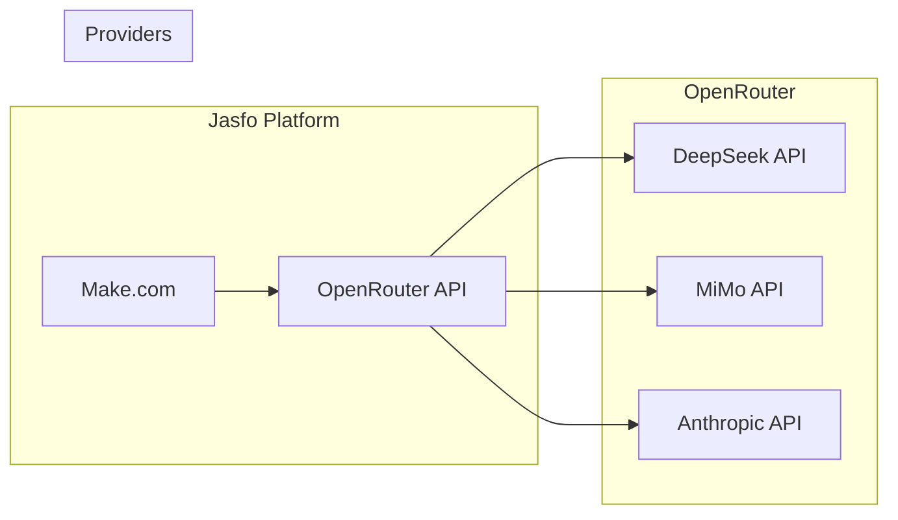

# OpenRouter Integration

OpenRouter is the unified API gateway for all AI model calls in the Jasfo Lead Intelligence Platform. It provides access to DeepSeek V4 Flash, MiMo V2.5, and Claude Sonnet 4 through a single consistent API, with automatic fallback across providers.

## Architecture



## API Setup

### Authentication

OpenRouter uses a single API key for all model access:

```
Authorization: Bearer ${OPENROUTER_API_KEY}
```

The key is stored in Make.com's **secure data store** and referenced by variable, never hard-coded in scenarios.

### Endpoint

```
POST https://openrouter.ai/api/v1/chat/completions
```

### Request Format

A standard request:

```json
{
  "model": "deepseek/deepseek-v4-flash",
  "messages": [
    {
      "role": "system",
      "content": "You are a lead intelligence agent..."
    },
    {
      "role": "user",
      "content": "Extract company data from:\n\n[input_text]"
    }
  ],
  "temperature": 0.1,
  "max_tokens": 4096,
  "response_format": { "type": "json_object" }
}
```

### Provider Routing

OpenRouter routes to the best available provider for each model. You can also specify preferred providers:

```json
{
  "model": "deepseek/deepseek-v4-flash",
  "provider": {
    "order": ["DeepSeek", "Together", "Fireworks"],
    "allow_fallbacks": true
  }
}
```

The platform uses the default OpenRouter provider ordering, which automatically selects the cheapest available provider for each model.

## Model Selection on OpenRouter

| Local Model Name | OpenRouter Model ID | Default Provider | Fallback Providers |
|-----------------|--------------------|-----------------|-------------------|
| DeepSeek V4 Flash | `deepseek/deepseek-v4-flash` | DeepSeek | Together, Fireworks |
| MiMo V2.5 | `mimo/mimo-v2.5` | MiMo | None currently |
| Claude Sonnet 4 | `anthropic/claude-sonnet-4` | Anthropic | None currently |

## Fallback Chains

OpenRouter's built-in fallback mechanism is configured per model:

```json
{
  "model": "deepseek/deepseek-v4-flash",
  "provider": {
    "order": ["DeepSeek", "Together", "Fireworks", "Novita"],
    "allow_fallbacks": true,
    "skip_fallback": false
  }
}
```

If the primary provider returns a 5xx error or times out, OpenRouter automatically retries with the next provider in the chain. The platform also implements its own retry layer (see [Fallback](../ai/fallback.md)) as a second line of defence.

## Cost Tracking

OpenRouter's response headers include cost information:

```
x-openrouter-cost: $0.000042
x-openrouter-tokens: 342
x-openrouter-model: deepseek/deepseek-v4-flash
```

These values are captured by Make.com and logged to a cost-tracking data store:

| Field | Source |
|-------|--------|
| `model` | `x-openrouter-model` header |
| `cost` | `x-openrouter-cost` header |
| `input_tokens` | `usage.prompt_tokens` in response body |
| `output_tokens` | `usage.completion_tokens` in response body |
| `provider` | `x-openrouter-provider` header |

A weekly Make.com scenario aggregates cost data into a report, split by model and by pipeline layer.

## Rate Limits

OpenRouter enforces rate limits based on account tier:

| Tier | Requests/min | Concurrent Requests | Monthly Cap |
|------|-------------|-------------------|-------------|
| Free | 20 | 1 | 100 |
| Tier 1 | 60 | 5 | $5 |
| Tier 2 | 500 | 25 | $50 |
| Tier 3 | 2,000 | 100 | $250 |
| Tier 4 | 5,000 | 250 | Unlimited |

The Jasfo platform operates on **Tier 2** ($50 monthly commitment), which provides **500 requests/minute** with **25 concurrent connections**. This is sufficient for the current lead volume.

### Rate Limit Handling

When a 429 response is received:

1. Read `Retry-After` header (typically 1–60 seconds)
2. Pause the Make.com queue for that specific model
3. Resume after `Retry-After` seconds
4. If rate-limited again within 60 seconds, switch to a fallback provider

## Error Codes

| HTTP Status | Meaning | Platform Action |
|------------|---------|-----------------|
| 200 | Success | Parse response |
| 400 | Bad request | Check prompt format, log error |
| 401 | Invalid key | Alert admin, pause pipeline |
| 429 | Rate limited | Pause queue, retry after delay |
| 5xx | Provider error | Retry with fallback provider |
| 503 | Service unavailable | Retry, switch models |

## Security

- API keys are stored in Make.com's **secure data store** with encrypted values
- Keys are never logged in scenario outputs or error messages
- OpenRouter key can be rotated without downtime via the data store
- All API calls use HTTPS
