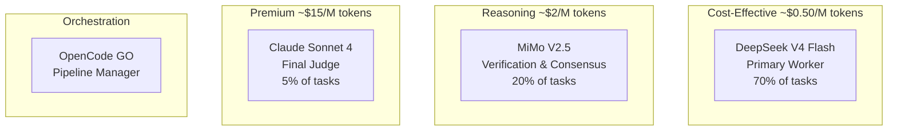
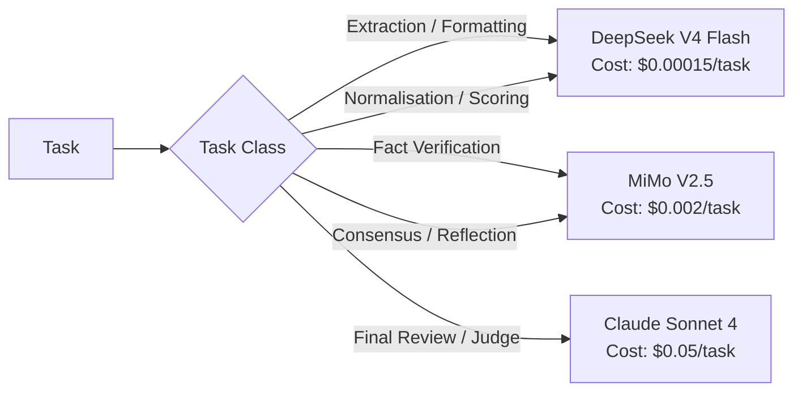

# Models Overview

The Jasfo Lead Intelligence Platform uses **four model tiers** to balance cost, speed, and accuracy. Each model has a specific role in the pipeline, with clear boundaries about which tasks it handles and which it does not.

## Model Tiers

## Model Summary

| Model | Role | % of Tasks | Cost per 1M Input Tokens | Avg Latency | Strengths |
|-------|------|-----------|-------------------------|-------------|-----------|
| DeepSeek V4 Flash | Primary worker | 70% | $0.50 | 2–4s | Speed, throughput, cost |
| MiMo V2.5 | Reasoning engine | 20% | $2.00 | 5–10s | Multi-step reasoning, verification |
| Claude Sonnet 4 | Premium judge | 5% | $15.00 | 8–15s | Final review, nuanced judgment |
| OpenCode GO | Orchestrator | 5% | Variable | N/A | Pipeline management, Make integration |

## Allocation by Task Type

## Cost Allocation

Of the total monthly AI API spend:

| Model | Monthly Spend | Tasks/Month | Notes |
|-------|-------------|-------------|-------|
| DeepSeek V4 Flash | ~$120 | ~85,000 | Largest volume, lowest unit cost |
| MiMo V2.5 | ~$55 | ~24,000 | Medium volume, medium complexity |
| Claude Sonnet 4 | ~$40 | ~480 | Lowest volume, highest value |
| **Total** | **~$215** | **~109,000** | |

## When to Upgrade

The model router upgrades to a higher tier when:

1. **Task requires multi-step reasoning** — MiMo or Claude instead of DeepSeek
2. **Confidence in current result is too low** — Run verification on a higher tier
3. **Contradiction detected** — Higher tier resolves disagreements
4. **Final review** — Only Claude Sonnet 4 for the Judge gate

The router never escalates unnecessarily: if a task can be completed with **sufficient confidence** on a cheap model, it stays on that model.

## Detailed Documentation

- [DeepSeek V4 Flash](deepseek-v4-flash.md) — Primary worker model details
- [MiMo V2.5](mimo.md) — Reasoning model details
- [Claude Sonnet 4](claude-sonnet-4.md) — Premium judge model details
- [OpenRouter](openrouter.md) — API integration and fallback chains
- [OpenCode GO](opencode-go.md) — Orchestration layer details
- [Model Selection](model-selection.md) — Decision tree for model choice
- [Cost Analysis](cost-analysis.md) — Detailed cost breakdown per model
- [Future Models](future-models.md) — Planned upgrades and evaluation framework
