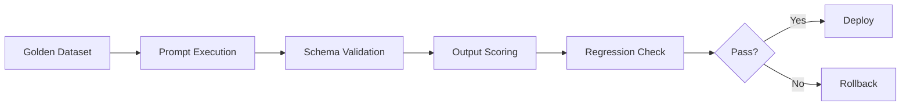

# Prompt Library

The Jasfo Lead Intelligence Platform uses a structured prompt library organized by agent role and responsibility. This document describes the organization, versioning strategy, and testing framework that governs all prompts in the system.

## Organization

Prompts are organized into four categories, each stored as a separate markdown file with versioned sections:

| Category | File | Purpose |
|----------|------|---------|
| System | `system-prompts.md` | Role definitions, behavioral constraints, output rules |
| Developer | `developer-prompts.md` | Context injection, data formatting, chain-of-thought patterns |
| User | `user-prompts.md` | Message templates passed to AI models with structured data |
| Few-Shot | `few-shot.md` | Example inputs and expected outputs per agent role |

Each prompt entry includes a unique identifier (e.g., `PROMPT-SYS-001`), version number, last modified date, and the full prompt text.

### Directory Layout

```
prompts/
├── README.md              # This file
├── system-prompts.md      # Agent role definitions
├── developer-prompts.md   # Developer/context prompts
├── user-prompts.md        # User message templates
├── json-schema.md         # Output validation schemas
├── few-shot.md            # Example-based prompts
├── prompt-versioning.md   # Version control process
├── prompt-testing.md      # Testing methodology
└── hallucination-tests.md # Anti-hallucination test suite
```

## Versioning

Every prompt is versioned using semantic versioning (`MAJOR.MINOR.PATCH`):

- **MAJOR**: Breaking change to output structure or agent behavior
- **MINOR**: Addition of new constraints, examples, or context fields
- **PATCH**: Typo fixes, formatting corrections, non-semantic changes

Version history is maintained inline within each prompt file as a YAML front-matter block:

```yaml
---
id: PROMPT-SYS-001
version: 2.1.0
last_modified: 2026-07-10
change_summary: Added reflection constraint for scoring agents
---
```

A changelog is appended to the end of each file, with entries sorted newest-first.

## Testing Framework

All prompts are validated against a golden dataset of 200+ known companies. The testing pipeline executes four phases:



### Test Categories

1. **Schema Validation**: Every prompt output is validated against its JSON schema (see `json-schema.md`). Structural errors fail immediately.
2. **Regression Testing**: Each prompt version runs against the golden dataset. Scores below 90% on any metric trigger a rollback.
3. **Hallucination Detection**: A separate suite (see `hallucination-tests.md`) probes known failure modes including fabricated data, incorrect URL construction, and entity hallucination.
4. **A/B Evaluation**: Candidate prompts run side-by-side against production prompts on a held-out test set. A 5-point scoring rubric evaluates accuracy, completeness, clarity, and conciseness.

### Continuous Integration

Prompts are tested automatically before deployment via a GitHub Actions workflow:

```yaml
# .github/workflows/prompt-tests.yml (abbreviated)
- name: Validate prompts
  run: python scripts/validate_prompts.py --all

- name: Run golden dataset
  run: python scripts/run_golden_tests.py --dataset datasets/golden-v3.json

- name: Check hallucination suite
  run: python scripts/hallucination_test.py --suite full
```

## Rollback Procedure

If a prompt change causes degradation:

1. Revert the prompt file to the previous version using git revert.
2. Re-run the golden dataset to confirm scores recover.
3. Tag the rollback in the changelog with the failed version number.
4. Deploy the reverted prompt.

Detailed rollback steps are documented in `prompt-versioning.md`.
