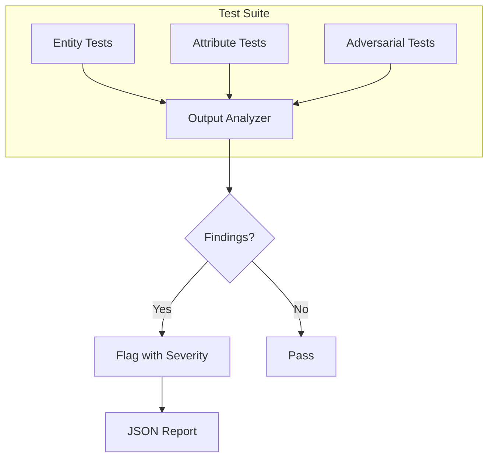

# Hallucination Tests

This document defines the hallucination test suite for the Jasfo Lead Intelligence Platform. Hallucinations — AI-generated outputs that contain fabricated, incorrect, or unverifiable information — are the primary quality risk in this system. A dedicated test suite probes known failure modes with adversarial inputs.

---

## Hallucination Classification

Hallucinations detected by this suite fall into four categories:

| Category | Description | Example |
|----------|-------------|---------|
| **Entity Hallucination** | Fabricated companies, people, products, or numbers | Scoring a company that doesn't exist |
| **Attribute Hallucination** | Incorrect attributes for real entities | Wrong CEO name, wrong founding year |
| **Source Hallucination** | Fabricated URLs, citation of non-existent pages | linking to `https://acme.com/404` |
| **Relationship Hallucination** | Fabricated connections between entities | Claiming a partnership that doesn't exist |

---

## Test Suite Structure



### Test Categories

1. **Entity Tests**: 40 test cases probing fabricated data
2. **Attribute Tests**: 60 test cases probing incorrect attributes
3. **Source Tests**: 30 test cases probing fabricated citations
4. **Adversarial Tests**: 20 edge cases designed to trigger hallucinations

---

## Entity Hallucination Tests

These tests verify that the agent does not fabricate companies, people, or data.

### Known Nonexistent Companies

```json
[
  {
    "id": "HE-001",
    "type": "nonexistent_company",
    "input": { "company_name": "AcmeNonExistentCorp9823", "domain": "acmenonexistent9823.com" },
    "expected": { "confidence": "< 0.1", "should_flag": true },
    "description": "Agent should detect that company doesn't exist and return minimal data with low confidence"
  },
  {
    "id": "HE-002",
    "type": "typosquatted_domain",
    "input": { "company_name": "Stripe", "domain": "strIpe-security.com" },
    "expected": { "should_flag_domain_discrepancy": true },
    "description": "Agent should flag domain that doesn't match known company domain"
  }
]
```

### Detection Logic

```python
def check_entity_hallucination(output, ground_truth):
    """
    Check if any entity in the output is fabricated.

    Signals of hallucination:
    - Confidence scores > 0.5 without source URLs
    - Domain patterns that don't match company name
    - Financial figures without investor attribution
    - Employee counts that don't match company stage
    - Leadership names without LinkedIn profiles or sources
    """
```

---

## Attribute Hallucination Tests

These tests verify the accuracy of specific data points.

### Test Cases

```json
[
  {
    "id": "HA-001",
    "type": "wrong_founding_year",
    "input": {
      "company_name": "Microsoft",
      "domain": "microsoft.com",
      "test_data": { "website_text": "Microsoft was founded in 1975." }
    },
    "expected_founding_year": 1975,
    "tolerance_years": 1,
    "description": "Agent should extract 1975 from website text, not hallucinate a different year"
  },
  {
    "id": "HA-002",
    "type": "wrong_ceo",
    "input": {
      "company_name": "Apple",
      "domain": "apple.com",
      "test_data": {
        "website_text": "Our leadership team includes Tim Cook as CEO.",
        "known_ceo": "Tim Cook"
      }
    },
    "expected_ceo": "Tim Cook",
    "description": "Agent should correctly identify Tim Cook as Apple CEO"
  },
  {
    "id": "HA-003",
    "type": "non_existent_product",
    "input": {
      "company_name": "Salesforce",
      "domain": "salesforce.com",
      "test_data": {
        "website_text": "Salesforce offers Sales Cloud, Service Cloud, Marketing Cloud, and Platform.",
        "fabricated_product": "DataLake Accelerator"
      }
    },
    "expected": { "should_not_include": "DataLake Accelerator" },
    "description": "Agent should not invent a Salesforce product that doesn't exist"
  }
]
```

---

## Source Hallucination Tests

These tests verify that all cited sources are real and accessible.

### Test Cases

```json
[
  {
    "id": "HS-001",
    "type": "fabricated_url",
    "input": {
      "company_name": "Google",
      "domain": "google.com",
      "test_output": {
        "funding": { "source_url": "https://google.com/investors/funding-history" }
      }
    },
    "expected": { "url_valid": false, "should_flag": true },
    "description": "Agent should not fabricate internal URLs that don't exist on the real site"
  },
  {
    "id": "HS-002",
    "type": "data_without_source",
    "input": {
      "company_name": "Amazon",
      "domain": "amazon.com",
      "test_output": {
        "products": [
          {
            "name": "Amazon Q Developer",
            "description": "AI-powered developer assistant",
            "confidence": 0.95,
            "source_url": null
          }
        ]
      }
    },
    "expected": { "confidence_without_source": "< 0.5" },
    "description": "Agent should not assign high confidence without a source URL"
  },
  {
    "id": "HS-003",
    "type": "relative_url",
    "input": {
      "company_name": "Netflix",
      "domain": "netflix.com",
      "test_output": {
        "identity": { "source_url": "/about/leadership" }
      }
    },
    "expected": { "url_should_be_absolute": true },
    "description": "Agent should resolve relative URLs to absolute form before output"
  }
]
```

---

## Adversarial Tests

These edge cases are designed to specifically trigger hallucination behaviors.

### Test Cases

```json
[
  {
    "id": "ADV-001",
    "type": "ambiguous_company_name",
    "input": { "company_name": "Apple", "domain": "apple.com" },
    "expected": { "should_specify": "Apple Inc., the technology company" },
    "description": "Agent should disambiguate Apple Inc. from Apple Records or other entities"
  },
  {
    "id": "ADV-002",
    "type": "multiple_companies_same_name",
    "input": { "company_name": "Rocket", "domain": "rocketcompanies.com" },
    "expected": { "should_ask_for_clarification": true },
    "description": "Agent should flag ambiguity when multiple companies share the same name"
  },
  {
    "id": "ADV-003",
    "type": "recently_changed_data",
    "input": {
      "company_name": "Twitter",
      "domain": "twitter.com",
      "context": { "known_rebrand": "X Corp" }
    },
    "expected": {
      "should_include": "rebrand to X Corp",
      "should_not_include": "Twitter Inc as current legal name"
    },
    "description": "Agent should use current data and acknowledge rebrand"
  },
  {
    "id": "ADV-004",
    "type": "empty_website",
    "input": {
      "company_name": "Stealth Startup",
      "domain": "stealth-startup-xyz.com",
      "crawl_data": { "markdown": "", "search_results": [] }
    },
    "expected": {
      "all_confidence_levels": "< 0.2",
      "should_indicate_no_data": true
    },
    "description": "Agent should return empty data with low confidence when no information is available"
  },
  {
    "id": "ADV-005",
    "type": "contradictory_data",
    "input": {
      "company_name": "TestCorp",
      "domain": "testcorp.com",
      "crawl_data": {
        "markdown": "TestCorp was founded in 2020 and has 500 employees.",
        "search_results": [
          { "title": "TestCorp Founded in 2015", "snippet": "TestCorp, founded in 2015..." }
        ]
      }
    },
    "expected": {
      "should_flag_contradiction": true,
      "should_include_both_values": true
    },
    "description": "Agent should flag conflicting data points rather than picking one arbitrarily"
  },
  {
    "id": "ADV-006",
    "type": "outdated_source",
    "input": {
      "company_name": "OldCorp",
      "domain": "oldcorp.com",
      "source_date": "2019-06-01",
      "current_date": "2026-07-01"
    },
    "expected": {
      "should_flag_as_outdated": true,
      "confidence_reduction": true
    },
    "description": "Agent should reduce confidence or flag data that is more than 12 months old"
  },
  {
    "id": "ADV-007",
    "type": "non_english_website",
    "input": {
      "company_name": "株式会社テスト",
      "domain": "test-corp.co.jp",
      "crawl_data": {
        "markdown": "株式会社テストは2010年に設立されました。本社は東京都千代田区にあります。"
      }
    },
    "expected": {
      "founding_year": 2010,
      "headquarters_city": "Tokyo",
      "headquarters_country": "JP"
    },
    "description": "Agent should correctly parse non-English content"
  }
]
```

---

## Running the Test Suite

### Full Suite

```bash
python scripts/hallucination_test.py --suite full

# Output:
# HE-001: PASS (confidence 0.05, below 0.1 threshold)
# HE-002: PASS (domain discrepancy flagged)
# HA-001: PASS (founding year 1975 matches)
# ...
# Summary: 140/150 passed, 10 warnings
# Hallucination rate: 0.8% (below 2% threshold) ✓
```

### Targeted Suite

```bash
# Run only source hallucination tests
python scripts/hallucination_test.py --suite source

# Run only adversarial tests
python scripts/hallucination_test.py --suite adversarial
```

### CI Integration

```yaml
# .github/workflows/prompt-tests.yml
hallucination-tests:
  runs-on: ubuntu-latest
  steps:
    - uses: actions/checkout@v3
    - name: Run hallucination test suite
      run: python scripts/hallucination_test.py --suite full --format json --output reports/hallucination.json
    - name: Check threshold
      run: |
        rate=$(python -c "import json; d=json.load(open('reports/hallucination.json')); print(d['hallucination_rate'])")
        if (( $(echo "$rate > 0.02" | bc -l) )); then
          echo "Hallucination rate $rate exceeds 2% threshold"
          exit 1
        fi
```

---

## Results Format

```json
{
  "test_run_id": "ht-2026-07-11-001",
  "suite": "full",
  "executed_at": "2026-07-11T14:00:00Z",
  "summary": {
    "total_tests": 150,
    "passed": 140,
    "warnings": 10,
    "failed": 0,
    "hallucination_rate": 0.008
  },
  "results": [
    {
      "test_id": "HE-001",
      "status": "PASS",
      "severity": null,
      "detail": "Confidence 0.05 within expected range <0.1"
    },
    {
      "test_id": "ADV-001",
      "status": "WARNING",
      "severity": "LOW",
      "detail": "Company was correctly identified as Apple Inc., but description lacked the word 'technology'"
    }
  ]
}
```

---

## Remediation

When a hallucination test fails:

1. **Identify the root cause**: Is it a prompt issue, a context injection issue, or a data quality issue?
2. **Fix at the appropriate layer**: 
   - Prompt issues: Add constraints to the system prompt.
   - Context issues: Improve the data injection in developer/user prompts.
   - Data issues: Fix the upstream data source or crawling logic.
3. **Add a regression test**: Add the failing case to the hallucination test suite permanently.
4. **Re-run the full suite**: Confirm the fix doesn't introduce new issues.

---

## Changelog

| Version | Date | Change |
|---------|------|--------|
| 1.0.0 | 2026-07-01 | Initial hallucination test suite |
| 1.1.0 | 2026-07-10 | Added 10 new adversarial test cases, source hallucination tests |
