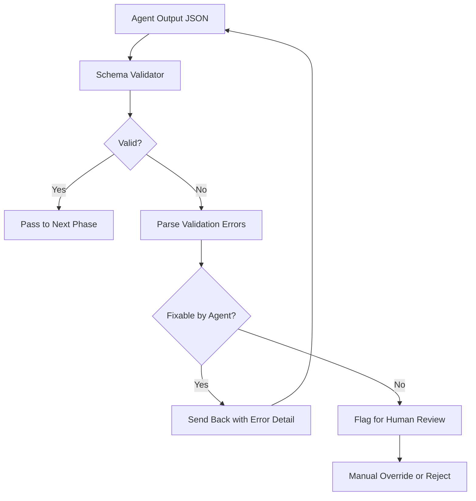

# JSON Schemas

This document defines the JSON schemas (Zod-like validation specs) for all structured outputs produced by the Jasfo Lead Intelligence Platform agents. Every schema includes TypeScript-style type definitions, validation rules, and field-level constraints.

---

## Schema Registry

| Schema | Agent | Version | Validated By |
|--------|-------|---------|-------------|
| CompanyData | Discovery | 2.0.0 | PROMPT-USER-001 |
| ScoreCard | Scoring | 2.1.0 | PROMPT-USER-002 |
| IntelligenceReport | Orchestrator | 1.3.0 | Final output |
| ReflectionReport | Reflection | 1.1.0 | PROMPT-DEV-004 |
| ExportPayload | Export | 1.2.0 | PROMPT-USER-003 |

---

## CompanyData Schema

```typescript
interface CompanyData {
  /** Version of this schema */
  schema_version: "2.0.0";

  /** Company identity information */
  identity: {
    name: string;                           // min 1 char
    domain: string;                         // valid URL format
    legal_name?: string;                    // optional
    founding_year?: number;                 // 1800..2030
    headquarters?: {
      city: string;
      state?: string;
      country: string;                      // ISO 3166-1 alpha-2
    };
    company_type?: "public" | "private" | "nonprofit" | "government";
    employee_count?: {
      range: string;                        // e.g. "51-200"
      source_url?: string;
      confidence: number;                   // 0.0..1.0
    };
    industry_classifications?: Array<{
      system: "NAICS" | "SIC" | "GICS" | "Custom";
      code: string;
      label: string;
    }>;
    social_links?: {
      linkedin?: string;
      crunchbase?: string;
      twitter?: string;
      github?: string;
    };
  };

  /** Product/service descriptions */
  products: Array<{
    name: string;
    description: string;
    category?: string;
    pricing_model?: "free" | "freemium" | "usage-based"
      | "seat-based" | "quote-based" | "not found";
    pricing_tiers?: Array<{
      name: string;
      price: number;
      currency: string;                     // ISO 4217
      billing: "monthly" | "annual" | "one-time";
    }>;
    confidence: number;
  }>;

  /** Technology stack */
  technology_stack?: {
    categories: Array<{
      name: string;                         // e.g. "Analytics", "CRM"
      technologies: Array<{
        name: string;
        category?: string;
        detected_via: string;               // source URL or tool
        confidence: number;
      }>;
    }>;
  };

  /** Funding history */
  funding?: {
    total_raised?: number;                  // USD
    currency: string;
    rounds: Array<{
      date: string;                         // ISO 8601
      round_type: "Seed" | "Series A" | "Series B" | "Series C"
        | "Series D" | "Growth" | "Debt" | "Grant" | "IPO";
      amount: number;
      currency: string;
      investors?: string[];
      valuation?: number;
      source_url: string;
      confidence: number;
    }>;
    last_funding_date?: string;
    confidence: number;
  };

  /** Leadership team */
  leadership: Array<{
    name: string;
    title: string;
    linkedin_url?: string;
    since?: string;                         // ISO 8601
    confidence: number;
  }>;

  /** Market context */
  market?: {
    competitors?: Array<{
      name: string;
      domain?: string;
      description?: string;
    }>;
    market_position?: "leader" | "challenger" | "niche" | "unknown";
    target_segments?: string[];
  };

  /** Recent signals */
  signals?: {
    news: Array<{
      title: string;
      url: string;
      date: string;                         // ISO 8601
      summary: string;
      source: string;
    }>;
    job_postings?: Array<{
      title: string;
      department?: string;
      location?: string;
      date_posted: string;
      url: string;
    }>;
    seo_activity?: {
      organic_keywords?: number;
      estimated_traffic?: number;
      domain_authority?: number;
      source: string;
      confidence: number;
    };
  };

  /** Metadata about this record */
  metadata: {
    sources_used: string[];                  // URLs
    crawl_id: string;
    scraped_at: string;                      // ISO 8601
    processing_time_ms: number;
    completeness_score: number;              // 0.0..1.0
  };
}
```

### Validation Rules

| Field | Rule | Error Message |
|-------|------|--------------|
| `identity.name` | Required, min 1 char | "Company name is required" |
| `identity.domain` | Valid URL format | "Domain must be a valid URL" |
| `identity.country` | ISO 3166-1 alpha-2 | "Country must be a 2-letter code" |
| `founding_year` | 1800..2030 | "Founding year out of range" |
| `products[].confidence` | 0.0..1.0 per item | "Confidence must be between 0 and 1" |
| `funding.rounds[].amount` | > 0 | "Funding amount must be positive" |
| `metadata.completeness_score` | 0.0..1.0 | "Completeness score out of range" |

---

## ScoreCard Schema

```typescript
interface ScoreCard {
  /** Version of this schema */
  schema_version: "2.1.0";

  /** Target company */
  company_name: string;
  domain: string;

  /** Scoring metadata */
  scored_at: string;                        // ISO 8601
  scoring_model: "8-pillar-v2";

  /** Per-pillar scores */
  pillars: Array<{
    name: "Product Fit" | "ICP Alignment" | "Technology Fit"
      | "Funding Health" | "Growth Signal" | "Intent Signal"
      | "Competitive Moat" | "Relationship";
    score: number;                          // 0..100, integer
    weight: number;                         // 0.0..1.0
    justification: string;                  // 1-3 sentences
    evidence: Array<{
      source_url: string;
      snippet: string;
    }>;
    data_available: boolean;
  }>;

  /** Composite calculation */
  composite: {
    raw_score: number;                      // float, weighted average
    rounded_score: number;                  // integer composite
    confidence: "High" | "Medium" | "Low";
  };

  /** Risk factors and flags */
  risk_factors: Array<{
    description: string;
    severity: "Low" | "Medium" | "High" | "Critical";
    affected_pillars: string[];
    mitigation?: string;
  }>;

  /** Reflection pass results */
  reflection?: {
    passed: boolean;
    findings: Array<{
      type: "CONSISTENCY" | "ACCURACY" | "COMPLETENESS";
      description: string;
      resolved: boolean;
    }>;
  };

  /** Scoring metadata */
  metadata: {
    total_processing_time_ms: number;
    pillars_with_data: number;
    pillars_without_data: number;
    model_used: string;
  };
}
```

### Validation Rules

| Field | Rule | Error Message |
|-------|------|--------------|
| `pillars[].score` | 0..100 integer | "Score must be an integer 0-100" |
| `pillars[].weight` | 0.0..1.0 | "Weight must be 0 to 1" |
| Sum of weights | == 1.0 (±0.01) | "Weights must sum to 1.0" |
| `composite.raw_score` | == weighted average | "Composite must match pillar weights" |
| `composite.rounded_score` | == round(raw) | "Rounded score must match raw" |
| `risk_factors` | 0+ items | OK to be empty |

---

## IntelligenceReport Schema

```typescript
interface IntelligenceReport {
  /** Version of this schema */
  schema_version: "1.3.0";

  /** Report identity */
  report_id: string;                        // UUID v4
  company_name: string;
  domain: string;
  generated_at: string;                     // ISO 8601
  generated_by: string;                     // agent name

  /** Core data sections */
  company_data: CompanyData;
  scorecard: ScoreCard;

  /** Summary */
  executive_summary: string;                // 2-3 paragraphs
  key_highlights: Array<{
    category: string;
    finding: string;
    significance: "positive" | "negative" | "neutral";
  }>;
  next_steps: Array<{
    action: string;
    priority: "immediate" | "this_week" | "this_month";
    assigned_to?: string;
  }>;

  /** Export metadata */
  export: {
    format: string;
    delivered_at?: string;
    delivery_channel: string;
    delivery_status: "pending" | "sent" | "failed";
  };
}
```

---

## ReflectionReport Schema

```typescript
interface ReflectionReport {
  /** Version of this schema */
  schema_version: "1.1.0";

  /** Review target */
  agent_output_id: string;
  agent_type: "discovery" | "scoring" | "export";
  reviewed_at: string;                      // ISO 8601

  /** Verdict */
  verdict: "PASS" | "FAIL";
  overall_quality: 1 | 2 | 3 | 4 | 5;      // Likert scale

  /** Findings */
  findings: Array<{
    id: string;
    severity: "CRITICAL" | "HIGH" | "MEDIUM" | "LOW";
    category: string;                       // e.g. "hallucination", "consistency"
    description: string;
    location: string;                       // JSON path to the issue
    suggested_fix: string;
  }>;

  /** Summary */
  summary: string;
  remediation_instructions?: string;         // only if verdict == FAIL
}
```

---

## ExportPayload Schema

```typescript
interface ExportPayload {
  /** Version of this schema */
  schema_version: "1.2.0";

  /** Export configuration */
  format: "json" | "csv" | "markdown" | "pdf" | "telegram";
  channel: "telegram" | "email" | "webhook";

  /** Content */
  content: string;                          // formatted output
  report: IntelligenceReport;               // source data

  /** Delivery metadata */
  delivery: {
    attempted_at: string;
    status: "pending" | "sent" | "failed";
    error_message?: string;
    recipient?: string;                     // channel-specific
    message_id?: string;                    // Telegram message ID
  };

  /** Size management */
  size: {
    raw_bytes: number;
    compressed_bytes?: number;
    truncated: boolean;
    original_length?: number;
  };
}
```

---

## Schema Validation Pipeline



### Validation Implementation (Pseudocode)

```typescript
function validateSchema(data: unknown, schema: string): ValidationResult {
  // 1. Check required fields
  // 2. Validate field types
  // 3. Check numeric ranges
  // 4. Validate enum values
  // 5. Check nested object structure
  // 6. Return result with error paths
}
```

---

## Changelog

| Version | Date | Change |
|---------|------|--------|
| 2.0.0 | 2026-07-08 | CompanyData: Added `social_links`, `industry_classifications`, `seo_activity` |
| 2.1.0 | 2026-07-10 | ScoreCard: Added per-pillar weights, reflection block |
| 1.3.0 | 2026-07-05 | IntelligenceReport: Added `export` metadata section |
| 1.1.0 | 2026-07-09 | ReflectionReport: Initial schema |
| 1.2.0 | 2026-07-05 | ExportPayload: Initial schema |
