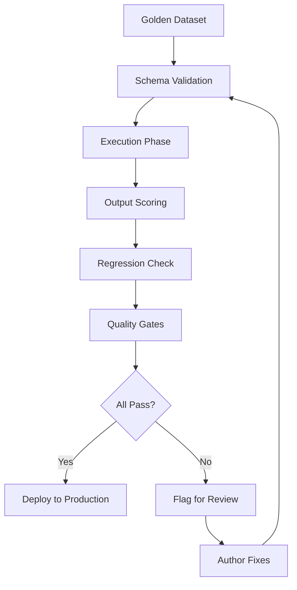

# Prompt Testing

This document describes the testing methodology used to validate all prompts in the Jasfo Lead Intelligence Platform. Prompts are tested through a multi-phase pipeline that ensures accuracy, consistency, and freedom from hallucination before deployment.

---

## Testing Philosophy

1. **Data-Driven**: Tests use real company data from the golden dataset. No synthetic or AI-generated test data.
2. **Automated**: The entire test pipeline runs without human intervention via GitHub Actions.
3. **Quantitative**: Every test produces numeric scores that must meet or exceed defined thresholds.
4. **Reproducible**: Tests use fixed seeds, pinned model versions, and cached responses where possible.

---

## Test Pipeline



### Phase 1: Schema Validation

Every prompt output is validated against its JSON schema:

```bash
python scripts/validate_output_schema.py \
  --prompt-id PROMPT-SYS-003 \
  --outputs test_outputs/scoring_*.json \
  --schema schemas/scorecard.json
```

**Pass criteria**: 100% of outputs must pass schema validation. Any structural error fails the phase.

### Phase 2: Execution

The prompt is executed against the golden dataset:

```bash
python scripts/run_golden_tests.py \
  --prompt-id PROMPT-SYS-002 \
  --dataset datasets/golden-v3.json \
  --num-companies 200 \
  --model claude-sonnet-4-20250514
```

### Phase 3: Output Scoring

Each output is scored on four dimensions:

| Metric | Weight | Description |
|--------|--------|-------------|
| **Accuracy** | 40% | Are data points correct and properly attributed? |
| **Completeness** | 25% | Are all required fields populated? |
| **Clarity** | 20% | Is the output well-structured and readable? |
| **Conciseness** | 15% | Is the output free of unnecessary verbosity? |

Each output gets a 0–100 score per dimension. The overall score is the weighted sum.

### Phase 4: Regression Check

The new prompt version's outputs are compared against the previous version:

```bash
python scripts/regression_test.py \
  --baseline outputs/v2.0.0/ \
  --candidate outputs/v2.1.0/ \
  --threshold 0.90
```

**Pass criteria**: Score must be >= 90% of the baseline version score. If a regression is detected, the test fails.

### Phase 5: Quality Gates

| Gate | Threshold | Action on Failure |
|------|-----------|-------------------|
| Schema compliance | 100% | Block deployment |
| Accuracy score | >= 85 | Block deployment |
| Completeness score | >= 75 | Warning (manual review) |
| Hallucination rate | < 2% of outputs | Block deployment |
| Regression | >= 90% of baseline | Block deployment |

---

## Golden Dataset

The golden dataset is a curated collection of 200+ company records with verified ground truth data.

### Dataset Composition

```json
{
  "metadata": {
    "version": "v3",
    "as_of": "2026-07-01",
    "total_companies": 234,
    "verified_by": "manual_human_review"
  },
  "companies": [
    {
      "company_name": "Stripe",
      "domain": "stripe.com",
      "ground_truth": {
        "identity": { "founding_year": 2010, "company_type": "private", "employee_range": "5001-10000" },
        "funding": { "total_raised": 2200000000, "last_round": "Series H", "last_valuation": 95000000000 },
        "products": ["Payments", "Connect", "Atlas", "Billing", "Tax", "Sigma"]
      },
      "test_sources": [
        { "source": "website", "url": "https://stripe.com" },
        { "source": "crunchbase", "url": "https://crunchbase.com/organization/stripe" },
        { "source": "linkedin", "url": "https://linkedin.com/company/stripe" }
      ]
    }
  ]
}
```

### Dataset Distribution

| Category | Count | Examples |
|----------|-------|---------|
| Large public companies | 40 | Microsoft, Salesforce, Adobe |
| VC-backed startups | 80 | Stripe, Databricks, Canva |
| SMB / Mid-market | 60 | Various $10M–$100M ARR |
| Agencies / Services | 30 | Various digital agencies |
| Non-profit / Government | 24 | Various 501(c)(3), .gov |

---

## Regression Testing

Regression tests compare the outputs of a candidate prompt version against the established baseline.

### Comparison Methodology

```python
def regression_score(baseline_outputs, candidate_outputs):
    scores = []
    for company in baseline_outputs:
        base = baseline_outputs[company]
        cand = candidate_outputs[company]

        # Compare structure
        struct_score = structural_similarity(base, cand)

        # Compare values
        val_score = value_agreement(base, cand)

        # Compare confidence scores
        conf_score = confidence_correlation(base, cand)

        scores.append(0.4 * struct_score + 0.4 * val_score + 0.2 * conf_score)

    return statistics.mean(scores)
```

### When to Regress

| Scenario | Expected Change | Impact |
|----------|----------------|--------|
| MAJOR version bump | Structural changes expected | New baseline required |
| MINOR version bump | Slight improvements expected | Score should increase |
| PATCH version bump | No behavioral change | Score should be ~99%+ |

---

## A/B Evaluation

For candidate prompt versions that pass regression, an A/B evaluation is run against the production version on a held-out test set.

### Setup

- **Control**: Production prompt version (e.g., v2.0.0)
- **Treatment**: Candidate prompt version (e.g., v2.1.0)
- **Dataset**: 50 companies held out from the golden dataset
- **Evaluator**: Human reviewers or a separate judge model

### Evaluation Rubric

| Criterion | Weight | 1 (Poor) | 3 (Good) | 5 (Excellent) |
|-----------|--------|----------|----------|---------------|
| Accuracy | 40% | Multiple errors | Minor errors | All correct |
| Completeness | 25% | >30% fields empty | <10% fields empty | All fields populated |
| Actionability | 20% | No useful insights | Some insights | Clear recommendations |
| Efficiency | 15% | Verbose/unclear | Mostly concise | Perfectly concise |

### Decision Rules

- If treatment scores >= control on all criteria: **Deploy treatment**.
- If treatment scores lower on any criterion: **Flag for review**, do not deploy.
- If treatment scores significantly higher (>10%): **Deploy and update baseline**.

---

## Test Execution Logging

All test runs are logged to a central database:

```json
{
  "test_run_id": "tr-2026-07-11-001",
  "prompt_id": "PROMPT-SYS-003",
  "prompt_version": "2.2.0",
  "dataset_version": "v3",
  "execution_time": "2026-07-11T14:00:00Z",
  "results": {
    "schema_pass_rate": 1.0,
    "accuracy_score": 92.4,
    "completeness_score": 85.1,
    "hallucination_rate": 0.8,
    "regression_score": 96.2
  },
  "verdict": "PASS"
}
```

Test history is queryable for trend analysis and audit purposes.

---

## Changelog

| Version | Date | Change |
|---------|------|--------|
| 1.0.0 | 2026-07-01 | Initial testing methodology documentation |
| 1.1.0 | 2026-07-10 | Added A/B evaluation framework, updated quality gate thresholds |
