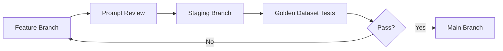
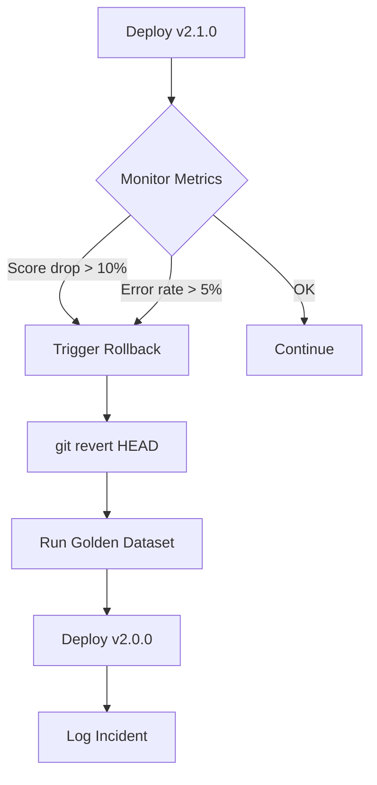

# Prompt Versioning

This document defines the version control strategy for all prompts used in the Jasfo Lead Intelligence Platform. Prompts are treated as code — versioned, reviewed, tested, and deployed through a structured pipeline.

---

## Versioning Strategy

All prompts use **semantic versioning** (`MAJOR.MINOR.PATCH`) with the following rules:

| Bump | When | Example |
|------|------|---------|
| **MAJOR** | Breaking change to output schema, agent behavior, or required fields | `1.x.x → 2.0.0` |
| **MINOR** | New constraints, context fields, examples, or non-breaking behavior changes | `1.0.x → 1.1.0` |
| **PATCH** | Typo fixes, formatting corrections, URL updates, clarifications | `1.0.0 → 1.0.1` |

### Scope of Versioning

Each prompt file has its own independent version. There is no global "prompt library version." Cross-referenced prompts (e.g., a developer prompt that references a system prompt) should document the compatible versions in their metadata.

```yaml
# In developer prompt metadata
compatible_with:
  system_prompts: ">=2.0.0 <3.0.0"
  schemas: ">=2.0.0"
```

---

## Version Storage

Version metadata is stored in two locations:

### 1. Inline YAML Front Matter

Each prompt entry in the documentation files includes a YAML front matter block:

```yaml
---
id: PROMPT-SYS-001
version: 2.1.0
last_modified: 2026-07-10
change_summary: Added timeout delegation rule for Make.com scenarios
---
```

### 2. CHANGELOG File

A `CHANGELOG.md` at the root of the `prompts/` directory tracks all prompt changes across the library:

```markdown
# Prompt Changelog

## 2026-07-11
- PROMPT-SYS-003 v2.2.0: Added reflection pass constraint
- PROMPT-DEV-002 v2.2.0: Added consistency review instruction
- PROMPT-USER-002 v2.1.0: Added configurable scoring weights

## 2026-07-10
- PROMPT-SYS-001 v2.1.0: Added timeout delegation rule
- PROMPT-USER-002 v2.0.0: Major revision to scoring data format

## 2026-07-08
- PROMPT-SYS-002 v2.0.0: Expanded research dimensions
- PROMPT-DEV-001 v2.0.0: Added crawl data injection
```

---

## Git-Based Version Control

All prompts are stored in a `prompts/` directory within the platform's Git repository.

### Branch Strategy



| Branch | Purpose |
|--------|---------|
| `main` | Production prompts. Only merged after full test suite passes. |
| `staging` | Pre-production validation. Runs against golden dataset. |
| `feature/prompt-xxx` | Individual prompt changes. Reviewed before merging. |

### Commit Convention

```
prompt(SYS-001): Add timeout delegation rule for Make.com scenarios
prompt(DEV-002): Bump to v2.2.0 with consistency review
prompt(USER-001): Fix truncated URL field in crawl results
```

---

## Testing Before Deployment

Every prompt change must pass these gates before reaching production:

### Gate 1: Format Validation

```bash
# Check YAML front matter is valid
python scripts/validate_prompt_metadata.py prompts/

# Check all cross-references resolve
python scripts/validate_cross_references.py prompts/
```

### Gate 2: Schema Compatibility

```bash
# Run against golden dataset with new prompt
python scripts/run_golden_tests.py \
  --prompt-id PROMPT-SYS-001 \
  --dataset datasets/golden-v3.json \
  --threshold 0.90
```

### Gate 3: Regression Suite

```bash
# Compare against previous version outputs
python scripts/regression_test.py \
  --prompt-id PROMPT-SYS-001 \
  --old-version 2.0.0 \
  --new-version 2.1.0
```

---

## Rollback Strategy

If a prompt change causes degradation in production:

### Automated Rollback



### Rollback Steps

1. **Immediate**: Run `git revert HEAD` on the prompt file.
2. **Verify**: Execute the golden dataset test suite against the reverted prompt.
3. **Deploy**: Push the revert to production.
4. **Document**: Append to the changelog:

```markdown
## 2026-07-12
- PROMPT-SYS-003 v2.2.0 ROLLED BACK to v2.1.0
  Reason: Consistency review constraint caused 15% score drop on golden dataset
  Reverted by: git revert a3f2c1d
```

### Post-Rollback Analysis

- Identify what caused the degradation (use regression test output).
- Fix the issue in a new feature branch.
- Re-run the full test suite before re-deploying.

---

## Version Compatibility Matrix

| Prompt | Current Version | Compatible Schemas | Notes |
|--------|----------------|-------------------|-------|
| PROMPT-SYS-001 | 2.1.0 | CompanyData >=2.0.0, ScoreCard >=2.1.0 | |
| PROMPT-SYS-002 | 2.0.0 | CompanyData >=2.0.0 | |
| PROMPT-SYS-003 | 2.2.0 | ScoreCard >=2.1.0 | |
| PROMPT-SYS-004 | 1.3.0 | ExportPayload >=1.2.0 | |
| PROMPT-SYS-005 | 1.1.0 | ReflectionReport >=1.1.0 | |
| PROMPT-DEV-001 | 2.0.0 | CompanyData >=2.0.0 | |
| PROMPT-DEV-002 | 2.2.0 | ScoreCard >=2.1.0 | |
| PROMPT-DEV-003 | 1.2.0 | ExportPayload >=1.2.0 | |
| PROMPT-DEV-004 | 1.1.0 | ReflectionReport >=1.1.0 | |
| PROMPT-USER-001 | 2.0.0 | CompanyData >=2.0.0 | |
| PROMPT-USER-002 | 2.1.0 | ScoreCard >=2.1.0 | |
| PROMPT-USER-003 | 1.2.0 | ExportPayload >=1.2.0 | |

---

## Changelog

| Version | Date | Change |
|---------|------|--------|
| 1.0.0 | 2026-07-01 | Initial versioning documentation |
