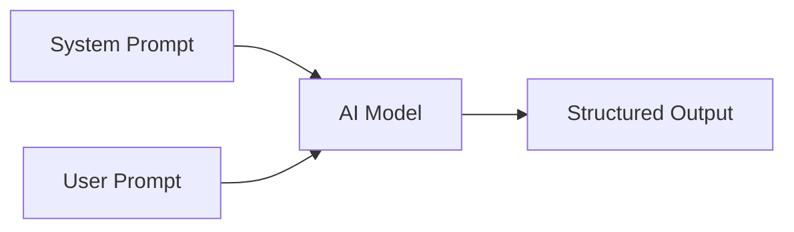

# User Prompts

User prompts are the message templates that carry raw or lightly processed data to the AI model. They represent the "user turn" in the chat completion API and contain the actual data being processed, as opposed to system instructions.

---

## Architecture

The AI pipeline uses a two-message structure for every agent call:



- **System Message**: Contains role definition and constraints (see `system-prompts.md`).
- **User Message**: Contains the task data — company info, crawl results, scoring context.

---

## PROMPT-USER-001: Discovery Data Message

```yaml
---
id: PROMPT-USER-001
version: 2.0.0
last_modified: 2026-07-08
used_by: scenario-02-discovery
---
```

```
=== COMPANY RESEARCH TASK ===

Company Name: {company_name}
Website Domain: {domain}
Research Depth: {depth}

=== CRAWL RESULTS ===

The following data was extracted from the company website and web search.
Process each section and incorporate it into your research output.

## Website Content
{extracted_markdown}

## Search Results
{search_results_json}

## Structured Data (if available)
{structured_data_json}

=== ADDITIONAL CONTEXT ===

Industry: {industry}
Target Segment: {segment}
Geography Focus: {geo_focus}

=== INSTRUCTIONS ===

Using the data above, complete a CompanyData record. For any fields
not covered by the provided data, set confidence to 0.0 and mark as
"Not found in available sources". Do not use external knowledge to
fill gaps — only what is provided above.
```

### Field Descriptions

| Field | Source | Type |
|-------|--------|------|
| `{company_name}` | User query or CSV import | string |
| `{domain}` | Firecrawl search result | string |
| `{depth}` | Scenario config | `basic\|standard\|deep` |
| `{extracted_markdown}` | Firecrawl markdown output | string (markdown) |
| `{search_results_json}` | Firecrawl search API | JSON array |
| `{structured_data_json}` | Firecrawl extract API | JSON object |
| `{industry}` | Lead scoring filters | string |
| `{segment}` | Lead scoring filters | string |
| `{geo_focus}` | Lead scoring filters | string |

---

## PROMPT-USER-002: Scoring Data Message

```yaml
---
id: PROMPT-USER-002
version: 2.1.0
last_modified: 2026-07-10
used_by: scenario-05-scoring
---
```

```
=== SCORING TASK ===

Company: {company_name}
Domain: {domain}

=== DISCOVERED DATA ===

{company_data_json}

=== SCORING WEIGHTS ===

Product Fit: {weight_product_fit}
ICP Alignment: {weight_icp}
Technology Fit: {weight_tech}
Funding Health: {weight_funding}
Growth Signal: {weight_growth}
Intent Signal: {weight_intent}
Competitive Moat: {weight_moat}
Relationship: {weight_relationship}

=== INSTRUCTIONS ===

Score this company across all 8 pillars using the provided data only.
Do not infer or assume data points that are not present. If a pillar
lacks supporting data, score 0 and note "Insufficient data".
```

---

## PROMPT-USER-003: Export Data Message

```yaml
---
id: PROMPT-USER-003
version: 1.2.0
last_modified: 2026-07-05
used_by: scenario-06-export
---
```

```
=== EXPORT TASK ===

Company: {company_name}
Export Format: {format}
Delivery Channel: {channel}

=== FINAL REPORT ===

{full_report_json}
```

---

## Data Injection Best Practices

### Pre-processing Rules

Before data is injected into user prompts, the pipeline applies these transformations:

1. **Truncation**: Markdown content exceeding 50,000 characters is truncated to the first 50,000 characters. A truncation warning is appended.
2. **Null Handling**: Empty arrays are replaced with `[]`. Null values are replaced with the string `"Not available"`.
3. **URL Normalization**: All URLs are converted to absolute form. Relative URLs in extracted markdown are resolved against the base domain.
4. **Date Formatting**: All dates are converted to ISO 8601 before injection.

### Truncation Warning

When content is truncated, this block is appended:

```
--- TRUNCATION NOTICE ---
The source content exceeded the maximum length (50,000 chars).
The remaining {truncated_chars} characters were omitted.
Confidence scores for fields dependent on omitted content
should be marked as "Limited" (0.3).
```

### Data Size Limits

| Section | Max Length | Action on Exceed |
|---------|-----------|------------------|
| Website content | 50,000 chars | Truncate with warning |
| Search results | 100 entries | Keep top 100 by relevance |
| Structured data | 500 KB | Split into batches |
| Full report JSON | 1 MB | Compress with gzip before storage |

---

## Changelog

| Version | Date | Change |
|---------|------|--------|
| 2.0.0 | 2026-07-08 | PROMPT-USER-001: Added crawl results section, depth parameter |
| 2.1.0 | 2026-07-10 | PROMPT-USER-002: Added configurable scoring weights |
| 1.2.0 | 2026-07-05 | PROMPT-USER-003: Added delivery channel parameter |
