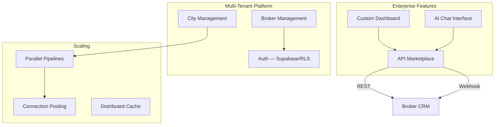
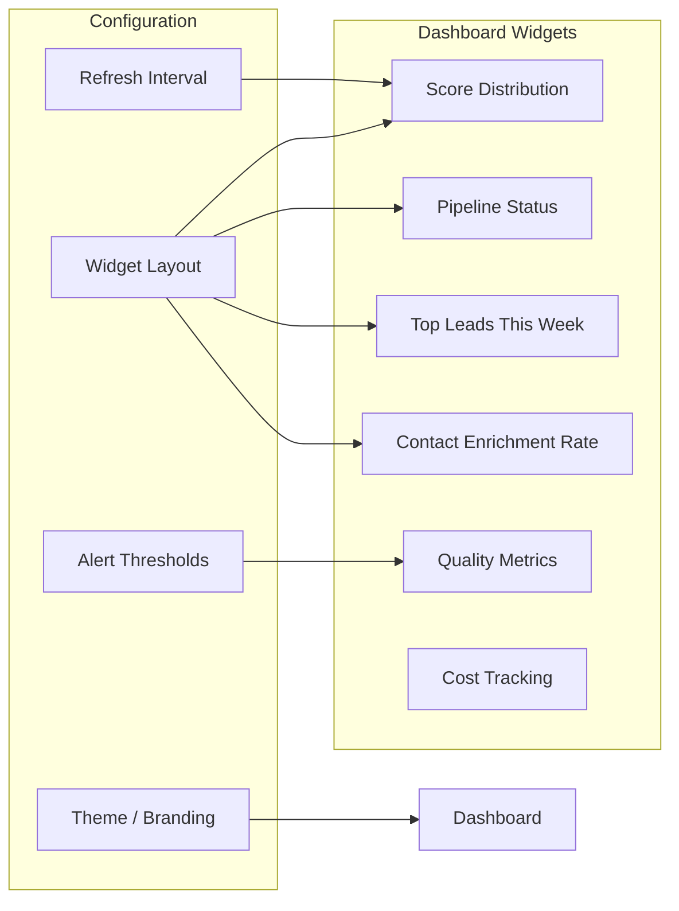

# Enterprise Features

The enterprise feature set extends the Jasfo Lead Intelligence Platform from a single-city, single-broker tool into a multi-tenant platform serving brokerages, commercial real estate firms, and economic development organizations. These features enable deployment across multiple cities simultaneously, support multiple brokers with role-based access, and provide customizable dashboards, AI-assisted interaction, and API-based data access for integration into existing workflows.

## Architecture Overview



## Multi-City Deployment

The platform supports concurrent lead scoring across multiple cities, each with independent configuration:

```json
{
  "cities": [
    {
      "id": 1,
      "name": "San Francisco",
      "brokers": [1, 2],
      "pillar_weights": {
        "management": 0.18, "growth": 0.17,
        "technology": 0.15, "financial_health": 0.12,
        "culture": 0.12, "market_position": 0.12,
        "operations": 0.08, "risk": 0.06
      },
      "scrape_config": {
        "timeout": 10,
        "max_pages": 3
      },
      "schedule": {
        "day": "monday",
        "time": "09:00"
      }
    },
    {
      "id": 2,
      "name": "Austin",
      "brokers": [3],
      "pillar_weights": {
        "growth": 0.22, "management": 0.18,
        "culture": 0.15, "technology": 0.13,
        "market_position": 0.11, "financial_health": 0.10,
        "operations": 0.06, "risk": 0.05
      },
      "scrape_config": {
        "timeout": 8,
        "max_pages": 2
      },
      "schedule": {
        "day": "tuesday",
        "time": "10:00"
      }
    }
  ]
}
```

Each city can have:
- **Independent Pillar Weights** — Custom scoring priorities based on local market conditions
- **Dedicated Pipeline Schedule** — Staggered execution to avoid resource contention
- **City-Specific Brokers** — Only brokers assigned to a city can view its leads
- **Custom Data Sources** — City-specific business directories and local data feeds
- **Separate Quality Gates** — Individual acceptance criteria and review workflows

## Multi-Broker Support

The platform supports multiple brokers per city with role-based access:

| Role | Permissions | Scope |
|---|---|---|
| Admin | Full platform access, configuration, all cities | Global |
| City Manager | Pipeline management, broker assignment, city configuration | Per city |
| Senior Broker | View all leads in city, review/sign-off, export | Per city |
| Broker | View assigned leads, basic export | Per broker |
| Analyst | Read-only access, report generation | Per city |

Access control is enforced at the database level via Supabase Row-Level Security policies:

```sql
-- Brokers can only see leads for their assigned city
CREATE POLICY "broker_city_access"
ON companies
FOR SELECT
USING (
  city_id IN (
    SELECT city_id FROM broker_assignments 
    WHERE broker_id = auth.uid()
  )
);

-- Brokers can only see their specific leads
CREATE POLICY "broker_lead_access"
ON scores
FOR SELECT
USING (
  company_id IN (
    SELECT id FROM companies 
    WHERE city_id IN (
      SELECT city_id FROM broker_assignments
      WHERE broker_id = auth.uid()
    )
  )
);
```

## Custom Dashboard

The enterprise dashboard provides a customizable landing page for each broker or city manager:



Dashboard features include:
- **Drag-and-Drop Widget Layout** — Arrange widgets in a grid layout, saved per user
- **Custom Filters** — Filter leads by score range, industry, confidence, enrichment status
- **Saved Searches** — Save frequently used filter combinations for quick access
- **Scheduled Reports** — Automatic PDF/CSV report generation on a configurable schedule
- **White-Label Branding** — Custom logo, colors, and domain for broker-facing views
- **Real-Time Updates** — Supabase Realtime subscriptions push new scores as they complete

## AI Chat Interface

An integrated AI chat interface allows brokers to interact with their lead data using natural language:

```python
# src/chat/lead_assistant.py

class LeadAssistant:
    """AI-powered chat interface for broker lead queries."""

    SYSTEM_PROMPT = """
    You are a lead intelligence assistant for commercial real estate brokers.
    You have access to the broker's scored leads, company data, and scoring evidence.
    Answer questions about leads, provide recommendations, and explain scoring rationale.
    Always cite specific evidence when discussing a company's score.
    """

    async def handle_query(self, broker_id: int, query: str) -> ChatResponse:
        """Process a broker's natural language query about their leads."""
        # Retrieve context for the broker's city
        broker_context = await self.get_broker_context(broker_id)
        
        # Determine intent and retrieve relevant data
        intent = self.classify_intent(query)
        data = await self.retrieve_data_for_intent(broker_id, intent, query)
        
        # Generate response with AI
        response = await self.llm.generate(
            system=self.SYSTEM_PROMPT,
            context=broker_context,
            data=data,
            query=query,
        )
        
        return ChatResponse(
            answer=response["answer"],
            sources=response.get("sources", []),
            suggested_followups=response.get("followups", []),
        )
```

Example broker queries the AI assistant can handle:

| Query | Action |
|---|---|
| "Show me my top 10 leads this week" | Filter and rank by score |
| "Why did Company X get a low score?" | Retrieve evidence and explain |
| "Which companies in the tech sector scored highest?" | Filter by industry, sort by score |
| "Send me a list of leads with enriched contacts" | Filter and export |
| "Compare this week's pipeline to last week" | Historical comparison |
| "Which leads have I not reviewed yet?" | Filter by review status |

The chat interface is accessible from the dashboard and via Telegram for on-the-go queries.

## API Marketplace

The API marketplace enables external systems to access platform data programmatically:

### REST API Endpoints

| Endpoint | Method | Description | Rate Limit |
|---|---|---|---|
| `/api/v1/leads` | GET | List leads with filters | 100/min |
| `/api/v1/leads/:id` | GET | Single lead detail | 100/min |
| `/api/v1/leads` | POST | Submit company for scoring | 50/min |
| `/api/v1/cities` | GET | List configured cities | 60/min |
| `/api/v1/export` | GET | Export results as CSV/JSON | 10/min |
| `/api/v1/webhooks` | POST | Register webhook for events | 10/min |

### Webhook Events

Integrations can subscribe to real-time events via webhooks:

```json
{
  "webhooks": [
    {
      "id": "wh_abc123",
      "url": "https://broker-crm.com/webhooks/jasfo",
      "events": ["lead.scored", "pipeline.completed", "lead.contact_enriched"],
      "secret": "whsec_...",
      "created_at": "2026-07-01T00:00:00Z"
    }
  ]
}
```

Available webhook events:

| Event | Payload | Description |
|---|---|---|
| `lead.scored` | Company ID, scores, confidence | Fired when a single company finishes scoring |
| `pipeline.completed` | Pipeline run ID, stats | Fired when the weekly pipeline completes |
| `lead.contact_enriched` | Company ID, contact details | Fired when contact enrichment completes |
| `quality_gate.failed` | Pipeline run ID, failed criteria | Fired when a quality gate check fails |
| `broker.signoff` | Pipeline run ID, broker ID | Fired when a broker signs off |

### API Authentication

API access requires an API key generated from the dashboard:

```http
GET /api/v1/leads?city=san-francisco&min_score=70
Authorization: Bearer jf_api_abc123def456
X-Jasfo-Broker-ID: broker_42
```

API keys are:
- **Scoped** — Limited to specific cities and read/write permissions
- **Revocable** — Can be revoked immediately from the dashboard
- **Rate Limited** — Enforced per key, with configurable limits
- **Auditable** — All API calls are logged with timestamp, endpoint, and IP

## Enterprise Migration Path

Transitioning from single-tenant to multi-tenant enterprise:

| Step | Description | Effort |
|---|---|---|
| 1 | Enable broker_id column in all tables | 1 day |
| 2 | Implement RLS policies for tenant isolation | 2 days |
| 3 | Create broker and city management API | 2 days |
| 4 | Build city configuration dashboard | 3 days |
| 5 | Add API key generation and management | 1 day |
| 6 | Develop custom dashboard framework | 5 days |
| 7 | Implement AI chat interface | 5 days |
| 8 | Build webhook system and event bus | 3 days |

**Total estimated effort**: 22 working days (~4–5 weeks) for a complete enterprise deployment, though features can be rolled out incrementally.
