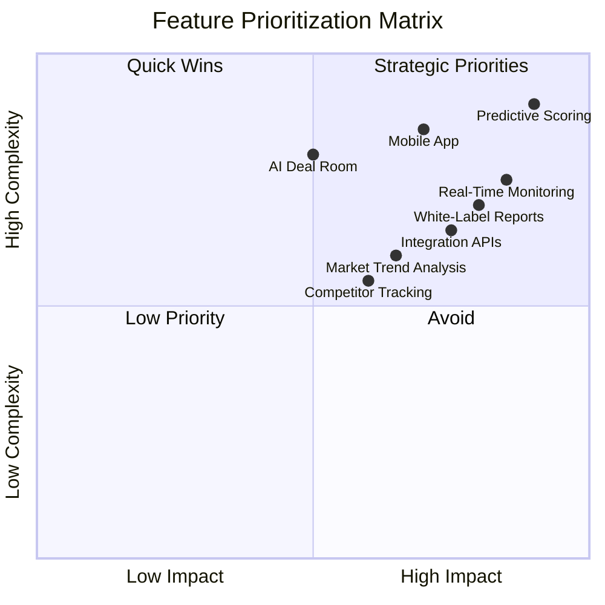
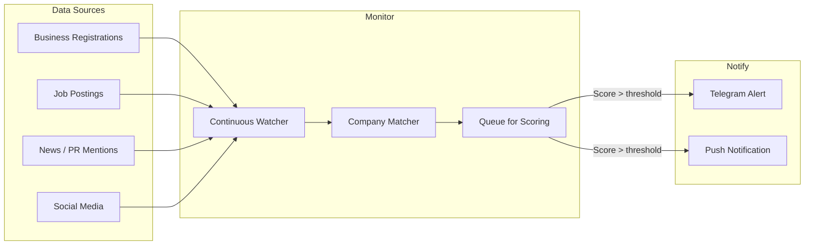
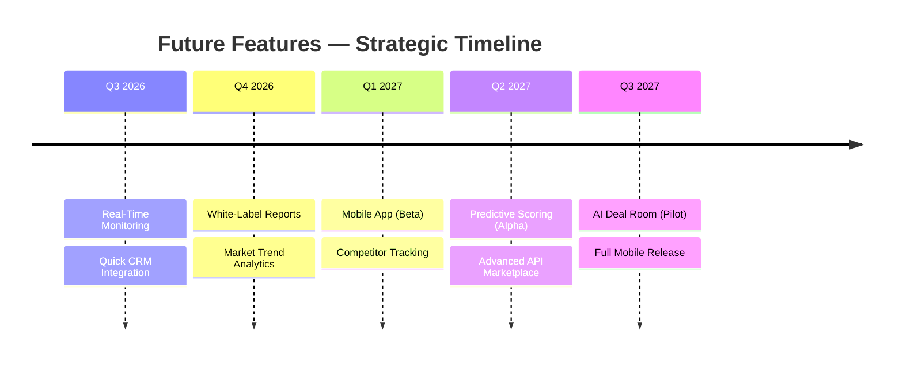

# Future Features

Beyond the core platform and enterprise features, the Jasfo Lead Intelligence Platform roadmap includes several forward-looking capabilities designed to expand utility, increase broker engagement, and open new revenue channels. These features are not yet scheduled for development but are documented here as candidates for future investment, prioritized by expected impact and technical feasibility.

## Feature Prioritization



## Feature Candidates

### 1. Real-Time Lead Monitoring (High Impact, Medium Complexity)

An always-on monitoring capability that continuously watches for new companies matching broker criteria and scores them in real time, rather than waiting for the weekly batch pipeline:



**Use Case**: A broker wants to know immediately when a high-potential company opens an office in their territory, raises funding, or posts a significant hiring spree.

**Implementation Approach**: Add a lightweight event consumer that monitors business registration feeds, job board APIs, and news sources. New companies matching broker criteria (industry, city, size) are automatically queued for scoring. Results above a broker-configurable threshold trigger an immediate notification.

**Estimated Effort**: 10–15 days

### 2. Mobile Application (High Impact, High Complexity)

A native mobile application for iOS and Android providing on-the-go access to lead intelligence:

**Core Features**:
- Lead dashboard with sortable, filterable company list
- Push notifications for high-value new leads
- Quick score lookup — enter a company name and get instant scoring
- Contact card export to device contacts
- Offline access to recently viewed leads
- Score explanation and evidence viewing
- Telegram-style chat integration with the AI lead assistant

**Technical Approach**: React Native application consuming the existing API layer. Supabase Realtime handles push notification delivery. Offline data is cached using SQLite with sync-on-connect.

**Estimated Effort**: 20–30 days (initial release)

### 3. White-Label Reports (Medium Impact, Medium Complexity)

Customizable, branded report generation for brokers to share with their clients (landlords, property owners, economic development boards):

**Report Types**:
- **Company Profile** — Deep dive on a single company with scoring, evidence, and recommendations
- **Market Overview** — Aggregate view of lead quality in a city or submarket
- **Pipeline Summary** — Weekly pipeline results formatted for client presentation
- **Trend Analysis** — Quarter-over-quarter lead quality trends

**Branding Features**:
- Custom logo and colors
- Custom domain for report links
- Editable sections and commentary
- PDF and interactive web delivery
- Auto-generated executive summaries

**Estimated Effort**: 8–12 days

### 4. Integration APIs (Medium Impact, Medium Complexity)

Standardized API integrations for popular CRM and productivity platforms:

| Platform | Integration Type | Value |
|---|---|---|
| Salesforce | Lead object sync | Push scored leads as Salesforce leads |
| HubSpot | Contact/company sync | Enrich CRM with Jasfo scores |
| Slack | Notification channel | Pipeline alerts and lead notifications |
| Google Sheets | Export destination | Auto-populate sheets with weekly results |
| Zapier / Make.com | Universal connector | Custom workflows for any platform |
| CRMs (custom) | REST API + webhook | General-purpose integration |

**Revenue Model**: APIs are free for read access (up to 1,000 calls/month). Premium tier ($49–$99/month) unlocks higher rate limits, webhook subscriptions, and Salesforce/HubSpot native connectors.

**Estimated Effort**: 5–10 days per integration

### 5. Predictive Scoring (Highest Impact, Highest Complexity)

A machine learning model trained on historical lead outcomes to predict which scored companies will convert into actual leases or investments:

```python
# Concept: predictive scoring model
class PredictiveScorer:
    """Predicts conversion probability based on historical outcomes."""

    FEATURES = [
        "overall_score",
        "management_score",
        "growth_score",
        "revenue_range",
        "employee_count",
        "industry",
        "city",
        "funding_total",
        "years_in_business",
        "website_quality",
    ]

    def __init__(self):
        self.model = RandomForestRegressor(
            n_estimators=200,
            max_depth=8,
            random_state=42,
        )

    def train(self, historical_data: pd.DataFrame):
        """Train the model on historical lead outcomes."""
        X = historical_data[self.FEATURES]
        y = historical_data["converted_within_6_months"]
        self.model.fit(X, y)
    
    def predict_probability(self, company_data: dict) -> float:
        """Predict probability of conversion for a new lead."""
        features = [company_data[f] for f in self.FEATURES]
        proba = self.model.predict_proba([features])[0][1]
        return round(proba, 3)
```

**Data Requirements**: 6–12 months of historical lead outcomes with conversion tracking to train a reliable model.

**Estimated Effort**: 15–20 days (after sufficient training data exists)

### 6. Market Trend Analysis (Medium Impact, Low Complexity)

Aggregate analytics that reveal market trends across scored companies:

**Analytics**:
- Industry distribution trends by quarter
- Average score trends by city
- Most common high-scoring signals
- Contact enrichment success rates by industry
- Pipeline velocity metrics

**Delivery**: Dashboard widgets and automated monthly market reports.

**Estimated Effort**: 5–8 days

### 7. Competitor Tracking (Low Impact, Low Complexity)

Notify brokers when a known competitor company appears in another broker's territory:

**Use Case**: A broker in San Francisco wants to know when a company they've been tracking opens an office in Austin (their expansion market).

**Implementation**: Optional company watchlist with cross-city alerting when a watched company is scored in a different city.

**Estimated Effort**: 3–5 days

### 8. AI Deal Room (Lower Impact, High Complexity)

A collaborative workspace where brokers and clients can review, discuss, and manage leads:

**Features**:
- Shared lead boards per client
- Annotations and comments on company profiles
- Approval workflows for client decision-making
- Document storage for lease/investment materials
- Activity timeline and notifications

**Estimated Effort**: 20–30 days

## Strategic Roadmap



## Investment Criteria

Each future feature will be evaluated against these criteria before development begins:

1. **Broker Demand** — Requested by 3+ brokers or a single enterprise client willing to co-invest
2. **Revenue Potential** — Clear path to incremental revenue (new clients, upsell, premium tier)
3. **Technical Feasibility** — Solvable with current architecture; no unproven technologies
4. **Maintenance Cost** — Projected support burden is reasonable for the team size
5. **Competitive Differentiation** — Meaningfully differentiates the platform from alternatives

Features must meet at least 3 of 5 criteria to be scheduled for development.
