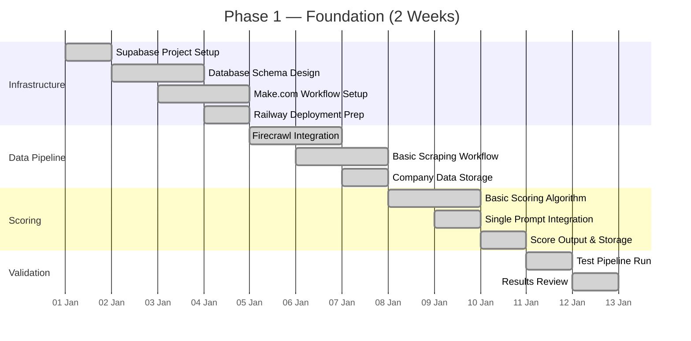

# Phase 1: Foundation (Weeks 1–2)

Phase 1 establishes the core infrastructure and basic lead scoring pipeline. By the end of this phase, the platform can accept a company (name + website), scrape its public data, generate a basic lead score, and store the results in a database — all orchestrated through Make.com workflows and accessible via a simple Telegram notification.

## Objectives

## Deliverables

### Week 1: Infrastructure and Data Ingestion

**Supabase Project Setup** — A Supabase project is provisioned on the Pro plan with PostgreSQL 16. Core tables are created via migration: `companies` (name, website, city, industry, employee range), `scores` (company_id, overall_score, confidence, scored_at), `pipeline_runs` (status, started_at, completed_at, companies_scored, errors). Row-Level Security policies are not yet required — Phase 1 assumes single-tenant operation.

**Make.com Workflow** — A Make.com scenario is configured to orchestrate the lead scoring pipeline. The workflow accepts a company name and website as input, calls the Firecrawl module to scrape the company website, passes the scraped content to OpenAI for initial scoring, and stores the result in Supabase. Error handling is minimal at this stage — failed companies are logged but do not halt the pipeline.

**Firecrawl Integration** — Firecrawl is configured with an API key stored in Make.com's secure storage. The scraping module targets the company's website and returns clean markdown content. Initial configuration includes a 10-second timeout, mobile user-agent, and exclusion of navigation elements to focus on page body content.

### Week 2: Basic Scoring and Validation

**Single Prompt Scoring** — A single GPT prompt is designed to analyze scraped company data and return a lead score (0–100) with brief supporting evidence. The prompt instructs the model to evaluate the company on: professionalism of web presence, clarity of value proposition, team quality signals, market positioning, and growth indicators. The prompt is stored as a Make.com module configuration.

**Basic Scoring Algorithm** — The scoring algorithm applies a simple weighted average to the five evaluation dimensions. Each dimension receives equal weight (20%) in Phase 1. Scores are rounded to one decimal place. A confidence level (high/medium/low) is assigned based on the amount and quality of data scraped — websites with fewer than 500 words of meaningful content receive "low" confidence.

**Initial Test Pipeline** — A test run of 20 companies validates the complete pipeline. Success criteria: all 20 companies receive a score, average pipeline completion time is under 3 minutes per company, and no company returns a score outside the 0–100 range. Results are reviewed manually to assess scoring quality and identify obvious issues.

## Technical Decisions

| Decision | Choice | Rationale |
|---|---|---|
| Orchestration | Make.com | Visual workflow builder; no code required for Phase 1 |
| AI Model | GPT-4o-mini | Fast, cost-effective for initial prompt development |
| Scraping | Firecrawl | Reliable markdown extraction; simple API |
| Database | Supabase PostgreSQL | Managed, scalable, built-in auth for later phases |
| Hosting | Railway | Docker-based, simple deployment, built-in observability |

## Success Criteria

- Supabase database operational with schema migrations applied
- Make.com workflow accepts company input and triggers automated scoring
- Firecrawl successfully scrapes company websites and returns clean markdown
- GPT-4o-mini generates scores with supporting evidence
- Scores are stored in Supabase and retrievable via API
- End-to-end pipeline completes for 20 test companies
- Pipeline executes within 3 minutes per company average

## Limitations

Phase 1 is intentionally limited. Several constraints are accepted to deliver working functionality quickly:

- Single scoring prompt with no specialist agents
- No contact enrichment (email, phone, LinkedIn discovery)
- No Telegram notifications (results checked manually)
- No Go-To-Market scoring pillar
- No CSV export
- No multi-broker support
- Prompt is not A/B tested against a golden dataset

These limitations are addressed in subsequent phases, but Phase 1 provides a working foundation that can be demonstrated and validated before investing in more complex capabilities.
