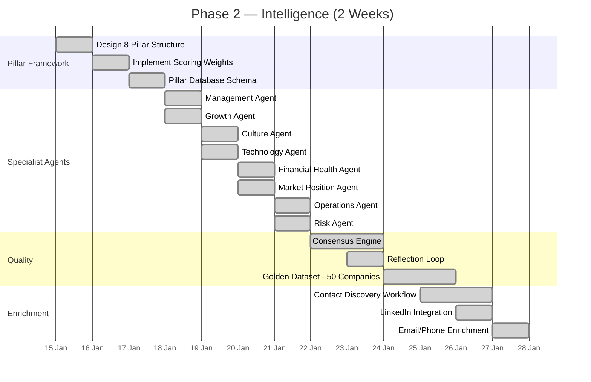
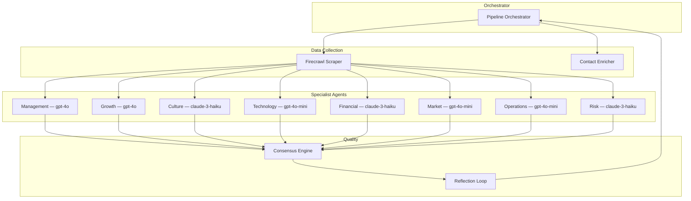

# Phase 2: Intelligence (Weeks 3–4)

Phase 2 transforms the basic single-prompt scoring engine into a sophisticated multi-dimensional evaluation system. This phase introduces the eight-pillar scoring framework, specialist AI agents for each pillar, a consensus mechanism that reconciles divergent agent scores, a reflection loop for quality improvement, and automated contact enrichment. By the end of Phase 2, the platform produces detailed, defensible lead scores with evidence attribution and enriched contact data.

## Objectives



## The Eight-Pillar Framework

The platform evaluates companies across eight discrete dimensions, each scored independently by a specialized agent before being aggregated into the overall lead score:

| Pillar | Weight | Evaluation Focus | Data Sources |
|---|---|---|---|
| Management | 18% | Leadership quality, experience, track record | LinkedIn, Crunchbase, news |
| Growth | 17% | Revenue trajectory, hiring, expansion signals | Website, news, job postings |
| Culture | 13% | Employee satisfaction, values, retention | Glassdoor, reviews, careers page |
| Technology | 13% | Tech stack, product maturity, innovation | Website, GitHub, product pages |
| Financial Health | 12% | Funding, revenue signals, stability | Crunchbase, SEC filings, news |
| Market Position | 12% | Competitive landscape, market share, brand | Industry reports, search presence |
| Operations | 8% | Professional infrastructure, processes | Website, business registration |
| Risk | 7% | Legal exposure, compliance, reputation | News, legal records, reviews |

Pillar weights are configurable and can be adjusted per city, broker, or industry based on specific evaluation priorities. The default weights above represent a balanced assessment suitable for most lead scoring scenarios.

## Specialist Agent Architecture

Each pillar is scored by a dedicated AI agent with a role-specific system prompt:



Each specialist agent receives:
- The company's scraped website content
- Any previously collected signals (Crunchbase, Glassdoor, LinkedIn data)
- A role-specific evaluation rubric with scoring criteria
- Instructions to return a structured JSON response with score, evidence, and confidence

The orchestrator distributes scoring tasks to agents in parallel, collects responses, and passes them to the consensus engine.

## Consensus Engine

The consensus engine reconciles the eight pillar scores into a single overall score and identifies scoring conflicts:

```python
# scoring/consensus.py

class ConsensusEngine:
    """Reconciles specialist agent scores into final output."""

    PILLAR_WEIGHTS = {
        "management": 0.18,
        "growth": 0.17,
        "culture": 0.13,
        "technology": 0.13,
        "financial_health": 0.12,
        "market_position": 0.12,
        "operations": 0.08,
        "risk": 0.07,
    }

    def compute_overall_score(self, pillar_scores: dict) -> float:
        """Weighted average of all pillar scores."""
        total = 0.0
        weight_sum = 0.0
        for pillar, score in pillar_scores.items():
            if score is not None:
                total += score * self.PILLAR_WEIGHTS[pillar]
                weight_sum += self.PILLAR_WEIGHTS[pillar]
        return round(total / weight_sum, 1) if weight_sum > 0 else 0.0

    def detect_score_divergence(self, pillar_scores: dict) -> list:
        """Identify pillars where evidence contradicts score."""
        warnings = []
        scores = [v for v in pillar_scores.values() if v is not None]
        if not scores:
            return warnings
        mean = sum(scores) / len(scores)
        for pillar, score in pillar_scores.items():
            if score is not None and abs(score - mean) > 25:
                warnings.append({
                    "pillar": pillar,
                    "score": score,
                    "mean": round(mean, 1),
                    "deviation": round(abs(score - mean), 1),
                    "action": "review_evidence",
                })
        return warnings
```

## Reflection Loop

After initial scoring, a reflection pass reviews the outputs for quality and consistency:

1. **Evidence Check** — Each pillar score is checked against its evidence. If a score exceeds 80 but evidence is sparse, the score is flagged and optionally downgraded by one confidence level.
2. **Conflict Resolution** — If the consensus engine detects significant divergence between pillars (e.g., Management scores 90 but Culture scores 30), the reflection loop requests re-scoring of both pillars with cross-reference instructions.
3. **Overall Calibration** — The overall score is compared against expected distribution. If it falls outside the typical range for the company's industry and size, a calibration adjustment is applied.
4. **Confidence Assessment** — Overall confidence is computed from: volume of data available, number of pillars scored, divergence between pillar scores, and number of reflection flags.

## Contact Enrichment

Contact enrichment discovers and validates decision-maker contact information:

| Data Point | Source | Method |
|---|---|---|
| CEO/Founder name | LinkedIn, website | Scrape + LLM extraction |
| Decision-maker email | Public sources | Pattern-based discovery |
| Phone number | Website, business listings | Scrape + validation |
| LinkedIn profiles | LinkedIn search | URL pattern matching |
| Company address | Website, Google Maps | Address extraction |

Enriched contacts are stored in a `contacts` table linked to the company record. Each contact includes source attribution and a confidence score so brokers can assess reliability.

## Golden Dataset Creation

Phase 2 creates the foundational golden dataset of 50 manually scored companies:

1. **Selection** — 50 companies are selected spanning the full spectrum of lead quality, across 7+ industries and multiple cities
2. **Research** — Each company is manually researched using all available data sources
3. **Scoring** — Two domain experts independently score each company using the eight-pillar rubric
4. **Reconciliation** — Discrepancies >10 points are discussed until consensus is reached
5. **Documentation** — Each entry includes the company data, scores, evidence summary, and scoring rationale

The golden dataset is used for Phase 3 prompt A/B testing, regression detection, and quality monitoring.

## Success Criteria

- Eight-pillar scoring pipeline operational with specialist agents
- Consensus engine correctly computes weighted overall scores
- Reflection loop flags and resolves at least 80% of scoring conflicts
- Contact enrichment discovers at least one contact for 60% of scored companies
- Golden dataset of 50 companies completed and validated
- Mean Absolute Error against golden dataset < 10 points (baseline measurement)
- Pipeline completes within 60 minutes for 500 companies
