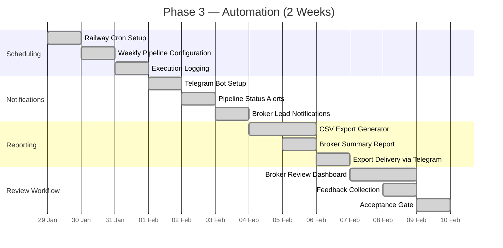
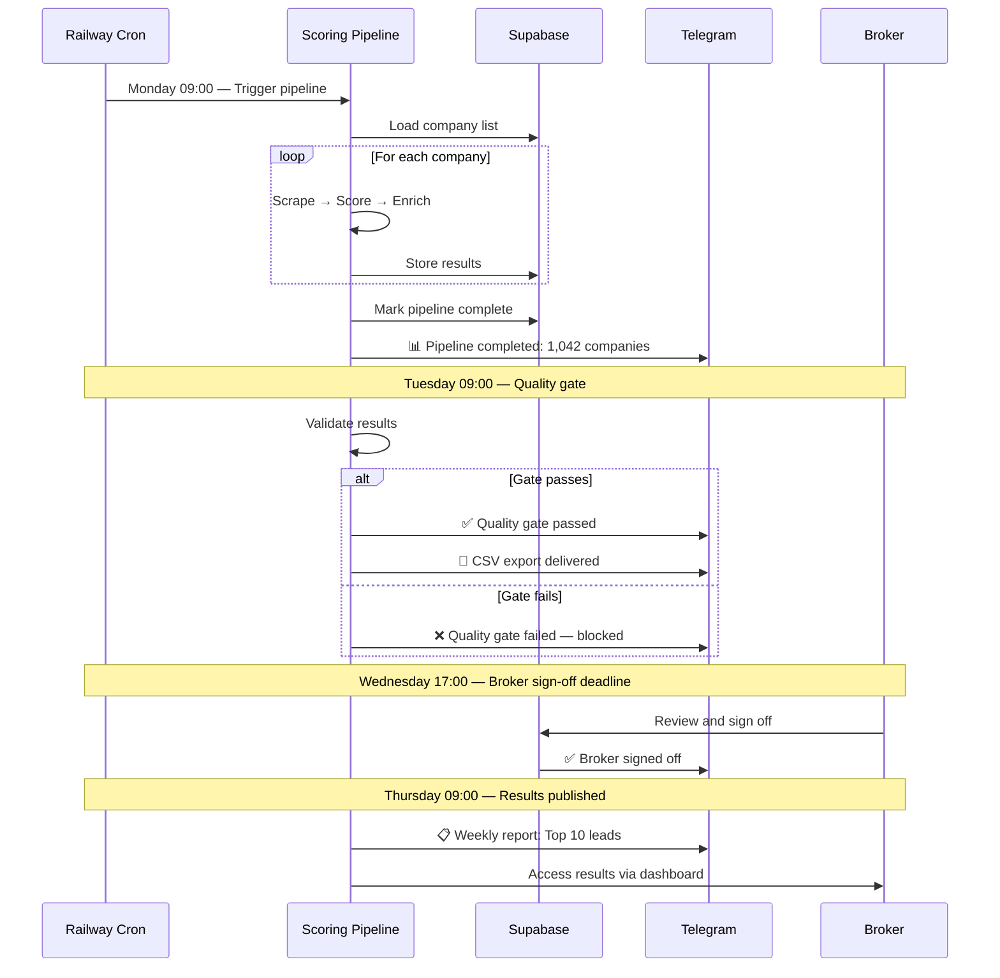

# Phase 3: Automation (Weeks 5–6)

Phase 3 transforms the manually triggered pipeline into a fully automated weekly system with broker-facing outputs. This phase introduces scheduled execution via cron, Telegram notifications for pipeline events and broker alerts, CSV export for broker consumption, and a broker review workflow for sign-off. By the end of Phase 3, the platform operates autonomously — processing companies, notifying brokers, and delivering reports with minimal human intervention.

## Objectives



## Weekly Pipeline Schedule



### Cron Configuration

The Railway cron service is configured with the following schedule:

```json
{
  "services": [
    {
      "name": "pipeline-cron",
      "cron": "0 9 * * 1",
      "command": "python -m src.pipeline.run_weekly",
      "environment": "production"
    }
  ]
}
```

The cron job triggers the weekly pipeline every Monday at 09:00 UTC. The pipeline runs as a single process that:
1. Loads all companies configured for scoring
2. Processes them through the scoring pipeline (scrape → score → enrich)
3. Writes results to the database as they complete
4. Updates pipeline run status on completion
5. Triggers the quality gate validation

## Telegram Notification System

A Telegram bot provides real-time updates for pipeline events and broker notifications:

### Bot Commands

| Command | Purpose | Audience |
|---|---|---|
| `/pipeline status` | Current pipeline run status | Operations |
| `/pipeline results` | Summary of last completed run | Operations |
| `/leads top` | Top 10 leads this week | Broker |
| `/leads city [city]` | Leads filtered by city | Broker |
| `/report weekly` | Weekly summary report | Broker |
| `/export csv` | Download CSV of current results | Broker |

### Notification Channels

| Channel | Content | Frequency |
|---|---|---|
| `#alerts` | Pipeline failures, quality gate failures, errors | As needed |
| `#pipeline-reports` | Pipeline completion, weekly summary, cost report | Weekly |
| `#broker-updates` | Top leads, new high-scoring companies, dashboard updates | Weekly |
| Direct message | Broker-specific notifications (high-value leads) | As needed |

## CSV Export

The CSV export generates a broker-ready file with all scored companies and their evaluation data:

```python
# src/export/csv_generator.py

class CSVExportGenerator:
    """Generates broker-ready CSV exports of pipeline results."""

    EXPORT_COLUMNS = [
        "Company Name",
        "Website",
        "City",
        "Industry",
        "Overall Score",
        "Confidence",
        "Management Score",
        "Growth Score",
        "Culture Score",
        "Technology Score",
        "Financial Health Score",
        "Market Position Score",
        "Operations Score",
        "Risk Score",
        "Contact Name",
        "Contact Title",
        "Contact Email",
        "Contact Phone",
        "Evidence Summary",
        "Data Sources",
    ]

    async def generate_export(self, pipeline_run_id: int) -> bytes:
        """Generate CSV export for a completed pipeline run."""
        companies = await self.get_scored_companies(pipeline_run_id)
        
        output = io.StringIO()
        writer = csv.writer(output)
        writer.writerow(self.EXPORT_COLUMNS)
        
        for company in companies:
            writer.writerow([
                company["company_name"],
                company["website"],
                company["city"],
                company.get("industry", ""),
                company["overall_score"],
                company["confidence"],
                company["pillars"].get("management", ""),
                company["pillars"].get("growth", ""),
                company["pillars"].get("culture", ""),
                company["pillars"].get("technology", ""),
                company["pillars"].get("financial_health", ""),
                company["pillars"].get("market_position", ""),
                company["pillars"].get("operations", ""),
                company["pillars"].get("risk", ""),
                company.get("contact_name", ""),
                company.get("contact_title", ""),
                company.get("contact_email", ""),
                company.get("contact_phone", ""),
                company.get("evidence_summary", ""),
                company.get("data_sources", ""),
            ])
        
        return output.getvalue().encode("utf-8-sig")
```

The export is:
- **Auto-generated** — Created immediately after pipeline completion
- **Validated** — Checked for column count, row count, and data types
- **Delivered** — Sent via Telegram as a file attachment, optionally uploaded to cloud storage
- **Archived** — Retained for 90 days, accessible via the broker dashboard

## Broker Review Workflow

The broker review workflow enables quality control before results are finalized:

### Review States

```
draft → pending_review → approved → published
                    ↓
              needs_changes → pending_review
```

| State | Description | Duration |
|---|---|---|
| `draft` | Pipeline complete, initial results generated | 1 hour |
| `pending_review` | Awaiting broker review and sign-off | 48 hours max |
| `approved` | Broker has signed off | — |
| `needs_changes` | Broker requested corrections | 24 hours |
| `published` | Results finalized and delivered | — |

### Review Interface

Brokers access a simple web-based review dashboard at `review.jasfo.com`:

1. **Summary View** — Pipeline statistics, score distribution, top/bottom companies
2. **Sample Review** — 5 randomly selected companies with full scoring details
3. **Manual Override** — Option to adjust scores for specific companies with documented rationale
4. **Feedback Form** — Structured feedback on scoring quality, data accuracy, missing signals
5. **Sign-Off Button** — One-click approval when review is complete

### Review Automation

If a broker has not completed review within 48 hours:

| Time Elapsed | Action |
|---|---|
| 24 hours | Telegram reminder: "Pipeline results pending your review" |
| 36 hours | Second reminder: "Review due in 12 hours — your brokers are waiting" |
| 48 hours | Auto-approval with note: "Auto-approved — no broker feedback received" |
| 48+ hours | Results published; broker override available for 24 hours post-publish |

## Success Criteria

- Pipeline executes on schedule every Monday without manual intervention
- Telegram notifications delivered for pipeline start, completion, gate status, and errors
- CSV export generated and validated within 5 minutes of pipeline completion
- Broker can access review dashboard and complete sign-off within 48 hours
- Auto-approval triggers if broker does not review within deadline
- Pipeline completes weekly with < 3% error rate
- All alerts delivered within 30 seconds of triggering event
