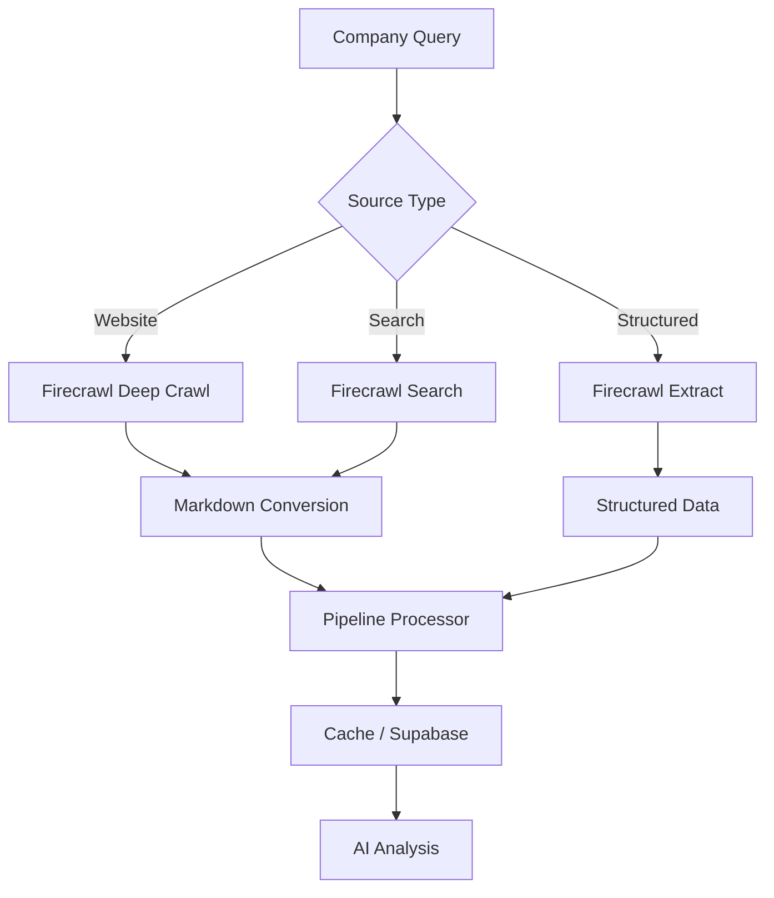
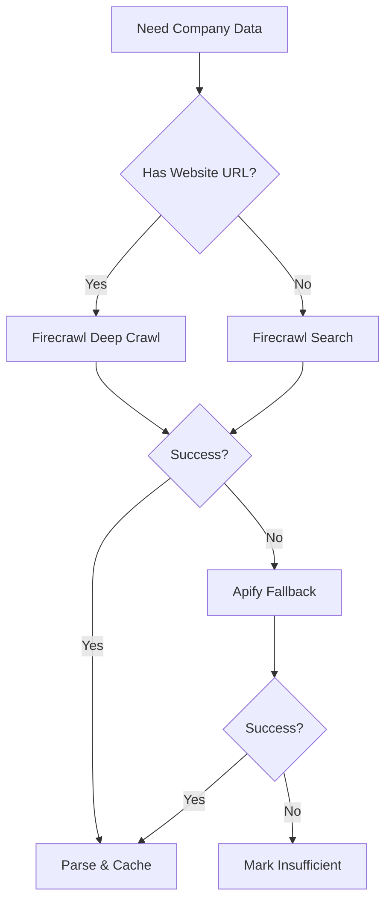
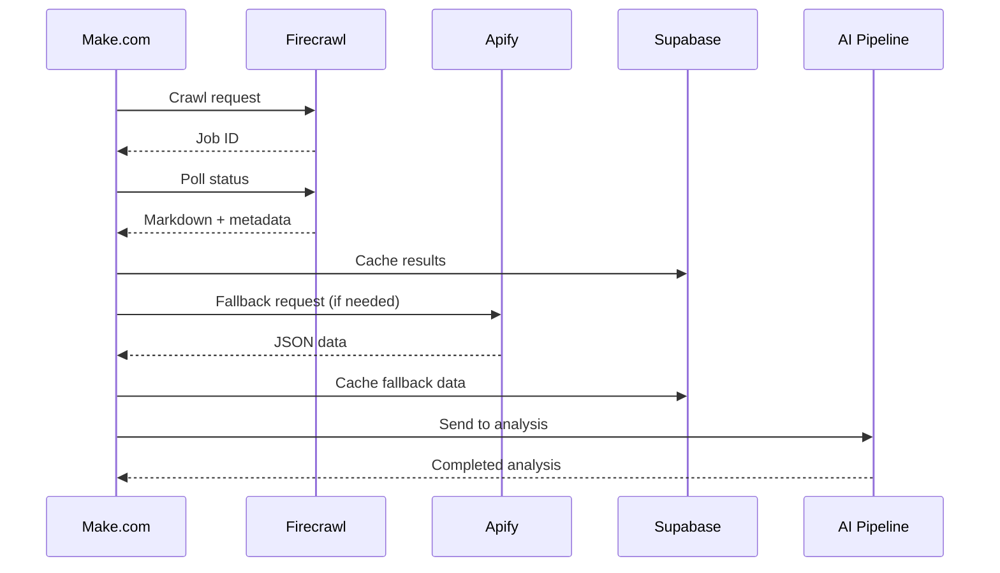

# Scraping Strategy Overview

The scraping layer is the data acquisition engine of the Jasfo Lead Intelligence Platform. It collects raw company information from public web sources and feeds it to the AI analysis pipeline.

---

## Architecture



Scraping follows a **Firecrawl-first, Apify-fallback** strategy:

1. **Firecrawl** is the primary scraping engine for all web data acquisition. It handles deep crawls, structured extraction, search, and markdown conversion through a unified API.
2. **Apify** serves as the backup for sources where Firecrawl has gaps — specifically LinkedIn profile scraping and Crunchbase data extraction, which require specialized actors.
3. **Supabase** caches all scrape results to avoid redundant requests and control costs.

---

## Scraping Methods

| Method | API Endpoint | Use Case | Priority |
|--------|-------------|----------|----------|
| **Deep Crawl** | `POST /crawl` | Multi-page website analysis | Primary |
| **Extract** | `POST /scrape` with `extract` param | Structured data from a single page | Primary |
| **Markdown** | `POST /scrape` | Clean text for AI processing | Primary |
| **Search** | `POST /search` | Finding company info across the web | Primary |
| **Apify LinkedIn** | LinkedIn Profile Scraper | Company LinkedIn page | Fallback |
| **Apify Crunchbase** | Crunchbase Scraper | Funding and investor data | Fallback |

### Decision Flow



---

## Cost Optimization

| Method | Cost per Request | Monthly Budget | Optimal Volume |
|--------|-----------------|----------------|----------------|
| Firecrawl Deep Crawl | 1 credit per 500 pages | 500 credits | ~250 companies |
| Firecrawl Extract | 1 credit per request | 300 credits | ~300 companies |
| Firecrawl Search | 1 credit per 100 searches | 100 credits | ~full search needs |
| Firecrawl Markdown | 0.25 credits per 1000 pages | 250 credits | ~1000 pages |
| Apify Actors | $0.50–$2.00 per run | $100 | ~50–200 companies |

### Cost-Saving Measures

1. **Caching**: All results are cached in Supabase with a 7-day TTL for standard data, 30-day TTL for company identity data.
2. **Depth Truncation**: Deep crawl depth is limited to 2 pages for basic research, 5 pages for standard, 10 pages for deep.
3. **Selective Extraction**: Extract API is used only for the highest-value pages (pricing, about, leadership) rather than every page.
4. **Reuse**: If a company has been scraped in the last 7 days, use the cached result.

---

## Retry Strategy

Every scraping method implements a retry strategy tuned to the failure patterns of that source:

```json
{
  "firecrawl": {
    "max_retries": 3,
    "initial_delay_ms": 1000,
    "backoff_factor": 2,
    "max_delay_ms": 10000,
    "retry_on": ["rate_limit", "timeout", "server_error"]
  },
  "apify": {
    "max_retries": 2,
    "initial_delay_ms": 5000,
    "backoff_factor": 3,
    "max_delay_ms": 30000,
    "retry_on": ["actor_error", "timeout"]
  }
}
```

---

## Quality Checks

After scraping, the data goes through validation:

1. **Domain Match**: Does the scraped content reference the expected company or domain?
2. **Content Length**: Is there enough content to extract meaningful data? (Minimum 200 characters of meaningful text)
3. **Error Pages**: Is the page a 404, 500, or captcha page? (Detected by common patterns)
4. **Language**: Is the content in a supported language? (English preferred, others flagged)

Scrapes that fail quality checks are retried once with different parameters, then marked as failed.

---

## Rate Limiting

| Source | Max Requests | Time Window | Concurrency |
|--------|-------------|-------------|-------------|
| Firecrawl API | 50 | 1 minute | 5 parallel |
| Any single domain | 10 | 1 minute | 2 parallel |
| Apify actors | 5 | 1 minute | 1 parallel |

Rate limits are enforced by a token bucket algorithm. Exceeded requests are queued with exponential backoff.

---

## Data Flow



---

## Changelog

| Version | Date | Change |
|---------|------|--------|
| 1.0.0 | 2026-07-01 | Initial scraping strategy documentation |
