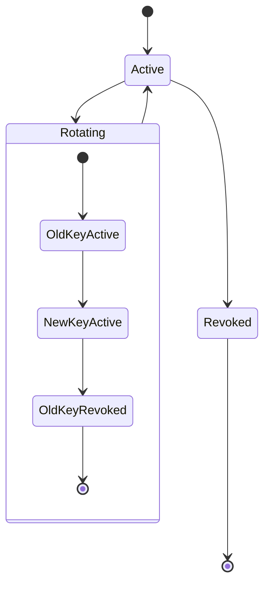

# API Key Management

## Overview

API keys are the primary authentication mechanism for external service integrations. The Jasfo platform currently integrates with six external APIs, each requiring one or more keys. All keys are stored in **Supabase Vault** — an encrypted secret store backed by PostgreSQL's `pgcrypto` extension. Keys are never written to environment variables, configuration files, source code, or logs.

The platform maintains a key inventory with rotation schedules, scope descriptions, and access controls. Keys are automatically rotated on a quarterly basis with a 30-day overlap window to ensure zero downtime.

---

## Key Inventory

| Service | Key Name | Type | Scope | Rotation |
|---------|----------|------|-------|----------|
| Firebase | `firecrawl.api_key` | Bearer token | Crawl, extract, search, map | Quarterly |
| Apollo.io | `apollo.api_key` | Bearer token | People search, enrich | Quarterly |
| Hunter.io | `hunter.api_key` | Query param | Email find, verify | Quarterly |
| Snov.io | `snov.client_id`, `snov.client_secret` | OAuth credentials | Email find, verify | Quarterly |
| Telegram | `telegram.bot_token` | Bot token | Send messages | Quarterly |
| OpenRouter | `openrouter.api_key` | Bearer token | LLM completions | Quarterly |

---

## Storage in Supabase Vault

### Creating a Secret

```sql
SELECT vault.create_secret(
  'fc-api-key-abc123',
  'firecrawl.api_key',
  'Firecrawl API key for web scraping and extraction'
);
```

### Reading a Secret (Server-Side Only)

```sql
SELECT * FROM vault.decrypted_secrets
WHERE name = 'firecrawl.api_key';
```

The `vault.decrypted_secrets` view is protected by PostgreSQL permissions. Only the service role and specific database roles can read it.

### Using Secrets in Make.com

Make.com uses HTTP modules with the **Supabase: Get Vault Secret** custom connector:

1. In Make.com, create a connection to Supabase (service role)
2. Use **Supabase: Run SQL** to call `vault.decrypted_secrets`
3. Parse the result and inject into the next module
4. Never log or expose the secret value

---

## Lifecycle



### Rotation Schedule

| Phase | Action | Duration |
|-------|--------|----------|
| Day 0 | Generate new key in target service | 1 hour |
| Day 0 | Store new key in Vault alongside old key | Immediate |
| Day 0–30 | Both keys active (overlap window) | 30 days |
| Day 30 | Remove old key from Vault | Immediate |
| Day 30 | Revoke old key in target service | 1 hour |

---

## Least Privilege Per Key

| Service | Minimum Scopes Required |
|---------|----------------------|
| Firebase | `crawl`, `extract`, `search` |
| Apollo.io | `people_read`, `organization_read` |
| Hunter.io | `email_finder`, `email_verifier` |
| Snov.io | `email_find`, `email_verify` |
| Telegram | `send_message` only |
| OpenRouter | `chat_completions` only |

Keys are scoped at the provider level where possible. Apollo.io API keys are read-only. Hunter.io keys are restricted to find and verify endpoints. Telegram bots are configured without callback data modification permissions unless needed.

---

## Emergency Revocation

If a key is suspected compromised:

1. Immediately revoke the key in the provider's dashboard
2. Store a new key in Supabase Vault
3. Update the key name in Vault to trigger replacement
4. Review access logs for suspicious activity
5. Document the incident in the security log

---

## Monitoring

| Metric | Threshold | Action |
|--------|-----------|--------|
| Key usage spike | > 200% of daily average | Investigate for abuse |
| Authentication errors | > 10 consecutive | Check key validity |
| Last rotation exceeded | > 95 days | Trigger rotation workflow |
| Unknown source IP | Any | Alert and investigate |
