# Security Audit

## Overview

The security audit program ensures the Jasfo platform maintains a consistent security posture through regular reviews, penetration testing, and compliance verification. The program covers the full platform attack surface: web application, API endpoints, third-party integrations, data storage, export mechanisms, and operational procedures.

Audits are conducted on a quarterly cycle with additional ad-hoc reviews triggered by major platform changes, new integrations, or security incidents. Findings are tracked in a centralized register and remediated according to severity-based SLAs.

---

## Audit Schedule

| Audit Type | Frequency | Scope | Performer |
|------------|-----------|-------|-----------|
| Internal security review | Quarterly | Full platform | Platform operator |
| Dependency audit | Monthly | Package dependencies | Automated (Dependabot) |
| Secret scanning | Continuous | Source code, logs | Automated (Gitleaks) |
| API key audit | Quarterly | Key inventory, rotation | Manual |
| Penetration test | Annually | Full platform | External firm |
| Compliance review | Annually | SOC 2, GDPR | External auditor |
| Vulnerability scan | Monthly | Public endpoints | Automated |

---

## Audit Checklist

### Application Security

| Check | Method | Frequency | Status |
|-------|--------|-----------|--------|
| OWASP Top 10 assessment | Automated scanner | Quarterly | Pass |
| XSS prevention review | Code review | Quarterly | Pass |
| CSRF protection | Code review | Quarterly | Pass |
| SQL injection testing | Automated + manual | Quarterly | Pass |
| Authentication testing | Manual test | Quarterly | Pass |
| Authorization testing | Manual test | Quarterly | Pass |
| Session management review | Manual test | Quarterly | Pass |
| File upload security | Manual test | Per change | Pass |

### API Security

| Check | Method | Frequency | Status |
|-------|--------|-----------|--------|
| Rate limit testing | Load test | Quarterly | Pass |
| API key validation | Code review | Quarterly | Pass |
| Endpoint enumeration | Automated scan | Quarterly | Pass |
| Request validation | Code review | Per change | Pass |
| Response sanitization | Code review | Per change | Pass |
| Webhook signature verification | Manual test | Quarterly | Pass |

### Data Security

| Check | Method | Frequency | Status |
|-------|--------|-----------|--------|
| Encryption at rest verification | Configuration review | Quarterly | Pass |
| TLS 1.3 enforcement | Automated test | Monthly | Pass |
| Field-level encryption test | Manual verification | Quarterly | Pass |
| Vault access audit | Log review | Monthly | Pass |
| Export file access review | Log review | Monthly | Pass |
| Data retention enforcement | Automated check | Quarterly | Pass |

### Integration Security

| Check | Method | Frequency | Status |
|-------|--------|-----------|--------|
| API key scope review | Manual review | Quarterly | Pass |
| Third-party security posture | Due diligence | Annually | In progress |
| Webhook endpoint validation | Manual review | Quarterly | Pass |
| OAuth token expiry check | Automated check | Monthly | Pass |

### Operational Security

| Check | Method | Frequency | Status |
|-------|--------|-----------|--------|
| Incident response drill | Tabletop exercise | Quarterly | Pass |
| Backup restore test | Automated test | Monthly | Pass |
| Secret rotation verification | Automated check | Quarterly | Pass |
| Log review | Manual review | Weekly | Pass |
| Access log anomaly detection | Automated | Continuous | Pass |

---

## Penetration Testing Plan

### Scope

| Area | In Scope | Out of Scope |
|------|----------|-------------|
| Web dashboard | ✅ | — |
| Public API endpoints | ✅ | — |
| Authentication flows | ✅ | — |
| Export mechanisms | ✅ | — |
| Webhook delivery | ✅ | — |
| Third-party APIs | — | Provider-managed |

### Methodology

The annual penetration test follows the OWASP Web Security Testing Guide (WSTG):

```mermaid
flowchart LR
    A[Information Gathering] --> B[Configuration Review]
    B --> C[Identity Testing]
    C --> D[Authorization Testing]
    D --> E[Session Testing]
    E --> F[Input Validation]
    F --> G[Error Handling]
    G --> H[Cryptography Review]
    H --> I[Business Logic]
    I --> J[Reporting]
```

### Reporting

| Finding Type | SLA | Notification |
|-------------|-----|-------------|
| Critical | < 24 hours | Immediate Telegram alert |
| High | < 72 hours | Email + Telegram |
| Medium | < 2 weeks | Email |
| Low | < 1 month | Email |

---

## Compliance Checklist

### SOC 2 Readiness

| Criteria | Status | Evidence |
|----------|--------|----------|
| Security policy documented | ✅ | This document |
| Access control implemented | ✅ | RLS + API keys |
| Encryption at rest | ✅ | AES-256 |
| Encryption in transit | ✅ | TLS 1.3 |
| Incident response plan | ✅ | Documented |
| Logging and monitoring | ✅ | Centralized logging |
| Change management | ✅ | Make.com versioning |

### GDPR Compliance

| Requirement | Status | Implementation |
|-------------|--------|----------------|
| Lawful processing | ✅ | Legitimate interest basis |
| Data minimization | ✅ | Only essential fields collected |
| Retention limitation | ✅ | 90-day default retention |
| Right to access | ✅ | Full data export capability |
| Right to deletion | ✅ | Lead deletion workflow |
| Data portability | ✅ | CSV/JSON export format |
| Breach notification | ✅ | 72-hour notification plan |

### CCPA Compliance

| Requirement | Status |
|-------------|--------|
| Right to know | ✅ |
| Right to delete | ✅ |
| Right to opt-out | N/A (no sale of data) |
| Non-discrimination | ✅ |

---

## Finding Register

| ID | Finding | Severity | Found | Remediated | Status |
|----|---------|----------|-------|------------|--------|
| AUD-2026-001 | API key logged in debug output | High | 2026-04-15 | 2026-04-16 | Closed |
| AUD-2026-002 | Missing rate limit on export endpoint | Medium | 2026-04-15 | 2026-04-20 | Closed |
| AUD-2026-003 | TLS 1.2 fallback permitted | Low | 2026-07-01 | 2026-07-02 | Closed |
| AUD-2026-004 | Export signed URL TTL too long | Medium | 2026-07-01 | 2026-07-02 | Closed |

---

## Continuous Improvement

| Month | Activity | Owner |
|-------|----------|-------|
| Jan | Annual penetration test | External firm |
| Apr | Q1 internal review + dependency audit | Platform operator |
| Jul | Q2 internal review + DR test | Platform operator |
| Oct | Q3 internal review + compliance assessment | Platform operator |
| Ongoing | Dependabot alerts + secret scanning | Automated |
