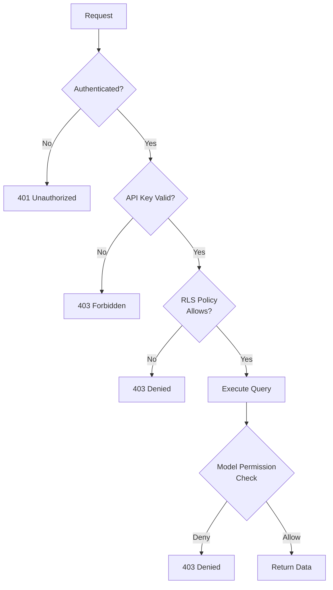

# Authorization

## Overview

Authorization on the Jasfo platform determines what actions authenticated identities can perform. The platform uses a multi-layer authorization model: **Row Level Security (RLS)** at the PostgreSQL database level, **API access control** at the application layer, and **model-level permissions** for the single-user broker model. Since the platform operates with one primary user, authorization is relatively simple but deliberately layered to prevent accidental data leaks through exports or misconfigured integrations.

All authorization decisions are logged. Denied requests are logged with the reason for denial for audit purposes.

---

## Authorization Layers



---

## Row Level Security (RLS)

RLS is the primary authorization mechanism for database access. Every table has at least one RLS policy that restricts access to authenticated sessions.

### Policy: Single-User Access

```sql
-- Applied to all tables
CREATE POLICY "single_user_access"
ON leads
FOR ALL
USING (
  auth.role() = 'service_role'
);

-- Restrict anon key access
CREATE POLICY "anon_read_only"
ON leads
FOR SELECT
USING (
  auth.role() = 'anon' AND ...
);
```

### Table-Level RLS Status

| Table | RLS Enabled | Policy |
|-------|-------------|--------|
| `leads` | ✅ | Service role only |
| `enrichment_log` | ✅ | Service role only |
| `export_log` | ✅ | Service role only |
| `api_keys` | ✅ | Service role only |
| `vault` | ✅ | Vault admin only |

---

## API Access Control

### Endpoint Authorization

| Endpoint | Auth Required | Key Type |
|----------|---------------|----------|
| `GET /api/leads` | Yes | Anon JWT or service key |
| `POST /api/leads` | Yes | Service key only |
| `GET /api/exports` | Yes | Anon JWT |
| `POST /api/exports` | Yes | Service key only |
| `GET /api/health` | No | None |

### Scope-Based Access

API keys can be scoped to specific operations:

| Scope | Operations |
|-------|-----------|
| `leads:read` | Read-only lead queries |
| `leads:write` | Create and update leads |
| `exports:read` | Download existing exports |
| `exports:create` | Generate new exports |
| `admin:all` | Full platform access |

A key with `leads:read` and `exports:read` can query leads and download exports but cannot create new leads or generate exports.

---

## Model-Level Permissions

### Enrichment Permissions

| Field | Readable | Writable | Notes |
|-------|----------|----------|-------|
| `first_name` | ✅ | ✅ | Core field |
| `last_name` | ✅ | ✅ | Core field |
| `email` | ✅ | ✅ | Core field |
| `phone` | ✅ | ✅ | Sensitive — encrypted |
| `company_revenue` | ✅ | ✅ | Financial data |
| `notes` | ✅ | ✅ | User-controlled |

All fields are readable and writable by the single authenticated user. The model-level permission system is designed to support future multi-user or role-based access without schema changes.

---

## External Service Authorization

| Service | Auth Method | Credential Source |
|---------|-------------|-------------------|
| Apollo.io | Bearer token | Supabase Vault |
| Hunter.io | Query param `api_key` | Supabase Vault |
| Snov.io | OAuth 2.0 Bearer token | Supabase Vault |
| Firebase | Bearer token | Supabase Vault |
| Telegram | Bot token in URL path | Supabase Vault |
| OpenRouter | Bearer token | Supabase Vault |
| Google Sheets | OAuth 2.0 service account | Supabase Vault |

External service credentials are never exposed to the end user. The platform's Make.com workflows and OpenCode agents handle all external authentication transparently.

---

## Denied Request Logging

All authorization denials are logged with the following structure:

```json
{
  "timestamp": "2026-07-12T10:30:00Z",
  "event_type": "authorization_denied",
  "user": "anon",
  "ip_address": "203.0.113.42",
  "action": "leads:write",
  "resource": "leads",
  "reason": "RLS policy violation",
  "request_id": "req-abc123"
}
```

Denied requests that are not the result of user error (e.g., repeated probes) trigger security alerts.
