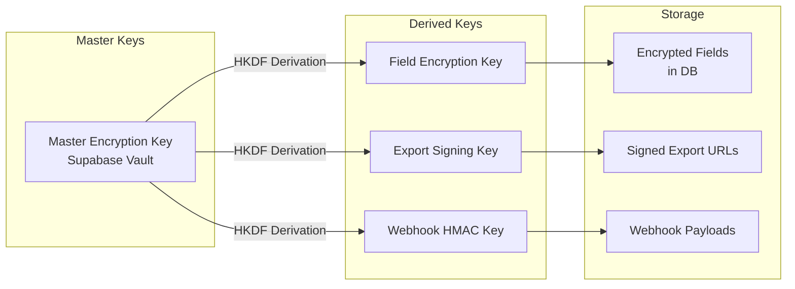
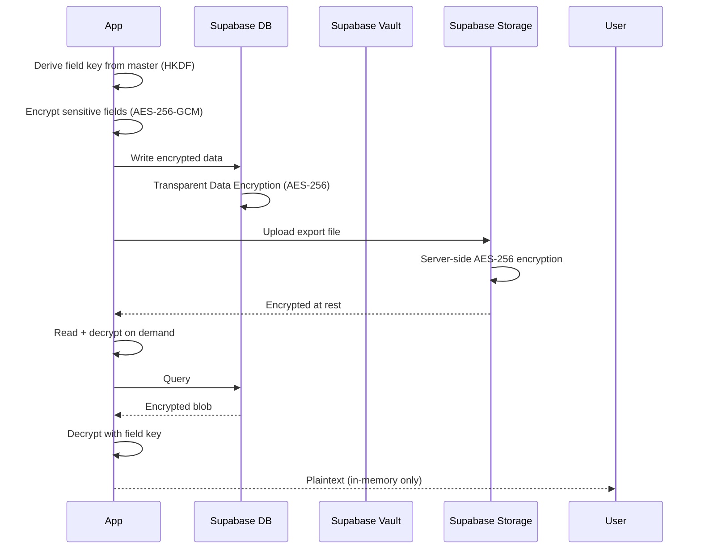

# Encryption Strategy

## Overview

The Jasfo platform employs a three-layer encryption strategy: **data in transit** using TLS 1.3, **data at rest** using the underlying cloud provider's AES-256 encryption, and **field-level encryption** for sensitive data elements using application-managed keys. This layered approach ensures that even if one layer is compromised, data remains protected by the other layers.

The platform does not store highly regulated data (PCI, HIPAA), but lead intelligence data — particularly phone numbers, email addresses, and company financials — is treated as sensitive business information. Field-level encryption provides an additional safeguard for export files and cached data.

---

## Encryption Layers

### Layer 1: Data in Transit

All API communication uses TLS 1.3 with strong cipher suites. The platform enforces HTTPS at every endpoint.

| Protocol | TLS 1.3 |
|----------|---------|
| Cipher suites | `TLS_AES_256_GCM_SHA384`, `TLS_CHACHA20_POLY1305_SHA256` |
| Key exchange | ECDHE (X25519) |
| Certificate validation | Required on all connections |
| HSTS | Enabled, max-age=31536000, includeSubDomains |

**Enforced on:**

- All Supabase API endpoints
- All external API calls (Apollo, Hunter, Snov, Firebase)
- Telegram API communication
- Google Sheets API
- Webhook delivery endpoints
- Export download URLs

### Layer 2: Data at Rest

| Storage Location | Encryption | Key Management |
|-----------------|------------|----------------|
| Supabase PostgreSQL | AES-256 (cloud provider managed) | Transparent Data Encryption |
| Supabase Storage | Server-side encryption with AES-256 | S3-managed keys |
| Redis Cache | AES-256 (ElastiCache at-rest encryption) | AWS-managed keys |
| Make.com data store | AES-256 (Make-managed) | Platform-managed |

### Layer 3: Field-Level Encryption

Certain sensitive fields are encrypted before being written to the database and decrypted on read.

**Encrypted fields:**

| Field | Reason | Algorithm |
|-------|--------|-----------|
| `phone` | Personal contact data | AES-256-GCM |
| `mobile_phone` | Personal contact data | AES-256-GCM |
| `notes` | May contain sensitive context | AES-256-GCM |
| Custom user fields | User-classified as sensitive | AES-256-GCM |

**Implementation:**

```sql
-- Write encrypted
SELECT pgp_sym_encrypt(
  '+14155551234',
  current_setting('app.encryption_key')
) AS encrypted_phone;

-- Read decrypted
SELECT pgp_sym_decrypt(
  encrypted_phone,
  current_setting('app.encryption_key')
) AS phone;
```

---

## Key Management



### Master Encryption Key

A single 256-bit key stored in Supabase Vault as `encryption.master_key`. This key is used only to derive sub-keys via HKDF (HMAC-based Key Derivation Function). The master key is never used directly for encryption operations.

### Key Rotation

| Key | Rotation | Procedure |
|-----|----------|-----------|
| Master key | Annual | Derive new sub-keys, re-encrypt all fields |
| Field encryption key | Annual (with master) | Re-encrypt sensitive fields |
| Export signing key | Quarterly | Update signing configuration |
| Webhook HMAC key | Quarterly | Rotate consumer-side shared secret |

---

## Export File Encryption

| Export Format | Encryption |
|-------------|------------|
| CSV | No (controlled via signed URL) |
| Excel | Optional AES-256 password protection |
| JSON | No (controlled via signed URL) |
| PDF | Optional AES-256 password protection |

Signed download URLs expire after 1 hour. Exports stored in Supabase Storage are encrypted at rest using server-side AES-256.

---

## Encryption at Rest Flow



---

## Supported Algorithms

| Use Case | Algorithm | Mode | Key Size |
|----------|-----------|------|----------|
| Field encryption | AES | GCM (authenticated) | 256 bits |
| Key derivation | HKDF | SHA-256 | Master key |
| Export signing | HMAC | SHA-256 | 256 bits |
| Webhook signatures | HMAC | SHA-256 | 256 bits |
| TLS | TLS 1.3 | AEAD | Per-session |

---

## Security Considerations

- **GCM nonces** are randomly generated for every encryption operation
- **Plaintext is never logged** at any layer
- **Decrypted data exists only in application memory**
- **Key material never appears in error messages or stack traces**
- **Export passwords** are single-use, generated per export, and delivered via separate channel
