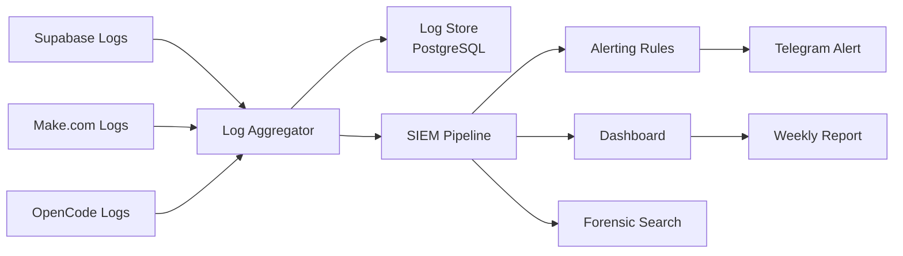

# Security Logging

## Overview

Security logging provides a complete, immutable record of all security-relevant events occurring within the Jasfo platform. Logs are used for incident detection, forensic investigation, compliance auditing, and operational monitoring. Every log entry includes a unique request ID, timestamp, actor identity, action, resource, and outcome.

The platform uses a centralized logging architecture. Application logs from Supabase, Make.com workflows, and OpenCode agents are aggregated into a searchable log store. Security-specific events are tagged for easy filtering and alerting.

---

## Log Events

### API Access Logs

Every API request to the platform is logged:

```json
{
  "timestamp": "2026-07-12T10:30:00Z",
  "event_type": "api_request",
  "request_id": "req-abc123",
  "method": "POST",
  "path": "/api/leads/search",
  "status_code": 200,
  "duration_ms": 342,
  "actor": {
    "type": "api_key",
    "id": "key_hash_abc123"
  },
  "ip_address": "203.0.113.42",
  "user_agent": "curl/8.0",
  "resource": "leads",
  "action": "search"
}
```

### Authentication Events

| Event | Logged Fields | Severity |
|-------|---------------|----------|
| Login success | User ID, IP, timestamp, user agent | Info |
| Login failure | Attempted user, IP, timestamp, reason | Warning |
| Session refresh | User ID, IP, timestamp | Info |
| Session expiry | User ID, timestamp | Info |
| API key auth success | Key hash, IP, timestamp | Info |
| API key auth failure | IP, timestamp, reason | Warning |
| Password change | User ID, timestamp | Warning |

### Data Access Audit

Data access events are logged for sensitive operations:

```json
{
  "timestamp": "2026-07-12T10:30:00Z",
  "event_type": "data_access",
  "request_id": "req-def456",
  "actor": "system",
  "action": "export",
  "resource": "leads",
  "record_count": 1250,
  "fields_exported": ["email", "phone", "company_revenue"],
  "export_format": "csv",
  "destination": "signed-url"
}
```

### Enrichment Events

| Event | Fields |
|-------|--------|
| Enrichment start | Lead ID, source, timestamp |
| Enrichment success | Lead ID, source, fields returned, confidence, cost |
| Enrichment failure | Lead ID, source, error, attempt count |
| Enrichment fallback | Lead ID, primary source, fallback source, reason |

### Error Events

| Event | Fields | Severity |
|-------|--------|----------|
| API error | Source, endpoint, status code, message | Error |
| Rate limit hit | Source, reset time, current count | Warning |
| Timeout | Source, endpoint, duration | Error |
| Unhandled exception | Module, error message, stack trace | Critical |

---

## Log Storage & Retention

| Log Type | Storage | Retention | Access |
|----------|---------|-----------|--------|
| API access logs | Supabase `api_logs` table | 90 days | Admin only |
| Authentication logs | Supabase Auth logs | 90 days | Admin only |
| Data access audit | Supabase `audit_log` table | 365 days | Admin only |
| Enrichment logs | Supabase `enrichment_log` table | 90 days | Admin only |
| Error logs | Supabase `error_log` table | 90 days | Admin only |
| Make.com execution logs | Make.com internal | 30 days | Make.com UI |

---

## Log Format

All logs follow a standardized JSON format:

| Field | Type | Description |
|-------|------|-------------|
| `timestamp` | ISO 8601 | Event time (UTC) |
| `event_type` | string | Category identifier |
| `request_id` | UUID | Correlates related events |
| `actor` | object | Who/what performed the action |
| `action` | string | What was done |
| `resource` | string | Target resource |
| `status` | string | Success / Failure / Warning |
| `details` | object | Event-specific data |
| `ip_address` | string | Originating IP |
| `severity` | string | Info / Warning / Error / Critical |

---

## Log Security

| Control | Implementation |
|---------|---------------|
| Tamper prevention | Append-only inserts, no UPDATE or DELETE on log tables |
| PII scrubbing | Emails, phone numbers, and IPs sanitized in log entries |
| Access control | Log tables accessible only by service role |
| Retention enforcement | Automated cleanup via cron job |
| Log monitoring | Failed logins, errors, denied requests trigger alerts |

---

## SIEM Integration Plan



### Planned SIEM Integration

| Phase | Target | Timeline |
|-------|--------|----------|
| 1 | Log aggregation to Supabase | ✅ Complete |
| 2 | Alert rules for critical events | ✅ Complete |
| 3 | Grafana dashboard for security metrics | Q3 2026 |
| 4 | ELK/Splunk forwarding | Q4 2026 |
| 5 | Automated incident response | Q1 2027 |
