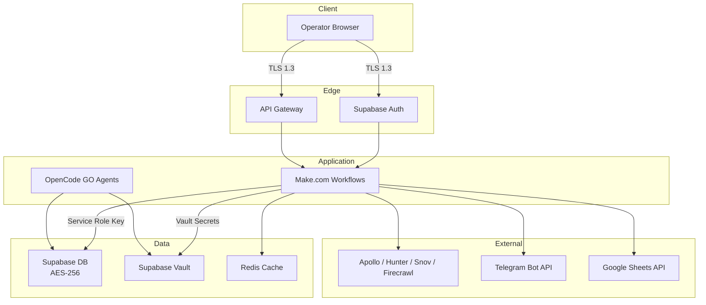

# Security Overview

## Philosophy

The Jasfo Lead Intelligence Platform operates with a single-user broker model — there is one operator who owns all lead data and enrichment pipelines. Security is therefore focused on protecting the broker's data at rest and in transit, securing API keys and secrets to external services, and ensuring that no data is leaked through exports, webhook deliveries, or third-party integrations.

The security model follows three principles: **least privilege** — every integration key has the minimum permissions necessary; **defense in depth** — data is encrypted at rest, in transit, and at the field level; and **auditability** — every enrichment action, export, and API call is logged with a traceable ID.

---

## Security Architecture

### Security Layers

| Layer | Protection | Implementation |
|-------|-----------|----------------|
| Transport | TLS 1.3 | All API communication |
| Authentication | Supabase Auth + API Keys | Email/password for UI, Bearer tokens for API |
| Authorization | Row Level Security | PostgreSQL RLS policies |
| Storage | AES-256 | Supabase encryption at rest |
| Field-level | Application-level encryption | Sensitive fields encrypted before DB write |
| Secrets | Encrypted vault | Supabase Vault with access control |
| Audit | Structured logging | All operations logged with trace IDs |

---

## Key Security Controls

| Control | Status | Details |
|---------|--------|---------|
| Encryption at rest | ✅ Active | Supabase AES-256 for database, server-side encryption for storage |
| Encryption in transit | ✅ Active | TLS 1.3 with strong cipher suites |
| Field-level encryption | ✅ Active | Phone numbers, custom notes encrypted |
| Secret management | ✅ Active | Supabase Vault, never in env vars |
| API key rotation | ✅ Scheduled | Quarterly rotation with 30-day overlap |
| Least privilege keys | ✅ Active | Each external API key scoped to minimum |
| Access logging | ✅ Active | All API calls logged with timestamp, IP, action |
| RLS policies | ✅ Active | Single-user policies enforced at DB level |
| Audit schedule | ✅ Quarterly | External penetration test + internal review |

---

## What We Do NOT Store

The platform is designed to minimize data retention risk. The following are never stored:

- **Full credit card numbers** (only tokenized references via billing provider)
- **Passwords** in plaintext (Supabase Auth handles hashing)
- **Unencrypted API keys** (all keys in Supabase Vault)
- **Raw SMTP credentials** (temporary connections only)
- **Browser session data** (no tracking or cookie-based profiling)
- **Unrestricted export files** (all exports have signed URLs with expiry)

---

## Compliance Posture

| Standard | Applicability | Status |
|----------|--------------|--------|
| SOC 2 Type I | Security, Availability | In progress |
| GDPR | EU personal data | Data processing controls implemented |
| CCPA | California residents | Data deletion capability available |
| ISO 27001 | Information security | Planned for next cycle |

---

## Incident Response

| Severity | Response Time | Notification |
|----------|--------------|-------------|
| Critical (data breach) | < 1 hour | Telegram alert + email |
| High (key compromise) | < 4 hours | Telegram alert |
| Medium (suspicious activity) | < 24 hours | Daily digest |
| Low (probe/scan) | < 1 week | Weekly review |

All security incidents are tracked in a dedicated log and reviewed during the quarterly audit.
