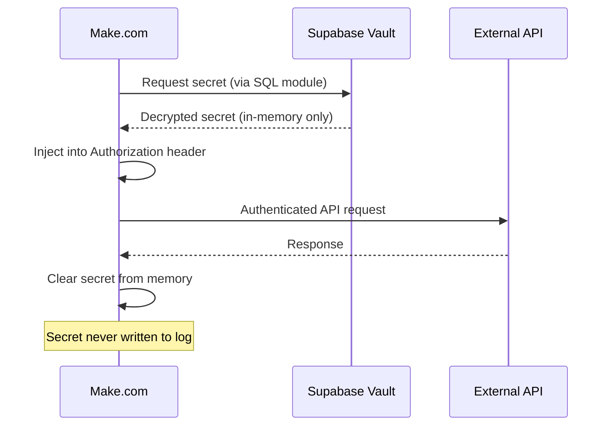

# Secrets Management

## Overview

Secrets management governs how sensitive configuration values — API keys, database credentials, encryption keys, and service tokens — are stored, accessed, rotated, and audited across the Jasfo platform. The platform uses **Supabase Vault** as the primary secrets store for long-lived secrets and environment variables for runtime configuration (with strict controls).

The cardinal rule of secrets management on this platform: **never log a secret**. All Make.com modules, OpenCode agents, and custom code are configured to sanitize secrets from logs, error messages, and debug output. A pre-commit hook scans for accidental secret exposure in export files and configuration.

---

## Where Secrets Live

### Supabase Vault (Primary)

Used for all third-party API keys and long-lived credentials.

```sql
-- Write
SELECT vault.create_secret('value', 'name', 'description');

-- Read (requires vault_access role)
SELECT * FROM vault.decrypted_secrets WHERE name = 'firecrawl.api_key';

-- Update
SELECT vault.update_secret('secret_id', 'new_value');

-- Delete
SELECT vault.delete_secret('secret_id');
```

**Stored in Vault:**

- Firecrawl API key
- Apollo.io API key
- Hunter.io API key
- Snov.io client ID + secret
- Telegram bot token
- OpenRouter API key
- Supabase service role key
- Google Sheets service account key
- Encryption master keys

### Environment Variables (Runtime)

Used for non-secret configuration and Supabase project identifiers.

```makefile
# .env — Never commit to version control
SUPABASE_URL=https://xxxxx.supabase.co
SUPABASE_ANON_KEY=xxxxx
REDIS_URL=redis://...
LOG_LEVEL=info
```

### Make.com Connection Store

Make.com has a built-in encrypted connection store for API keys used in scenarios. Each connection is encrypted at rest and accessed by reference in modules.

| Connection Name | Service | Type |
|----------------|---------|------|
| Supabase Admin | Supabase | Service role |
| Firebase | Firebase | API key |
| Apollo | Apollo.io | API key |
| Hunter | Hunter.io | API key |
| Snov | Snov.io | OAuth |
| Telegram | Telegram | Bot token |

---

## Secret Usage Flow



---

## Prohibited Practices

| Practice | Why | Alternative |
|----------|-----|-------------|
| Hardcoding keys in source code | Committed to git, exposed in CI | Supabase Vault |
| Storing secrets in `.env` committed to git | Public repository leaks | `.env` in `.gitignore` |
| Passing secrets in URLs (query params) | Logged by proxies, CDNs | Authorization header |
| Logging API responses containing secrets | Log aggregation exposure | Strip secrets before logging |
| Sharing secrets via email/chat | Unencrypted transit | Vault sharing mechanism |
| Using one key for all environments | Blast radius too large | Per-environment keys |

---

## Make.com Security Practices

### HTTP Module Configuration

| Setting | Value |
|---------|-------|
| Evaluate state? | No (prevents secret exposure in UI) |
| Store credentials | Encrypted connection store |
| Show response | Disabled for modules handling secrets |
| Log requests | Never |

### Error Handling

All HTTP modules that call external APIs are configured with error handlers that:

1. Catch the error response
2. Strip the request body (may contain secrets)
3. Log only the HTTP status code and error type
4. Return a sanitized error object to the main flow

---

## Rotation Schedule

| Secret Type | Rotation Period | Overlap Window |
|-------------|----------------|----------------|
| External API keys | 90 days | 30 days |
| Supabase service role key | 180 days | None (regenerate on update) |
| Encryption master keys | 365 days | None (re-encrypt data) |
| Google service account keys | 365 days | 30 days |
| Telegram bot tokens | Only on compromise | N/A |

---

## Monitoring & Alerting

| Event | Alert |
|-------|-------|
| Secret accessed outside normal hours | Telegram alert |
| Failed decryption attempt | Telegram alert + log |
| Unknown IP accessing Vault | Security incident |
| Rotation overdue | Telegram reminder |
