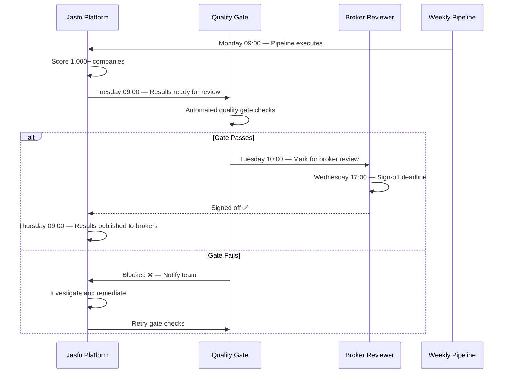

# Acceptance Testing

Acceptance testing is the final quality gate before scoring results are delivered to brokers. Unlike automated tests that verify technical correctness, acceptance tests validate that the platform's outputs meet business requirements — scores are meaningful, evidence is actionable, and the overall lead intelligence is ready for broker consumption. Acceptance follows a weekly cadence aligned with the platform's pipeline execution schedule.

## Acceptance Process



## Weekly Acceptance Criteria

Each weekly pipeline run must pass the following acceptance criteria before results are published to brokers:

| Criterion | Threshold | Method | Owner |
|---|---|---|---|
| Scoring completeness | ≥ 95% of companies scored | Automated count | Platform |
| Empty evidence rate | < 5% | Automated check | Platform |
| Score distribution | No single value > 15% of total | Automated histogram | Platform |
| Pipeline duration | < 120 minutes | Automated timer | Platform |
| Error rate | < 3% of companies | Automated audit | Platform |
| Cost per company | < $0.01 average | Automated calculation | Platform |
| Golden dataset drift | MAE < 5 points | Automated evaluation | Platform |
| Broker sample check | 5 random companies reviewed | Manual | Broker |
| Confidence calibration | High-confidence accuracy > 80% | Automated | Platform |

```python
# tests/acceptance/weekly_gate.py

class WeeklyAcceptanceGate:
    """Weekly quality gate check — blocks publishing if any criterion fails."""

    CRITERIA = {
        "scoring_completeness": {"threshold": 0.95, "metric": "ratio"},
        "empty_evidence_rate": {"threshold": 0.05, "metric": "ratio"},
        "max_score_concentration": {"threshold": 0.15, "metric": "ratio"},
        "max_pipeline_duration": {"threshold": 7200, "metric": "seconds"},
        "max_error_rate": {"threshold": 0.03, "metric": "ratio"},
        "max_cost_per_company": {"threshold": 0.01, "metric": "usd"},
        "golden_dataset_mae": {"threshold": 5.0, "metric": "points"},
    }

    async def run_gate_checks(self, pipeline_run_id: int) -> GateResult:
        results = {}
        all_passed = True
        
        pipeline = await get_pipeline_run(pipeline_run_id)
        stats = await compute_pipeline_stats(pipeline)
        
        for criterion, config in self.CRITERIA.items():
            actual = stats[criterion]
            threshold = config["threshold"]
            
            if criterion == "max_cost_per_company":
                passed = actual <= threshold
            elif criterion == "scoring_completeness":
                passed = actual >= threshold
            else:
                passed = actual <= threshold
                
            results[criterion] = {
                "passed": passed,
                "actual": actual,
                "threshold": threshold,
            }
            if not passed:
                all_passed = False
        
        return GateResult(passed=all_passed, criteria=results)
```

## Broker Sign-Off Process

After automated gates pass, a broker reviewer manually validates scoring quality on a sample of companies:

1. **Sample Selection** — The platform randomly selects 5 companies from the current week's pipeline, stratified by score range (1 high, 2 medium, 1 low, 1 very low)
2. **Review Dashboard** — The broker receives a link to a review dashboard showing each company's data sources, scores, and evidence
3. **Manual Assessment** — The broker independently evaluates each company and compares their assessment to the platform's score
4. **Feedback Collection** — For each discrepancy > 15 points, the broker provides specific feedback (missed signals, overvalued factors, incorrect data)
5. **Decision** — The broker either signs off (all discrepancies reasonable and explained) or requests remediation

```python
# tests/acceptance/broker_signoff.py

class BrokerSignOff:
    """Manages the broker sign-off workflow."""

    SAMPLE_SIZE = 5

    async def generate_review_package(self, pipeline_run_id):
        """Create a review package for broker sign-off."""
        companies = await select_review_sample(
            pipeline_run_id, 
            count=self.SAMPLE_SIZE
        )
        
        review_data = []
        for company in companies:
            review_data.append({
                "company_name": company["name"],
                "website": company["website"],
                "platform_score": company["overall_score"],
                "pillars": company["pillars"],
                "evidence": company["evidence"],
                "data_sources": company["data_sources"],
                "confidence": company["confidence"],
            })
        
        return ReviewPackage(
            pipeline_run_id=pipeline_run_id,
            week_ending=get_next_friday(),
            companies=review_data,
        )

    async def process_signoff(self, signoff_result: SignOffResult):
        """Process broker sign-off and determine next action."""
        if signoff_result.approved:
            await publish_results(signoff_result.pipeline_run_id)
            await send_notification(
                "✅ Pipeline signed off and published",
                channel="pipeline-reports"
            )
        else:
            await flag_for_review(
                signoff_result.pipeline_run_id,
                signoff_result.feedback
            )
            await send_notification(
                "⚠️ Pipeline blocked — broker flagged issues",
                channel="alerts"
            )
```

## Quality Gates

Quality gates are automated checkpoints that must pass for the pipeline to proceed to the next stage:

### Gate 1: Pipeline Completion (Monday 09:00–12:00)

- Pipeline executes all companies
- All worker tasks complete without fatal errors
- Pipeline status updates to `completed` in the database
- **Failure**: Restart pipeline; if fails twice, page on-call engineer

### Gate 2: Data Integrity (Tuesday 09:00–10:00)

- Row counts match expected ranges
- All scores are within 0–100 range
- No orphaned pipeline records
- Foreign key relationships are intact
- **Failure**: Roll back pipeline results; investigate database state

### Gate 3: Scoring Quality (Tuesday 10:00–12:00)

- Golden dataset MAE < 5 points
- No hallucinated evidence
- Score distribution is realistic (no clumping)
- Cost per company within budget
- **Failure**: Block publishing; flag scoring pipeline for review

### Gate 4: Broker Sign-Off (Tuesday–Wednesday)

- Review package generated and sent
- Broker completes review within 48 hours
- All discrepancies documented
- **Failure**: Escalate to account manager; negotiate resolution

### Gate 5: Publishing (Thursday 09:00)

- All previous gates passed
- CSV exports generated and validated
- Broker dashboard updated
- Notification sent
- **Failure**: Manual override required for publishing

## Acceptance Dashboard

The acceptance dashboard provides a single view of the current week's acceptance status, accessible to both the platform team and broker reviewers:

```
┌─────────────────────────────────────────────────────┐
│  Weekly Acceptance — Week of July 6, 2026           │
├─────────────────────────────────────────────────────┤
│  Gate 1: Pipeline Completion     ✅ 1,042 companies │
│  Gate 2: Data Integrity          ✅ All checks pass │
│  Gate 3: Scoring Quality         ✅ MAE: 3.2 points │
│  Gate 4: Broker Sign-Off         ⏳ Pending review  │
│  Gate 5: Publishing              ⏳ Waiting on Gate 4│
├─────────────────────────────────────────────────────┤
│  Pipeline Duration: 47 minutes                      │
│  Total Cost: $3.24                                  │
│  Companies Scored: 1,042 / 1,100 (94.7%)            │
│  Errors: 12 (1.2%)                                  │
└─────────────────────────────────────────────────────┘
```

## Failure Escalation

When a quality gate fails, the escalation follows a defined path:

| Gates Failed | Escalation | Response Time |
|---|---|---|
| Gate 1 or 2 | Platform engineering | 2 hours |
| Gate 3 | Scoring team lead | 4 hours |
| Gate 4 | Account manager + broker | 24 hours |
| Multiple gates | Incident response | 1 hour |

Each escalation triggers a targeted notification to the responsible party via Telegram with the specific failure details and a link to the acceptance dashboard for investigation.
