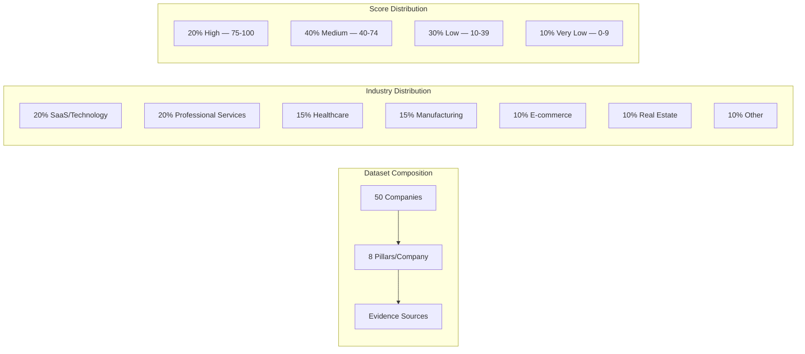

# Golden Dataset

The golden dataset is the foundation of prompt quality assurance for the Jasfo Lead Intelligence Platform. It comprises 50 companies that have been manually researched and scored by domain experts, with verified ground truth for every pillar. This dataset serves as the reference standard against which all prompt changes, model upgrades, and scoring methodology updates are evaluated.

## Dataset Overview



The dataset is curated to represent the full spectrum of lead quality scenarios the platform encounters in production — from high-growth VC-backed startups to local service businesses with limited digital presence. This diversity ensures prompt evaluation covers edge cases and challenging scoring scenarios, not just well-documented companies.

## Dataset Schema

The golden dataset is stored as a CSV file at `tests/prompts/golden_dataset.csv` with the following schema:

| Column | Type | Description |
|---|---|---|
| `company_id` | Integer | Unique identifier (1–50) |
| `company_name` | String | Legal or trading name |
| `website` | String | Company website URL (nullable) |
| `city` | String | Primary operating city |
| `industry` | String | Industry classification |
| `employees` | Integer | Approximate employee count |
| `reference_score` | Float | Overall lead score (0–100) |
| `reference_pillars` | JSON | Per-pillar scores as JSON object |
| `confidence` | String | "high", "medium", or "low" |
| `evidence_summary` | Text | Brief summary of scoring evidence |
| `scored_by` | String | Domain expert who created this entry |
| `scored_date` | Date | Date of manual scoring |
| `notes` | Text | Scoring rationale and edge case notes |

## Sample Entries

| Id | Name | Industry | Score | Confidence | Evidence |
|---|---|---|---|---|---|
| 1 | Acme Analytics | SaaS | 78 | high | $10M ARR, Series A, 85 employees, strong Glassdoor |
| 2 | Main Street Bakery | Food Service | 18 | low | No website, 3 employees, local only |
| 3 | GrowthForce Inc | Consulting | 62 | medium | $5M revenue, 25 employees, no recent funding |
| 4 | TechNova Solutions | SaaS | 91 | high | $50M ARR, Series C, 200+ employees, strong leadership |
| 5 | Harbor Freight Logistics | Manufacturing | 45 | medium | $20M revenue, 100 employees, traditional industry |

## Dataset Maintenance

The golden dataset is a living artifact that requires periodic maintenance to remain relevant:

**Quarterly Review** — Every quarter, the dataset is reviewed to:
- Add new companies reflecting emerging industries or scoring edge cases
- Remove companies that have changed significantly (acquired, rebranded, shut down)
- Re-score existing companies if platform methodology has evolved
- Rebalance industry distribution to match production traffic

**Version Control** — The dataset is version-controlled in the repository under `tests/prompts/golden_dataset.csv`. Changes are reviewed via pull request with at least two domain experts required for approval. Each version is tagged:

```
golden-dataset-v1.0 — Initial dataset (50 companies)
golden-dataset-v1.1 — Re-scored 5 companies for methodology v2
golden-dataset-v2.0 — Added 5 new companies, removed 3 outdated
```

**Quality Checks** — Before a dataset version is committed, automated validation runs:
- All 50 companies have valid scores (0–100)
- All 8 pillars are present for each company
- No duplicate company names or URLs
- Confidence levels are consistent with evidence quality
- Score distribution covers the full range (no clustering)

## Using the Dataset

The golden dataset is used by multiple testing and monitoring workflows:

| Use Case | Frequency | Purpose |
|---|---|---|
| Prompt evaluation | On every PR | Validate scoring accuracy against reference |
| A/B comparison | Prompt changes | Compare candidate vs current prompt |
| Hallucination detection | Daily | Detect invented evidence scores |
| Hourly regression | Hourly | Quick drift detection (5-company sample) |
| Model upgrade testing | Model changes | Re-validate with new model version |
| Platform acceptance | Weekly | Verify scoring quality before broker review |

## Dataset Integrity

Security and integrity measures ensure the dataset cannot be accidentally corrupted:

```python
# tests/prompts/validate_dataset.py

def validate_golden_dataset():
    """Run integrity checks on the golden dataset."""
    df = pd.read_csv("tests/prompts/golden_dataset.csv")
    
    # Count must be exactly 50
    assert len(df) == 50, f"Expected 50 entries, got {len(df)}"
    
    # Score ranges
    assert df["reference_score"].between(0, 100).all(), "Scores out of range"
    
    # No null values in required fields
    assert df["company_name"].notna().all()
    assert df["reference_score"].notna().all()
    
    # Pillars JSON must parse
    for pillars in df["reference_pillars"]:
        parsed = json.loads(pillars)
        assert len(parsed) == 8, f"Expected 8 pillars, got {len(parsed)}"
        for pillar_name, score in parsed.items():
            assert 0 <= score <= 100 or score is None
    
    # Confidence values must be valid
    assert df["confidence"].isin(["high", "medium", "low"]).all()
    
    # No duplicate company names
    assert df["company_name"].is_unique, "Duplicate company names found"
```

## Creating New Entries

When adding a new company to the golden dataset, the scoring process follows a rigorous methodology:

1. **Research Phase** — Gather data from: company website, LinkedIn, Crunchbase, Glassdoor, news articles, industry reports
2. **Evidence Assembly** — Compile findings into structured evidence per pillar, citing specific sources
3. **Initial Scoring** — Apply the platform's scoring rubric manually, documenting each score decision
4. **Peer Review** — A second domain expert independently scores the company; discrepancies >10 points are discussed
5. **Consensus** — Agreed-upon scores are recorded; the final score may be a reconciliation of both experts
6. **Entry Creation** — Data is entered into the CSV with full evidence summary and scoring notes
7. **Validation** — Automated validation runs confirm the entry meets all quality criteria

This process ensures that the ground truth in the golden dataset is as accurate and defensible as possible, providing a reliable reference for automated prompt evaluation.
