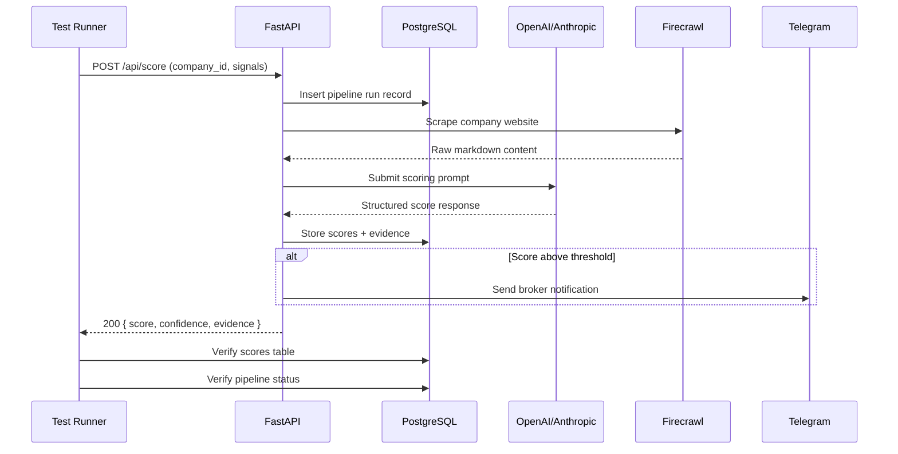

# Integration Testing

Integration tests validate that the Jasfo Lead Intelligence Platform's components work together correctly — from Firecrawl web scraping through GPT-based scoring to database persistence and Telegram notification delivery. Unlike unit tests, integration tests exercise real external services (with test credentials) and validate complete data flows end-to-end. These tests catch interface mismatches, configuration errors, and timing issues that unit tests cannot surface.

## Integration Test Architecture



## End-to-End Pipeline Tests

The core integration test runs a complete lead scoring pipeline from start to finish against the staging environment:

```python
# tests/integration/test_pipeline.py
import pytest
import httpx

class TestLeadScoringPipeline:
    """End-to-end pipeline execution tests."""

    @pytest.mark.slow
    async def test_complete_scoring_workflow(self, staging_client):
        """A company must progress through the full scoring pipeline."""
        # Step 1: Submit company for scoring
        response = await staging_client.post("/api/score", json={
            "company_name": "Acme Corp Test",
            "website": "https://example-test-acme.com",
            "city": "San Francisco",
        })
        assert response.status_code == 202
        pipeline_id = response.json()["pipeline_id"]

        # Step 2: Wait for pipeline completion (polling)
        for attempt in range(30):
            status = await staging_client.get(f"/api/pipeline/{pipeline_id}")
            if status.json()["status"] == "completed":
                break
            await asyncio.sleep(10)
        else:
            pytest.fail("Pipeline did not complete within 5 minutes")

        # Step 3: Verify scoring results
        scores = await staging_client.get(
            f"/api/pipeline/{pipeline_id}/scores"
        )
        result = scores.json()
        assert 0 <= result["overall_score"] <= 100
        assert len(result["pillars"]) == 8

    async def test_pipeline_for_company_without_website(self):
        """Companies without websites must receive a partial score."""
        response = await staging_client.post("/api/score", json={
            "company_name": "Main Street Bakery Test",
            "website": None,
            "city": "Austin",
        })
        assert response.status_code == 202
        # Verify confidence is lower without website data
        assert response.json()["confidence"] in ("low", "medium")
```

## API Integration Tests

API integration tests validate request/response contracts, authentication, and error handling across all public endpoints:

```python
# tests/integration/test_api.py

class TestScoreEndpoint:
    """Integration tests for the /api/score endpoint."""

    async def test_score_endpoint_returns_expected_structure(self, staging_client):
        """The score endpoint must return the documented response structure."""
        response = await staging_client.post("/api/score", json={
            "company_name": "Test Corp",
            "website": "https://test-corp.com",
            "city": "New York",
        })
        assert response.status_code == 202
        
        data = response.json()
        required_fields = {"pipeline_id", "status", "estimated_duration"}
        assert required_fields.issubset(data.keys())

    async def test_score_requires_authentication(self, client_no_auth):
        """Unauthenticated requests must be rejected."""
        response = await client_no_auth.post("/api/score", json={
            "company_name": "Unauth Corp",
            "website": "https://unauth-corp.com",
        })
        assert response.status_code == 401

    async def test_score_rejects_invalid_city(self, staging_client):
        """Requests with invalid city must return 422."""
        response = await staging_client.post("/api/score", json={
            "company_name": "Bad City Corp",
            "website": "https://bad-city.com",
            "city": "InvalidCityName",
        })
        assert response.status_code == 422

    async def test_score_returns_appropriate_error_messages(self, staging_client):
        """Error responses must include human-readable messages."""
        response = await staging_client.post("/api/score", json={})
        assert response.status_code == 422
        detail = response.json()["detail"]
        assert len(detail) > 0  # At least one validation error
```

## Data Flow Validation

Data flow tests verify that data is correctly persisted, transformed, and accessible across pipeline stages:

```python
# tests/integration/test_data_flow.py

class TestDataFlow:
    """Tests for data integrity across pipeline stages."""

    async def test_company_data_persisted_correctly(self, staging_client, db_session):
        """Company data submitted via API must be queryable in the database."""
        company_name = "Persistence Test Corp"
        response = await staging_client.post("/api/score", json={
            "company_name": company_name,
            "website": "https://persistence-test.com",
        })
        pipeline_id = response.json()["pipeline_id"]
        
        # Wait for completion (simplified)
        await wait_for_pipeline(staging_client, pipeline_id)
        
        # Verify database state
        result = db_session.execute(
            "SELECT company_name, overall_score FROM scores WHERE pipeline_id = $1",
            [pipeline_id]
        ).fetchone()
        assert result["company_name"] == company_name
        assert result["overall_score"] is not None

    async def test_scores_are_deterministic(self, staging_client):
        """Scoring the same company twice must produce consistent results."""
        company = {
            "company_name": "Determinism Test Corp",
            "website": "https://determinism-test.com",
        }
        
        response1 = await staging_client.post("/api/score", json=company)
        pid1 = response1.json()["pipeline_id"]
        await wait_for_pipeline(staging_client, pid1)
        score1 = await staging_client.get(f"/api/pipeline/{pid1}/scores")
        s1 = score1.json()["overall_score"]
        
        response2 = await staging_client.post("/api/score", json=company)
        pid2 = response2.json()["pipeline_id"]
        await wait_for_pipeline(staging_client, pid2)
        score2 = await staging_client.get(f"/api/pipeline/{pid2}/scores")
        s2 = score2.json()["overall_score"]
        
        # Allow small variance for LLM temperature
        assert abs(s1 - s2) <= 5
```

## External Service Mock Integration

For tests in CI where external API access is unavailable, integration tests can run against mocked services while still validating the same code paths:

```python
# tests/integration/conftest.py
@pytest.fixture
async def staged_pipeline(mock_services):
    """Pytest fixture that sets up staged integration test environment."""
    # Stage 1: In-memory database
    db = await create_ephemeral_database()
    
    # Stage 2: Mock Firecrawl returns a canned response
    firecrawl_mock = await start_mock_server("firecrawl", port=8090)
    firecrawl_mock.expect("POST", "/scrape").respond(
        status=200, body=MOCK_SCRAPE_RESULT
    )
    
    # Stage 3: Mock OpenAI returns a deterministic score
    openai_mock = await start_mock_server("openai", port=8091)
    openai_mock.expect("POST", "/v1/chat/completions").respond(
        status=200, body=MOCK_SCORE_RESPONSE
    )
    
    yield db, firecrawl_mock, openai_mock
    
    await db.cleanup()
    await firecrawl_mock.stop()
    await openai_mock.stop()
```

## Running Integration Tests

```bash
# Run all integration tests (requires staging environment)
pytest tests/integration/ -v --staging-url https://staging.api.jasfo.com

# Run with mock services (no external dependency)
pytest tests/integration/ -v --mock-services

# Run a single integration test
pytest tests/integration/test_pipeline.py::TestLeadScoringPipeline::test_complete_scoring_workflow -v

# Run with verbose logging for debugging
pytest tests/integration/ -v --log-cli-level=DEBUG

# Run pipeline tests only
pytest tests/integration/ -m pipeline -v
```

## Test Data Isolation

Integration tests operate on isolated data to prevent interference between test runs:

- **Staging Environment** — Integration tests run against the staging Supabase project, which is a replica of production without real data
- **Test Prefix** — All test company names include the `Test` suffix for easy identification and cleanup
- **Automatic Cleanup** — A cleanup job runs after each test suite and removes records matching the `%Test` pattern
- **Transaction Rollback** — Database-modifying tests wrap operations in transactions that are rolled back on teardown
