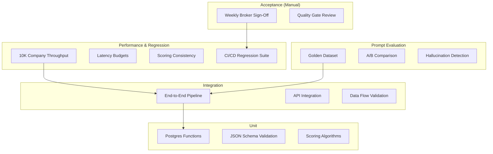

# Testing Framework Overview

The Jasfo Lead Intelligence Platform employs a comprehensive testing framework spanning six testing disciplines: unit testing, integration testing, prompt evaluation, performance benchmarking, regression detection, and acceptance verification. Each discipline targets a specific layer of the platform, from individual database functions to end-to-end pipeline execution and AI prompt quality. Together, these tests form the quality gate that every change must pass before reaching production.

## Testing Pyramid



The pyramid reflects the testing philosophy: a broad foundation of fast, isolated unit tests; fewer, slower integration tests that validate component interaction; targeted prompt evaluation tests for AI reliability; performance and regression benchmarks as guardrails; and manual acceptance gates for final sign-off. Each layer feeds into the next — a prompt evaluation failure blocks integration tests, and an integration failure blocks acceptance.

## Test Execution

Tests are executed automatically through multiple triggers:

| Trigger | Test Scope | Environment |
|---|---|---|
| `git push` to any branch | Unit tests | CI (ephemeral PostgreSQL) |
| PR creation | Unit + Integration + Prompt | CI (staging) |
| PR merge to `staging` | Full suite except acceptance | Staging |
| PR merge to `main` | Full suite including acceptance | Production |
| Weekly cron (Monday 09:00) | Full regression suite | Production |
| Monthly cron (1st of month) | Performance benchmarks | Staging |

## Test Configuration

Test configuration is managed through a `pytest.ini` file with environment-specific overrides:

```ini
[pytest]
testpaths = tests/unit tests/integration tests/prompts tests/performance
markers =
    unit: Fast, isolated unit tests
    integration: End-to-end pipeline and API tests
    prompt: Golden dataset prompt evaluation
    performance: Throughput and latency benchmarks
    regression: Scoring consistency checks
    acceptance: Quality gate validation
    slow: Tests that take > 30 seconds (skip in quick CI)
```

## Continuous Validation

Beyond commit-triggered tests, the platform runs continuous validation in production:

- **Post-Deployment Smoke Tests** — Every deploy triggers a 30-second smoke test suite that validates critical endpoints
- **Scheduled Regression Suite** — Every hour, a lightweight regression suite runs against production data to detect scoring drift
- **Daily Prompt Evaluation** — The golden dataset is scored daily and compared against the reference scores; deviations >5% trigger an alert

## Reporting

Test results are reported to multiple channels:

| Channel | Content | Frequency |
|---|---|---|
| GitHub Actions Summary | Pass/fail per test, duration, code coverage | Per run |
| Telegram `#alerts` | Failed tests with links to details | On failure |
| Telegram `#pipeline-reports` | Weekly regression summary | Weekly |
| Slack webhook (optional) | Production deployment test results | Per deploy |

## Test Data Management

Test data is maintained in three categories:

- **Fixture Data** — Static, version-controlled JSON files in `tests/fixtures/` containing sample companies, scores, and pipeline state
- **Golden Dataset** — 50 manually scored companies with verified ground truth, stored in `tests/prompts/golden_dataset.csv`
- **Ephemeral Test Data** — Generated at test runtime via factory functions, isolated per test run, and cleaned up automatically

Test data never includes real Personally Identifiable Information. All company and contact data in tests is synthetic.
