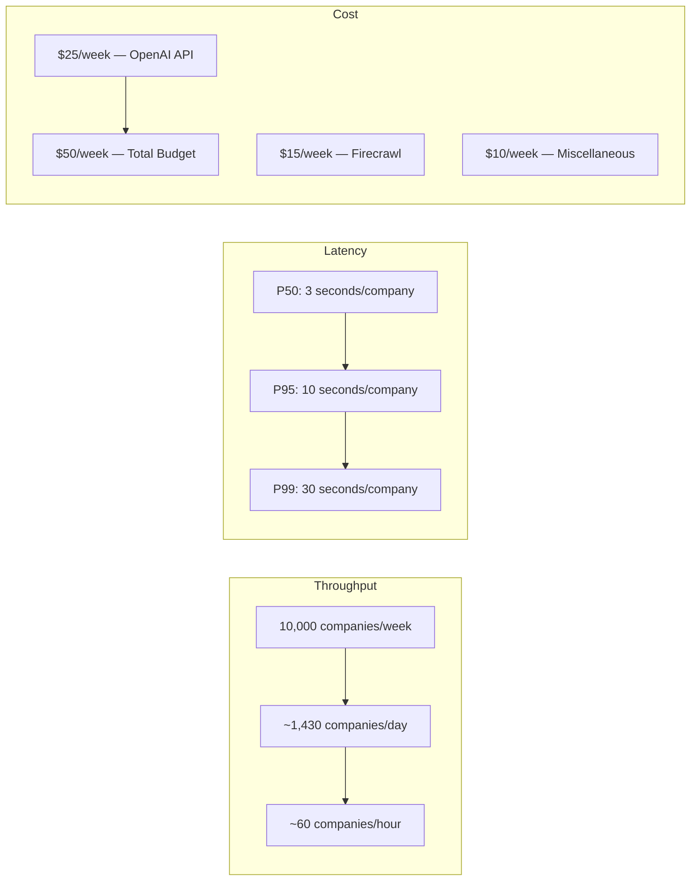

# Performance Testing

Performance testing ensures the Jasfo Lead Intelligence Platform meets throughput, latency, and cost targets under production-like loads. The platform is designed to score 10,000 companies per week with P95 latency under 10 seconds per company, all within a monthly budget of $100 for AI and scraping services. Performance tests validate these targets and identify regressions before they impact production throughput.

## Performance Targets



| Metric | Target | Warning Threshold | Critical Threshold |
|---|---|---|---|
| Weekly throughput | 10,000 companies | < 8,000/week | < 5,000/week |
| P50 score time | < 3 seconds | > 5 seconds | > 10 seconds |
| P95 score time | < 10 seconds | > 15 seconds | > 30 seconds |
| Pipeline duration (1,000 companies) | < 60 minutes | > 90 minutes | > 120 minutes |
| OpenAI cost per company | < $0.003 | > $0.005 | > $0.01 |
| Firecrawl cost per company | < $0.002 | > $0.003 | > $0.005 |
| API P95 response time | < 500 ms | > 1 second | > 3 seconds |
| Database query P95 | < 100 ms | > 200 ms | > 500 ms |

## Throughput Tests

Throughput tests measure how many companies the platform can score within a given time window:

```python
# tests/performance/test_throughput.py
import pytest
import time

class TestScoringThroughput:
    """Validates the platform can score companies at target throughput."""

    @pytest.mark.performance
    @pytest.mark.slow
    async def test_batch_scoring_100_companies(self, staging_client):
        """100 companies must complete scoring within 30 minutes."""
        companies = generate_test_companies(count=100)
        
        start_time = time.time()
        
        # Submit all companies for scoring
        pipeline_ids = []
        for company in companies:
            response = await staging_client.post("/api/score", json=company)
            pipeline_ids.append(response.json()["pipeline_id"])
        
        # Wait for all to complete
        completed = await wait_for_all_pipelines(staging_client, pipeline_ids)
        elapsed = time.time() - start_time
        
        assert completed, "Not all pipelines completed within timeout"
        assert elapsed < 1800, f"Took {elapsed:.0f}s, exceeds 1800s limit"
        
        avg_time = elapsed / len(companies)
        print(f"Average time per company: {avg_time:.1f}s")

    @pytest.mark.performance
    async def test_concurrent_scoring_limit(self, staging_client):
        """Platform must handle 10 concurrent scoring requests."""
        companies = generate_test_companies(count=10)
        
        # Fire all 10 requests concurrently
        tasks = [
            staging_client.post("/api/score", json=company)
            for company in companies
        ]
        responses = await asyncio.gather(*tasks)
        
        # All must return 202 (accepted)
        statuses = [r.status_code for r in responses]
        assert all(s == 202 for s in statuses), f"Got statuses: {statuses}"
```

## Latency Budget Tests

Latency tests break down the scoring pipeline into individual phases to identify bottlenecks:

```python
# tests/performance/test_latency.py

class TestScoringLatency:
    """Breaks down scoring latency by phase."""

    @pytest.mark.performance
    async def test_scoring_phases_within_budget(self, staging_client):
        """Each scoring phase must complete within its budget."""
        response = await staging_client.post("/api/score/analyze", json={
            "company_name": "Acme Performance Test",
            "website": "https://acme-perf-test.com",
        })
        timings = response.json()["timings"]
        
        budgets = {
            "web_scraping": 5.0,          # seconds
            "signal_extraction": 2.0,      # seconds
            "llm_scoring": 8.0,            # seconds
            "evidence_compilation": 1.0,   # seconds
            "database_write": 0.5,         # seconds
            "notification": 1.0,           # seconds
        }
        
        for phase, duration in timings.items():
            budget = budgets.get(phase)
            if budget:
                assert duration < budget, (
                    f"Phase '{phase}' took {duration:.2f}s, budget {budget}s"
                )

    @pytest.mark.performance
    async def test_api_endpoint_latency(self, staging_client):
        """API endpoints must respond within latency budget."""
        async def check_latency(method, path, label):
            start = time.time()
            await method(path)
            elapsed = time.time() - start
            return label, elapsed
        
        endpoints = [
            check_latency(staging_client.get, "/health", "health_check"),
            check_latency(staging_client.get, "/api/companies?limit=20", "list_companies"),
            check_latency(staging_client.get, "/api/scores?company_id=5", "get_scores"),
        ]
        
        results = await asyncio.gather(*endpoints)
        
        budgets = {
            "health_check": 0.2,       # 200ms
            "list_companies": 0.5,     # 500ms
            "get_scores": 0.3,         # 300ms
        }
        
        for label, elapsed in results:
            assert elapsed < budgets[label], (
                f"{label}: {elapsed*1000:.0f}ms exceeds {budgets[label]*1000:.0f}ms"
            )
```

## Cost Benchmark Tests

Cost tests measure AI and scraping costs per company to ensure the platform operates within budget:

```python
# tests/performance/test_costs.py

class TestCostBenchmarks:
    """Validates scoring costs remain within budget."""

    @pytest.mark.performance
    async def test_openai_tokens_per_company(self, staging_client):
        """Token usage per company must be within budget."""
        response = await staging_client.post("/api/score/analyze", json={
            "company_name": "Cost Test Corp",
            "website": "https://cost-test.com",
        })
        usage = response.json()["token_usage"]
        
        assert usage["prompt_tokens"] < 4000, (
            f"Prompt tokens {usage['prompt_tokens']} exceeds 4000"
        )
        assert usage["completion_tokens"] < 1000, (
            f"Completion tokens {usage['completion_tokens']} exceeds 1000"
        )
        assert usage["total_cost"] < 0.005, (
            f"Cost ${usage['total_cost']:.4f} exceeds $0.005 budget"
        )

    @pytest.mark.performance
    async def test_batch_cost_budget(self, staging_client):
        """Batch of 100 companies must stay within cost budget."""
        companies = generate_test_companies(count=100)
        total_cost = 0.0
        
        for company in companies:
            response = await staging_client.post("/api/score/analyze", json=company)
            usage = response.json()["token_usage"]
            total_cost += usage["total_cost"]
        
        avg_cost = total_cost / len(companies)
        assert avg_cost < 0.005, (
            f"Average cost ${avg_cost:.4f} exceeds $0.005/company"
        )
        assert total_cost < 0.50, (
            f"Total cost ${total_cost:.2f} exceeds $0.50 for 100 companies"
        )
```

## Stress Testing

Stress tests push the platform beyond normal operating limits to identify breaking points:

| Test | Load | Expected Behavior |
|---|---|---|
| Burst submit | 50 companies in 10 seconds | All accepted, pipeline queues |
| Concurrent worker | 5 simultaneous pipeline runs | Sequential processing, no races |
| Maximum database | 100 concurrent queries | Connection pooler manages, no errors |
| Large response | Company with 500 employees | Scoring completes, timeout handling |
| API rate limit | 1,000 requests/minute | 429 after threshold, service remains up |

## Running Performance Tests

```bash
# Run full performance suite (takes ~2 hours)
pytest tests/performance/ -v

# Run throughput only
pytest tests/performance/test_throughput.py -v

# Run latency budget tests
pytest tests/performance/test_latency.py -v

# Run cost benchmarks
pytest tests/performance/test_costs.py -v

# Run with smaller batch for quicker feedback
pytest tests/performance/ -v -k "not full"
```

## Performance Baseline Tracking

Performance metrics are tracked over time in a dedicated database table:

```sql
CREATE TABLE performance_baselines (
    id SERIAL PRIMARY KEY,
    test_name TEXT NOT NULL,
    metric_name TEXT NOT NULL,
    value NUMERIC NOT NULL,
    unit TEXT NOT NULL,
    recorded_at TIMESTAMPTZ DEFAULT NOW()
);

-- Track P95 latency weekly
INSERT INTO performance_baselines (test_name, metric_name, value, unit)
VALUES ('p95_score_time', 'latency', 7.2, 'seconds');
```

A weekly cron job runs the performance test suite and compares results against the previous week's baselines. Degradation beyond 20% triggers an alert and blocks the weekly pipeline execution until resolved.
